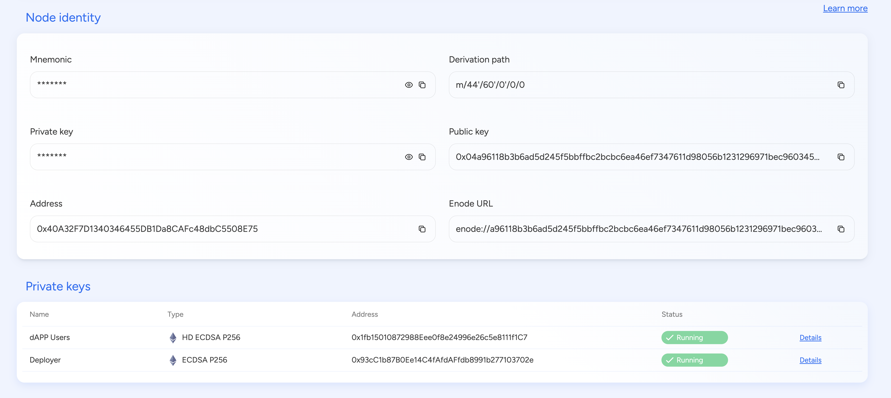
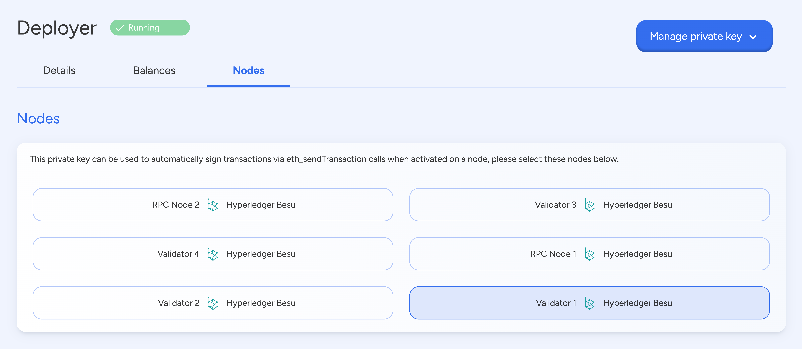

## Blockchain Transaction Signer

## Introduction

A **blockchain transaction signer** is a **cryptographic mechanism** used to
authorize and verify transactions before they are submitted to the blockchain.
It ensures that only the legitimate owner of an account can initiate
transactions, thereby preventing unauthorized access and fraud.  
Transaction signing plays a crucial role in blockchain security by using
**public-key cryptography** to create digital signatures. These signatures
confirm transaction authenticity without revealing the sender's private key,
ensuring both security and integrity.

---

Transaction signing follows these key steps:

1. **Transaction Creation** – The user or system constructs a transaction,
   specifying details such as sender, recipient, amount, and gas fees.
2. **Transaction Hashing** – The transaction data is hashed to generate a unique
   digest, ensuring the data remains tamper-proof.
3. **Digital Signing** – The sender's **private key** is used to sign the
   transaction hash, creating a **digital signature**.
4. **Transaction Submission** – The signed transaction is broadcast to the
   blockchain network.
5. **Verification by Nodes** – Other nodes verify the transaction using the
   sender’s **public key** to confirm authenticity before processing it.

By signing transactions locally before submission, users ensure that their
private keys remain secure and are never exposed to the network.

---

## SettleMint Blockchain Platform: Transaction Signing

SettleMint allows blockchain nodes to **automatically sign transactions** using
pre-attached private keys. This process ensures seamless execution of
transactions such as **smart contract interactions, token transfers, and
API-driven blockchain operations**.

The process includes:

1. **Private Key Attachment** – A private key is securely linked to a blockchain
   node.
2. **Transaction Request Generation** – An application or smart contract submits
   a transaction request.
3. **Transaction Hashing & Signing** – The node hashes and signs the transaction
   using the attached private key.
4. **Transaction Broadcast** – The signed transaction is submitted to the
   blockchain network.
5. **Network Validation** – Other nodes verify the transaction signature before
   adding it to the blockchain.

The platform supports **`eth_sendTransaction`**, enabling automated signing for
transactions on Ethereum-compatible networks.

---

## Attaching Private Keys to Nodes on SettleMint

SettleMint provides multiple ways to attach private keys securely to blockchain
nodes:

### **1. SettleMint Dashboard Configuration**

- Users can create private keys securely via the **SettleMint UI**.
- The private key is encrypted and stored within the **node’s secure
  environment**.

### **2. Hardware Security Module (HSM) or Vault Integration**

- SettleMint allows integration with **AWS KMS, HashiCorp Vault, and other
  secure key management services**.
- This approach keeps private keys **off-chain and protected from unauthorized
  access**.

### **3. Remote Signing via API**

- Instead of storing private keys on nodes, SettleMint supports **external
  signing services** that handle digital signatures remotely.
- This enhances security by **reducing node exposure** to potential attacks.

---

## Security Considerations

When attaching private keys to nodes for transaction signing, **strong security
measures** should be implemented:

- **Use Encrypted Storage:** Private keys should always be **encrypted at rest**
  to prevent unauthorized access.
- **Restrict Access Controls:** Only authorized applications should have access
  to the signing key.
- **Enable Multi-Signature if Needed:** High-value transactions should use
  **multisig wallets** for enhanced security.
- **Monitor & Audit Transactions:** Logging and monitoring signed transactions
  help detect **unauthorized or suspicious activities**.

---
