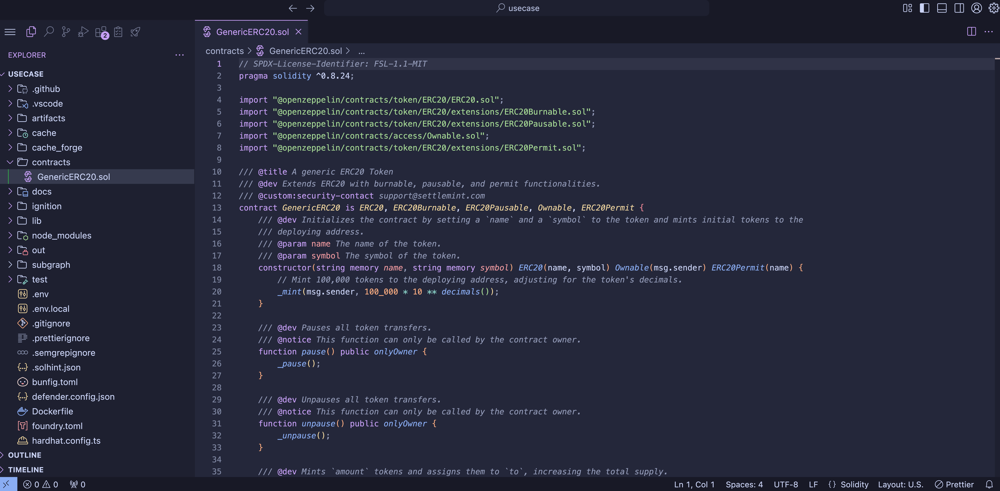

## Introduction

The Code Studio is a web-based Visual Studio Code IDE. It offers a comprehensive
toolset for building decentralized applications (dApps), including
pre-configured extensions and a seamless GitHub integration.

With the built-in SettleMint SDK Command Line Interface (CLI), you can easily
use platform services directly from within the Code Studio, making it easier to
build your dApp.

### Types of Code Studio

Currently, we offer the following types of Code Studio:

- [Smart contract sets](/platfrom-components/dev-tools/code-studio/code-studio) -
  A powerful tool that accelerates the development of your smart contracts. This
  code studio comes with pre-built smart contract set templates for your chosen
  use case, which are easily customizable to match your needs. It also includes
  compilation and migration scripts that drastically simplify deployment to the
  relevant blockchain.

A Smart Contract Set is a
[code studio](/platfrom-components/dev-tools/code-studio/code-studio) that comes
with a [smart contract set template](./smart-contract-templates) for your chosen
use case. It is a powerful tool that accelerates the development of your smart
contracts.

You can choose from a wide variety of templates in our open-source
[template library](smart-contract-templates). Each template includes pre-built
smart contracts which you can then customize to meet your specific needs.

## Overview of the Smart Contract Deployment Process on SettleMint

SettleMint's smart contract sets include both Hardhat and Foundry, enabling you
to compile, test, and deploy using your preferred framework or a combination of
both. This flexibility allows you to optimize your development process to best
suit your project needs and preferences.

The following is a high-level overview of smart contract development processes
at SettleMint.

### 1. Adding a Smart Contract Set

- **Add dev tool**: Navigate to the application you want to create the smart
  contract set in, then to the dev tools page and press the button "Add dev
  tool".
- **Code studio**: Select the "Code studio" option as the type of dev tool.
- **Smart contract set**: Select the "Smart contract set" option as the type of
  Code studio.
- **Picking Your Template**: Pick the template of your choice.

For detailed instructions, please see
[add a smart contract set](add-smart-contract-set).

### 2. Compiling and Configuring The Smart Contract

- **Compiling**: Convert your smart contract code into a format that the
  blockchain can understand and execute.
- **Configuring**: SettleMint sets all the necessary configurations for you,
- **Purpose**: Tailors the deployment process to your specific requirements and
  ensures your contract can run on the blockchain.

### 3. Deploying and Interacting with the Smart Contract

- **Deploying**: Upload your compiled smart contract to a blockchain network.
- **Interacting**: Once deployed, interact with the smart contract through
  transactions that call its functions.
- **Purpose**: Makes the contract accessible on the blockchain so users can
  interact with it and utilize its features to perform actions defined in its
  logic.

## Tools to Use

At SettleMint, we provide the option to use either Foundry or Hardhat. Both of
these tools allow you to compile and deploy smart contracts within the
SettleMint IDE. The workflow in both frameworks is very similar: you compile and
then deploy the smart contracts.

### Foundry

Foundry is a toolkit for EVM development. It provides tools to compile, test,
and deploy smart contracts.

1. **Initialize Project**: Set up your project folder and deploy a Foundry smart
   contract set.
2. **Write and Configure Contract**: Create your smart contract code in Solidity
   and set up your project settings in a `foundry.toml` file if needed.
3. **Compile and Deploy Contract**: Convert your Solidity code into bytecode and
   deploy your compiled contract to the blockchain network of your choice.

### Hardhat

Hardhat is a development environment for EVM software. It provides a flexible
and extensible ecosystem for building, testing, and deploying smart contracts.

1. **Initialize Project**: Set up your project folder and deploy a Hardhat smart
   contract set.
2. **Write and Configure Contract**: Create your smart contract code in Solidity
   and set up your project settings in a `hardhat.config.js` file if needed.
3. **Compile and Deploy Contract**: Convert your Solidity code into bytecode and
   deploy your compiled contract to the blockchain network of your choice.

## Key Points

- **Smart Contracts**: Self-executing programs with predefined rules.
- **Compiling and Configuring**: Converts code into a format the blockchain can
  run and tailors the deployment process.
- **Deploying and Interacting**: Uploads the compiled code to the blockchain and
  makes it accessible for interaction. By following these steps and using the
  appropriate tools, you can easily create, compile, and deploy smart contracts
  to automate and secure your business processes on the blockchain.

SettleMint's smart contract templates serve as open-source, ready-to-use
foundations for blockchain application development, significantly accelerating
the deployment process. These templates enable users to quickly customize and
extend their blockchain applications, leveraging tested and community-enhanced
frameworks to reduce development time and accelerate market entry.

## Open-Source Smart Contract Templates under the MIT License

Benefit from the expertise of the blockchain community and trust in the
reliability of your smart contracts. These templates are vetted and used by
major enterprises and institutions, ensuring enhanced security and confidence in
your deployments.

## Template library

The programming languages for smart contracts differ depending on the protocol:

- For **EVM-compatible networks** (like Ethereum), smart contracts are written
  in **Solidity**.
- For **Hyperledger Fabric**, smart contracts (also called chaincode) are
  written in **TypeScript** or **Go**.

---

### Solidity Contracts (EVM)

| Template                                                                                    | Description                               |
| ------------------------------------------------------------------------------------------- | ----------------------------------------- |
| [Empty](https://github.com/settlemint/solidity-empty)                                       | A minimal smart contract in Solidity      |
| [ERC20 Token](https://github.com/settlemint/solidity-token-erc20)                           | Standard ERC20 token implementation       |
| [ERC20 with MetaTx](https://github.com/settlemint/solidity-token-erc20-metatx)              | ERC20 token with meta-transaction support |
| [ERC20 with Crowdsale](https://github.com/settlemint/solidity-token-erc20-crowdsale)        | ERC20 token with integrated crowdsale     |
| [ERC1155 Token](https://github.com/settlemint/solidity-token-erc1155)                       | Multi-token standard (ERC1155)            |
| [ERC721](https://github.com/settlemint/solidity-token-erc721)                               | Standard NFT token (ERC721)               |
| [ERC721a](https://github.com/settlemint/solidity-token-erc721a)                             | Gas-optimized NFT (ERC721A)               |
| [ERC721 Generative Art](https://github.com/settlemint/solidity-token-erc721-generative-art) | NFT with generative art logic             |
| [Soulbound Token](https://github.com/settlemint/solidity-token-soulbound)                   | Non-transferable token                    |
| [Supply Chain](https://github.com/settlemint/solidity-supplychain)                          | Asset tracking across supply chain        |
| [State Machine](https://github.com/settlemint/solidity-statemachine)                        | State transition logic                    |
| [Diamond Bond](https://github.com/settlemint/solidity-diamond-bond)                         | Bond issuance and tracking                |
| [Attestation Service](https://github.com/settlemint/solidity-attestation-service)           | Verifiable claim attestations             |

---

### Chaincode Templates (Hyperledger Fabric)

| Template                                                                                    | Description                              |
| ------------------------------------------------------------------------------------------- | ---------------------------------------- |
| [Empty (TypeScript)](https://github.com/settlemint/chaincode-typescript-empty)              | Minimal TypeScript chaincode             |
| [Empty with PDC (TypeScript)](https://github.com/settlemint/chaincode-typescript-empty-pdc) | Chaincode using private data collections |
| [Empty (Go)](https://github.com/settlemint/chaincode-go-empty)                              | Minimal Go chaincode                     |

---

## Create Your Own Smart Contract Templates for Your Consortium

Within the self-managed Blockchain Transformation Platform (BTP), you can create
and add your own templates for use within your consortium. This fosters a
collaborative environment where templates can be reused and built upon,
promoting innovation and efficiency within your network.

To get started, visit:
[SettleMint GitHub Repository](https://github.com/settlemint/solidity-empty)
