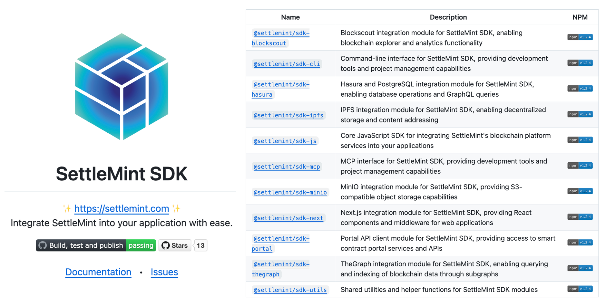

A Software Development Kit (SDK) is a collection of tools, libraries, and
documentation designed to help developers build applications efficiently. SDKs
provide pre-built functions, APIs, and utilities that eliminate the need to
write code from scratch, making development faster and more reliable. Whether
for mobile apps, cloud integrations, or blockchain applications, SDKs streamline
the process by offering standardized solutions that ensure compatibility and
ease of use. By leveraging SDKs, developers can focus on innovation rather than
the complexities of low-level coding, leading to quicker deployment and enhanced
functionality.



The SettleMint Blockchain SDK is designed to simplify blockchain development and
integration for enterprises and developers. It provides a modular set of tools
that allow seamless interaction with the SettleMint Blockchain Transformation
Platform, enabling smart contract deployment, dApp connectivity, and blockchain
infrastructure management. With support for multiple blockchain protocols,
developer-friendly APIs, and integrations with frameworks like JavaScript,
TypeScript, and Next.js, the SDK empowers organizations to build scalable
blockchain applications effortlessly. By reducing complexity and offering
plug-and-play functionality, SettleMint’s SDK accelerates blockchain adoption
across industries.

**[Official Documentation](https://console.settlemint.com/documentation)**  
**[NPM Package](https://www.npmjs.com/package/@settlemint/sdk-cli)**  
**[GitHub Repository](https://github.com/settlemint/sdk)**

### Key Features

- **Modular Design** – Pick and use only the packages you need.
- **Seamless Integration** – Connect applications to the SettleMint platform
  effortlessly.
- **Blockchain Agnostic** – Supports multiple protocols and networks.
- **Developer-Friendly** – Works with JavaScript, TypeScript, CLI, and
  frameworks like Next.js.
- **Open Source** – Contributions are welcome to enhance functionality.

## Getting Started

### Prerequisites

- **Node.js**: Version 16.x or higher
- **npm**: Version 8.x or higher
- **SettleMint Account**: Sign up at
  [console.settlemint.com](https://console.settlemint.com)
- **Personal Access Token (PAT)**: Required for authenticated SDK usage

### Installation

Install the core SDK using npm:

```sh
npm install @settlemint/sdk-js
```

To install additional modules:

```sh
npm install @settlemint/sdk-js @settlemint/sdk-ipfs @settlemint/sdk-cli
```

For detailed installation options, visit:  
[SettleMint SDK on NPM](https://www.npmjs.com/package/@settlemint/sdk-js)

### SDK Module Overview

The **SettleMint SDK** is a modular suite of tools designed for seamless
blockchain development. Each package is specialized for different blockchain
functionalities, allowing developers to integrate only the components they need.

| **Package**                                                                              | **Description**                                                 | **NPM Link**                                                    |
| ---------------------------------------------------------------------------------------- | --------------------------------------------------------------- | --------------------------------------------------------------- |
| [`@settlemint/sdk-js`](https://www.npmjs.com/package/@settlemint/sdk-js)                 | Core JavaScript SDK for blockchain interaction.                 | [NPM](https://www.npmjs.com/package/@settlemint/sdk-js)         |
| [`@settlemint/sdk-cli`](https://www.npmjs.com/package/@settlemint/sdk-cli)               | Command-line interface for project management.                  | [NPM](https://www.npmjs.com/package/@settlemint/sdk-cli)        |
| [`@settlemint/sdk-ipfs`](https://www.npmjs.com/package/@settlemint/sdk-ipfs)             | IPFS integration for decentralized storage.                     | [NPM](https://www.npmjs.com/package/@settlemint/sdk-ipfs)       |
| [`@settlemint/sdk-thegraph`](https://www.npmjs.com/package/@settlemint/sdk-thegraph)     | TheGraph integration for querying and indexing blockchain data. | [NPM](https://www.npmjs.com/package/@settlemint/sdk-thegraph)   |
| [`@settlemint/sdk-next`](https://www.npmjs.com/package/@settlemint/sdk-next)             | Next.js integration with React components.                      | [NPM](https://www.npmjs.com/package/@settlemint/sdk-next)       |
| [`@settlemint/sdk-hasura`](https://www.npmjs.com/package/@settlemint/sdk-hasura)         | Hasura and PostgreSQL integration for database operations.      | [NPM](https://www.npmjs.com/package/@settlemint/sdk-hasura)     |
| [`@settlemint/sdk-blockscout`](https://www.npmjs.com/package/@settlemint/sdk-blockscout) | Blockchain explorer and analytics functionality.                | [NPM](https://www.npmjs.com/package/@settlemint/sdk-blockscout) |
| [`@settlemint/sdk-mcp`](https://www.npmjs.com/package/@settlemint/sdk-mcp)               | Managed Compute Platform (MCP) integration.                     | [NPM](https://www.npmjs.com/package/@settlemint/sdk-mcp)        |
| [`@settlemint/sdk-minio`](https://www.npmjs.com/package/@settlemint/sdk-minio)           | MinIO integration for S3-compatible object storage.             | [NPM](https://www.npmjs.com/package/@settlemint/sdk-minio)      |
| [`@settlemint/sdk-utils`](https://www.npmjs.com/package/@settlemint/sdk-utils)           | Shared utilities and helper functions.                          | [NPM](https://www.npmjs.com/package/@settlemint/sdk-utils)      |

---

## How to Contribute

### 1. Fork the Repository

1. Go to the
   [SettleMint SDK GitHub Repository](https://github.com/settlemint/sdk).
2. Click on the **Fork** button to create a copy of the repository under your
   GitHub account.

### 2. Clone the Repository

Clone the repository to your local machine using:

```sh
git clone https://github.com/your-username/sdk.git
cd sdk
```

### 3. Create a New Branch

Before making changes, create a new branch for your feature or bug fix:

```sh
git checkout -b feature/your-feature-name
```

### 4. Make Your Changes

Modify the source code, documentation, or other relevant files as needed.

### 5. Commit Your Changes

Once you have made and tested your changes, commit them with a clear commit
message:

```sh
git add .
git commit -m "Add feature: description of the change"
```

### 6. Push to GitHub

Push your changes to your forked repository:

```sh
git push origin feature/your-feature-name
```

### 7. Create a Pull Request

1. Navigate to the **original SettleMint SDK repository**.
2. Click on **New Pull Request**.
3. Select your branch and submit the pull request with a clear description of
   the changes.

---

## Contribution Guidelines

- Follow the existing code style and structure.
- Write clear commit messages.
- Document new features and changes.
- Ensure all tests pass before submitting a pull request.
- Reference any related issues in your pull request.

---

## Reporting Issues

If you find a bug or have a suggestion, please open an issue on GitHub:

- Go to the [Issues Page](https://github.com/settlemint/sdk/issues).
- Click **New Issue** and provide a detailed description.

## License

The SettleMint SDK is released under the **FSL Software License**. See the
[LICENSE](https://github.com/settlemint/sdk/blob/main/LICENSE) file for details.
