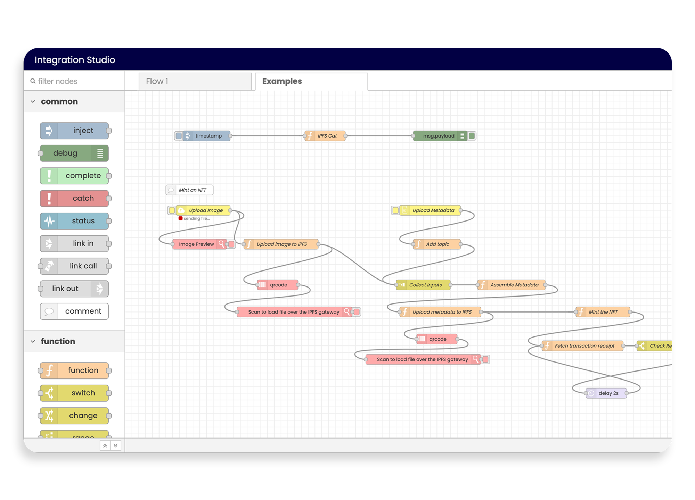
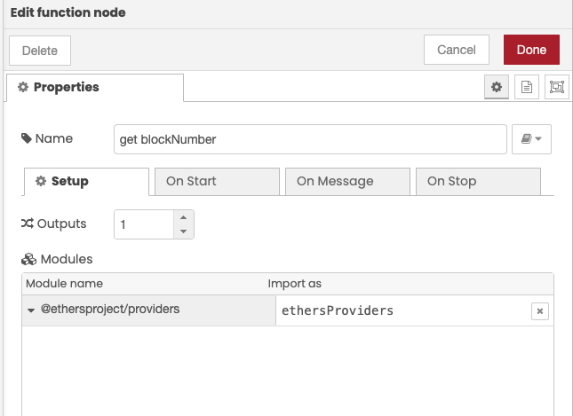

import { Callout } from "fumadocs-ui/components/callout";
import { Steps } from "fumadocs-ui/components/steps";

The SettleMint Integration Studio is a low-code development environment which
enables you to implement business logic for your application simply by dragging
and dropping.

Under the hood, the Integration Studio is powered by a **Node-RED** instance
dedicated to your application. It is a low-code programming platform built on
Node.js and designed for event-driven application development.
[Learn more about Node-RED here](https://nodered.org/docs/).

## Basic concepts

The business logic for your application can be represented as a sequence of
actions. Such a sequence of actions is represented by a **flow** in the
Integration Studio. To bring your application to life, you need to create flows.
**Nodes** are the smallest building blocks of a flow.

### Nodes

The nodes are the smallest building blocks. They can have at most one input
port, and multiple output ports. They are triggered by some event (eg. an http
request). When triggered, they perform some user defined actions, and generate
an output. This output can be passed to the input of another node, to trigger
another action.

### Flows

A flow is represented as a tab within the editor workspace and is the main way
to organize nodes. You can have more than one set of connected nodes in a flow
tab.

The Integration Studio allows you to create flows in the fastest way possible.
You can drag and drop nodes in workspace and easily connect them by clicking
from the output port of one node to input port of another to create complex
flows. This allows you to visualise the orchestration and interaction between
your components (your nodes). Since you can clearly visualize the sequence of
actions your application is going to perform, it is not only more interpretable
but also much easier to debug in the future.

The use cases include interacting with other web services, applications, and
even IoT devices - orchestrating them for any kind of purpose to bring your
business solution to life.

[Learn more about the basic concepts of Node-RED here](https://nodered.org/docs/user-guide/concepts)

## Adding the Integration Studio

Navigate to the **application** where you want to add the integration studio.
Click **Integration tools** in the left navigation, and then click **Add an
integration tool**. This opens a form.

<Steps>
### Select Integration Studio
Select **Integration Studio** and click **Continue** to proceed.

### Choose a Name

Choose a **name** for your Integration Studio. Choose one that will be easily
recognizable in your dashboards (eg. Crowdsale Flow)

### Select Deployment Plan

Choose a deployment plan. Select the type, cloud provider, region and resource
pack.
[More about deployment plans](/launching-the-platform/managed-cloud-deployment/deployment-plans)

### Confirm Setup

You can see the **resource cost** for the Integration Studio displayed at the
bottom of the form. Click **Confirm** to add the Integration Studio.

</Steps>

## Using the Integration Studio

When the Integration Studio is deployed, click on it from the list, and go to
the **Interface** tab to start building your flows. You can also view the
interface in full screen mode.

Once the Integration Studio interface is loaded, you will see 2 flow tabs: "Flow
1" and "Example". Head over to the **"Example" tab** to see some full blown
example flows to get you started.

Double-click any of the nodes to see the code they are running. This code is
written in JavaScript, and it represents the actions the particular node
performs.



### Setting up a flow

Before we show you how to set up your own flow, we recommend reading this
[article by Node-RED on creating your first flow](https://nodered.org/docs/tutorials/first-flow).

Now let's set up an example flow together and build an endpoint to get the
latest block number of the Polygon Mumbai Testnet using the Integration Studio.
If you do not have a Polygon Mumbai Node, you can easily
[deploy a node](/platfrom-components/add-a-node-to-a-network) first.

<Steps>
### Add HTTP Input Node
Drag and drop a **Http In node** to listen for requests. If you double-click the node, you will see you have a couple parameters to set:

- `METHOD` - set it to `GET`. This is HTTP Method that your node is configured
  to listen to.
- `URL` - set it to `/getLatestBlock`. This the endpoint that your node will
  listen to.

### Add Function Node

Drag and drop a **function node**. This is the node that will query the
blockchain for the block number. Double-click the node to configure it.

<Callout>
`rpcEndpoint` is the RPC url of your Polygon Mumbai Node.
Under the **Connect tab** of your Polygon Mumbai node, you will find its RPC url.

`accessToken` - You will need an access token for your application. If you do
not have one, you can easily
[create an access token](/platfrom-components/application-access-tokens) first.

</Callout>

Enter the following snippet in the Message tab:

```javascript
///////////////////////////////////////////////////////////
// Configuration                                         //
///////////////////////////////////////////////////////////

const rpcEndpoint = "https://YOUR_NODE_RPC_ENDPOINT.settlemint.com";
const accessToken = "YOUR_APPLICATION_ACCESS_TOKEN_HERE";

///////////////////////////////////////////////////////////
// Logic                                                 //
///////////////////////////////////////////////////////////

const ethers = global.get("ethers");
const provider = new ethers.providers.JsonRpcProvider(
  `${rpcEndpoint}/${accessToken}`
);
msg.payload = await provider.getBlockNumber();

return msg;

///////////////////////////////////////////////////////////
// End                                                   //
///////////////////////////////////////////////////////////
```

<Callout type="info">
**Note:** ethers and some ipfs libraries are already available by default and can be used like this:

```javascript
const ethers = global.get("ethers");
const provider = new ethers.providers.JsonRpcProvider(
  `${rpcEndpoint}/${accessToken}`
);

const ipfsHttpClient = global.get("ipfsHttpClient");
const client = ipfsHttpClient.create(`${ipfsEndpoint}/${accessToken}/api/v0`);

const uint8arrays = global.get("uint8arrays");
const itAll = global.get("itAll");
const data = uint8arrays.toString(
  uint8arrays.concat(await itAll(client.cat(cid)))
);
```

If the library you need isn't available by default you will need to import it in
the setup tab. Example for ethers providers:


</Callout>

### Add HTTP Response Node

Drag and drop a **Http Response node** to reply to the request. Double-click and
configure:

- `Status code` - This is the HTTP status code that the node will respond with
  after completion of the request. We set it to 200 (`OK`)

Click on the `Deploy` button in the top right corner to save and deploy your
changes.

### Test Your Endpoint

Now, go back to the **Connect tab** of your Integration Studio to see your **API
endpoint**, which looks something like
`https://YOUR_INTEGRATION_STUDIO_API_URL.settlemint.com`.

You can now send requests to
`https://YOUR_INTEGRATION_STUDIO_API_URL.settlemint.com/getLatestBlock` to get
the latest block number. Do not forget to create an API Key for your Integration
studio and pass it as the `x-auth-token` authorization header with your request.

Example terminal command:

```bash
curl -H "x-auth-token: bpaas-YOUR_INTEGRATION_KEY_HERE" https://YOUR_INTEGRATION_STUDIO_API_URL.settlemint.com/getLatestBlock
```

</Steps>

The API is live and protected by the authorization header, and you can
seamlessly integrate with your application.

You can use the Integration Studio to build very complex flows. Learn more in
this [cookbook by Node-RED](https://cookbook.nodered.org/) on the different
types of flows.
