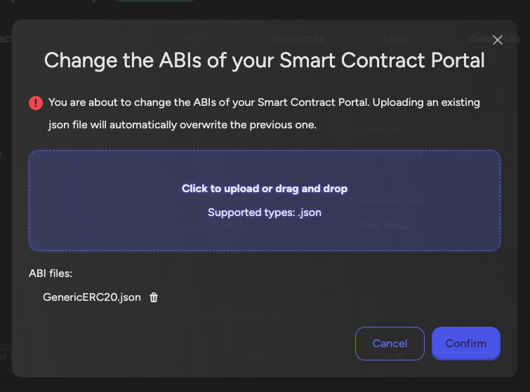
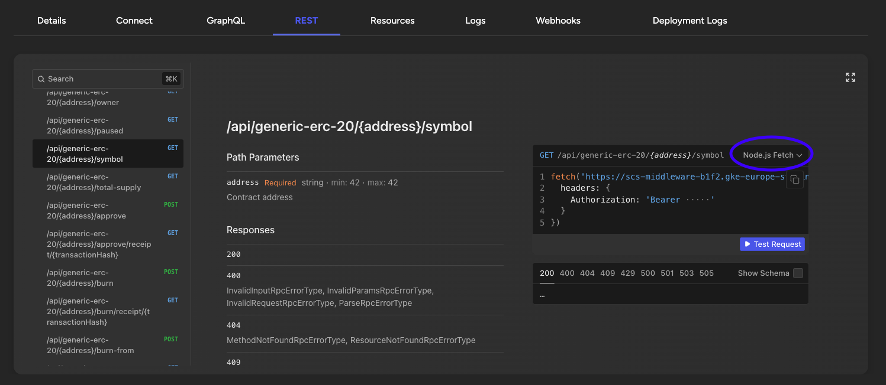
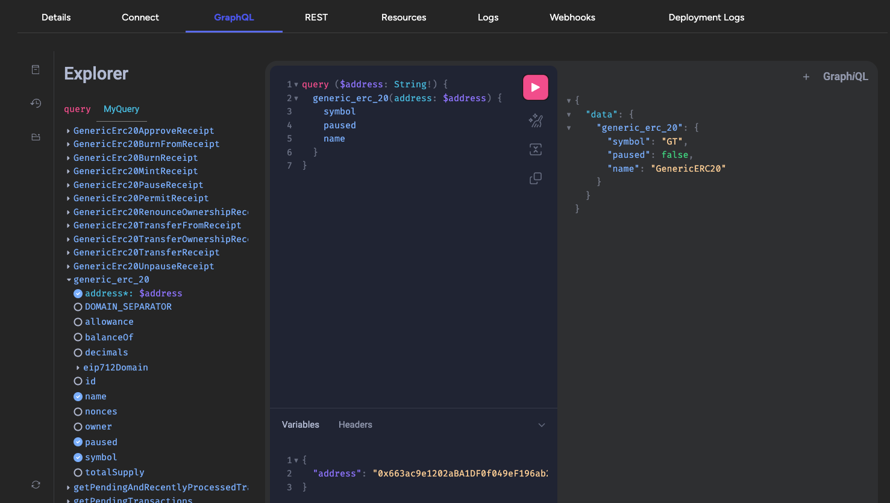

## The Smart Contract Portal Middleware

The Smart Contract Portal is a middleware which creates an easy to use api on
top of your smart contracts. It can be used with all EVM-compatible chains like
Ethereum, Hyperledger Besu, Polygon, Avalanche, etc. You can run it on your own
blockchain nodes (both public and permissioned) or on a Load Balancer.

Benefits of using the smart contract portal:

1. Simplified Integration: APIs allow developers to interact with complex smart
   contract functions through familiar interfaces, reducing the need to
   understand blockchain-specific languages and protocols.
2. Data Aggregation: APIs can consolidate data from multiple smart contracts,
   providing a unified view.
3. Improved Performance: GraphQL optimizes data fetching, ensuring that clients
   retrieve only the necessary data in a single request, reducing network load
   and improving performance.
4. Stack agnostic: Teams are free to choose their own technology stack.

<Callout type="warning">
  Before you start, make sure you are running an EVM-compatible network
  (Ethereum, Polygon, Hyperledger Besu, Avalanche, etc.) and have a private key
  to deploy your smart contracts.
</Callout>

### Using The Smart Contract Portal Middleware

The Portal middleware provides instant API access to your smart contracts. Key
features include:

- Auto-generated REST & GraphQL APIs
- Built-in webhooks for event notifications
- Type-safe contract interactions
- Automatic ABI parsing

### Using The Portal SDK

```typescript
import { createPortalClient } from "@settlemint/sdk-portal";

const { client: portalClient, graphql: portalGraphql } = createPortalClient({
  instance: process.env.SETTLEMINT_PORTAL_GRAPHQL_ENDPOINT,
  accessToken: process.env.SETTLEMINT_ACCESS_TOKEN,
});
```

<Callout type="tip">
  For comprehensive API documentation and advanced features, check out the
  [Portal SDK
  documentation](https://github.com/settlemint/sdk/tree/main/sdk/portal).
</Callout>

### Upload an ABI

A smart contract ABI (Application Binary Interface) is a standardized way for
interacting with smart contracts in the Ethereum blockchain and other compatible
systems. It serves as the bridge between human-readable contract code (written
in languages like Solidity) and the Ethereum Virtual Machine (EVM), which
executes the contract. The ABI specifies the functions that can be called on the
contract, including their names, input parameters, and output types.

When deploying a smart contract the ABI file can be found as part of the
artificats. See
[Deploying the Smart Contract](/developer-guides/connect-frontend#adding-the-abi).
Download the ABI json files and save them on your local filesystem.

When creating a new middleware you'll need to upload at least one ABI.

To update the ABIs of an existing smart contract portal middleware navigate to
the middleware, go the details and click on the 'Manage Middleware' button on
the top right. Click on the 'Update ABIs' item and a dialog will open. In this
dialog upload the ABI file(s) you saved on your local filesystem in the previous
step.



### REST

A fully typed REST api with documentation is created out of the Smart Contract
ABI, you can discover all its endpoints on the REST tab. To see examples in your
technology of choice use the dropdown in the example section on the right.



### GraphQL

The GraphQL api exposes the same functionality as the REST api, you can discover
it on the GraphQL tab.



### Webhooks

On the Webhooks tab you can register your own webhook. The portal will send
events to this webhook when a transaction is processed.

When sending a message the event will have a signature which allows the receiver
to validate if the event has not been tampered with.

The secret to validate the signature can be copied from the details page of your
webhook.


Standard Webhooks has built
[SDKs and useful tools](https://www.standardwebhooks.com/#resources) using
different programming languages that make it easy to start using webhooks.

An example using Typescript, [Elysia](https://elysiajs.com/) and
[standard webhooks](https://www.standardwebhooks.com/).

```ts
import { Elysia, t } from "elysia";
import { Webhook } from "standardwebhooks";

async function webhookConsumerBootstrap(secret: string) {
  const webhookConsumer = new Elysia().post(
    "/scp-listener",
    ({ headers, body }) => {
      try {
        const wh = new Webhook(btoa(secret));
        const verifiedPayload = wh.verify(JSON.stringify(body.payload), {
          "webhook-id": headers["btp-portal-event-id"]!,
          "webhook-signature": headers["btp-portal-event-signature"]!,
          "webhook-timestamp": headers["btp-portal-event-timestamp"]!,
        });
        console.log(
          `Received a webhook event: ${JSON.stringify(verifiedPayload)}`
        );
      } catch (err) {
        console.error("Webhook payload invalid", err);
        throw err;
      }
    },
    {
      body: t.Object({
        payload: t.Object({
          apiVersion: t.String(),
          eventId: t.String(),
          eventName: t.String(),
          timestamp: t.Number(),
          data: t.Any(),
        }),
      }),
    }
  );
  const app = new Elysia().use(webhookConsumer).onStart(({ server }) => {
    console.log(
      `Started the test webhook consumer on ${server?.url.toString()}`
    );
  });
}
```

## Further Reading

- [The Graph Middleware](#the-graph-middleware)
- [The Smart Contract Portal Middleware](#the-smart-contract-portal-middleware)
- [Attestation Indexer](#attestation-indexer)
- [Firefly FabConnect](#firefly-fabconnect)

<Callout type="info">
  All operations require appropriate permissions in your workspace.
</Callout>
