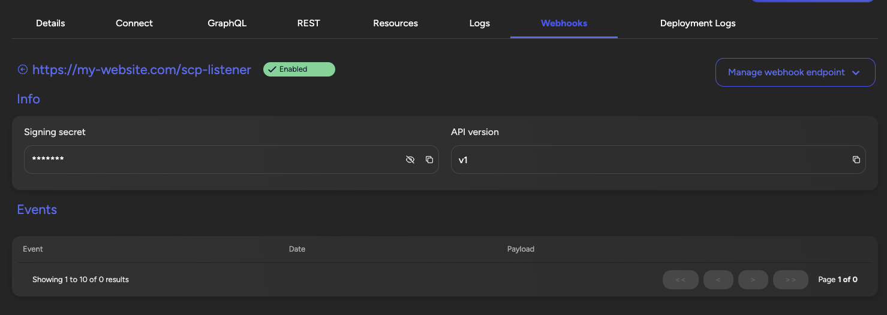

## The smart contract portal middleware

The Smart Contract Portal is an enterprise-grade API management solution that transforms your smart contracts into production-ready APIs with zero configuration. It provides comprehensive tooling for managing, monitoring, and integrating blockchain applications at scale.

The smart contract portal is a middleware which creates an easy to use api on
top of your smart contracts. It can be used with all EVM-compatible chains like
Ethereum, Hyperledger Besu, Polygon, Avalanche, etc. You can run it on your own
blockchain nodes (both public and permissioned) or on a Load Balancer.

Benefits of using the smart contract portal:

1. **Simplified Integration**: APIs allow developers to interact with complex smart
   contract functions through familiar interfaces, reducing the need to
   understand blockchain-specific languages and protocols.
2. **Data Aggregation**: APIs can consolidate data from multiple smart contracts,
   providing a unified view.
3. **Improved Performance**: GraphQL optimizes data fetching, ensuring that clients
   retrieve only the necessary data in a single request, reducing network load
   and improving performance.
4. **Stack agnostic**: Teams are free to choose their own technology stack.
5. **Transaction Monitoring & Alerting**: Monitor blockchain transactions in
   real-time, filter by parameters like sender, receiver, block number, function
   name, and contract address. Set up custom alerts to trigger actions such as
   email notifications, webhooks, or automated processes when specific
   conditions are met.
6. **Enterprise Security**: Built-in authentication, rate limiting, and access control
   for production deployments.
7. **High Availability**: Automatic failover and load balancing across multiple nodes.

<Callout type="warning">
  Before you start, make sure you are running an EVM-compatible network
  (Ethereum, Polygon, Hyperledger Besu, Avalanche, etc.) and have a private key
  to deploy your smart contracts.
</Callout>

### Using the smart contract portal middleware

The Portal middleware provides instant API access to your smart contracts. Key
features include:

- Auto-generated REST & GraphQL APIs
- Built-in webhooks for event notifications
- Type-safe contract interactions
- Automatic ABI parsing

### Using the portal SDK

The `@settlemint/sdk-portal` package provides a type-safe client for interacting with your Smart Contract Portal APIs.

#### Installation

```bash
npm install @settlemint/sdk-portal
# or
yarn add @settlemint/sdk-portal
# or
pnpm add @settlemint/sdk-portal
```

#### Basic Setup

```typescript
import { createPortalClient } from "@settlemint/sdk-portal";

const { client: portalClient, graphql: portalGraphql } = createPortalClient({
  instance: process.env.SETTLEMINT_PORTAL_GRAPHQL_ENDPOINT,
  accessToken: process.env.SETTLEMINT_ACCESS_TOKEN,
});
```

#### Advanced Usage Examples

##### Reading Contract State

```typescript
// Query contract state using GraphQL
const query = `
  query GetTokenBalance($address: String!) {
    ERC20 {
      balanceOf(account: $address) {
        value
        formatted
      }
      totalSupply {
        value
        formatted
      }
    }
  }
`;

const result = await portalGraphql.request(query, {
  address: "0x742d35Cc6634C0532925a3b844Bc9e7095931a3e"
});
```

##### Executing Transactions

```typescript
// Execute a contract transaction
const mutation = `
  mutation Transfer($to: String!, $amount: String!) {
    ERC20 {
      transfer(to: $to, amount: $amount) {
        transactionHash
        blockNumber
        gasUsed
        status
      }
    }
  }
`;

const txResult = await portalGraphql.request(mutation, {
  to: "0x742d35Cc6634C0532925a3b844Bc9e7095931a3e",
  amount: "1000000000000000000" // 1 token with 18 decimals
});
```

##### Subscribing to Events

```typescript
// Subscribe to contract events
const subscription = `
  subscription OnTransfer {
    ERC20 {
      Transfer {
        from
        to
        value
        blockNumber
        transactionHash
      }
    }
  }
`;

const unsubscribe = portalGraphql.subscribe(
  subscription,
  {},
  {
    next: (data) => console.log('Transfer event:', data),
    error: (err) => console.error('Subscription error:', err),
    complete: () => console.log('Subscription complete')
  }
);
```

<Callout type="tip">
  For comprehensive API documentation and advanced features, check out the
  [Portal SDK
  documentation](https://github.com/settlemint/sdk/tree/main/sdk/portal).
</Callout>

### ABI Management Interface

The Smart Contract Portal provides a comprehensive ABI management system that allows you to maintain multiple contract versions, manage upgrades, and ensure backward compatibility.

#### Upload an ABI

A smart contract ABI (Application Binary Interface) is a standardized way for
interacting with smart contracts in the Ethereum blockchain and other compatible
systems. It serves as the bridge between human-readable contract code (written
in languages like Solidity) and the Ethereum Virtual Machine (EVM), which
executes the contract. The ABI specifies the functions that can be called on the
contract, including their names, input parameters, and output types.

When deploying a smart contract the ABI file can be found as part of the
artificats. See
[Deploying the Smart Contract](/building-with-settlemint/evm-chains-guide/deploy-smart-contracts).
Download the ABI json files and save them on your local filesystem.

When creating a new middleware you'll need to upload at least one ABI.

To update the ABIs of an existing smart contract portal middleware navigate to
the middleware, go the details and click on the 'Manage Middleware' button on
the top right. Click on the 'Update ABIs' item and a dialog will open. In this
dialog upload the ABI file(s) you saved on your local filesystem in the previous
step.


#### ABI Versioning

The Portal supports managing multiple ABI versions simultaneously:

- **Version Tagging**: Tag each ABI with a version number for easy identification
- **Backward Compatibility**: Maintain multiple versions to support legacy integrations
- **Automatic Migration**: The Portal can automatically detect contract upgrades and suggest ABI updates

#### Batch ABI Management

For complex projects with multiple contracts:

```bash
# Upload multiple ABIs at once
settlemint portal abi upload \
  --portal-id <portal-id> \
  --files "./artifacts/contracts/**/*.json" \
  --version "v2.0.0"
```

### Rest

A fully typed REST api with documentation is created out of the Smart Contract
ABI, you can discover all its endpoints on the REST tab. To see examples in your
technology of choice use the dropdown in the example section on the right.


### Graphql

The GraphQL api exposes the same functionality as the REST api, you can discover
it on the GraphQL tab.


### Webhook Management and Consumers

The Smart Contract Portal's webhook system provides enterprise-grade event delivery with guaranteed message ordering, retry logic, and comprehensive monitoring.

#### Webhook Configuration

On the Webhooks tab you can register your own webhook endpoints. The portal will send
events to these endpoints when transactions are processed or specific conditions are met.

##### Security Features

- **HMAC Signatures**: Every webhook payload is signed using HMAC-SHA256
- **Timestamp Validation**: Prevent replay attacks with timestamp verification
- **IP Whitelisting**: Restrict webhook delivery to trusted IP addresses
- **TLS/SSL Required**: All webhook endpoints must use HTTPS

The secret to validate the signature can be copied from the details page of your
webhook.



#### Webhook Event Types

The Portal supports various event types:

- **Transaction Events**: Triggered when transactions are mined
- **Contract Events**: Triggered by specific smart contract events
- **State Changes**: Triggered when contract state changes meet certain criteria
- **Error Events**: Triggered when transactions fail or revert

#### Building Webhook Consumers

Standard Webhooks has built
[SDKs and useful tools](https://www.standardwebhooks.com/#resources) using
different programming languages that make it easy to start using webhooks.

##### TypeScript/Node.js Example

An example using Typescript, [Elysia](https://elysiajs.com/) and
[standard webhooks](https://www.standardwebhooks.com/).

```ts
import { Elysia, t } from "elysia";
import { Webhook } from "standardwebhooks";

async function webhookConsumerBootstrap(secret: string) {
  const webhookConsumer = new Elysia().post(
    "/scp-listener",
    async ({ headers, body }) => {
      try {
        // Verify webhook signature
        const wh = new Webhook(btoa(secret));
        const verifiedPayload = wh.verify(JSON.stringify(body.payload), {
          "webhook-id": headers["btp-portal-event-id"]!,
          "webhook-signature": headers["btp-portal-event-signature"]!,
          "webhook-timestamp": headers["btp-portal-event-timestamp"]!,
        });
        
        // Process based on event type
        switch (verifiedPayload.eventName) {
          case "transaction.confirmed":
            await handleTransactionConfirmed(verifiedPayload.data);
            break;
          case "contract.event":
            await handleContractEvent(verifiedPayload.data);
            break;
          case "transaction.failed":
            await handleTransactionFailed(verifiedPayload.data);
            break;
        }
        
        return { status: "processed" };
      } catch (err) {
        console.error("Webhook payload invalid", err);
        throw err;
      }
    },
    {
      body: t.Object({
        payload: t.Object({
          apiVersion: t.String(),
          eventId: t.String(),
          eventName: t.String(),
          timestamp: t.Number(),
          data: t.Any(),
        }),
      }),
    }
  );
  
  const app = new Elysia()
    .use(webhookConsumer)
    .onStart(({ server }) => {
      console.log(
        `Started webhook consumer on ${server?.url.toString()}`
      );
    });
    
  return app.listen(3000);
}

// Event handlers
async function handleTransactionConfirmed(data: any) {
  console.log("Transaction confirmed:", data.transactionHash);
  // Your business logic here
}

async function handleContractEvent(data: any) {
  console.log("Contract event:", data.eventName, data.args);
  // Your business logic here
}

async function handleTransactionFailed(data: any) {
  console.error("Transaction failed:", data.reason);
  // Error handling logic here
}
```

##### Python Example

```python
from flask import Flask, request, jsonify
from standardwebhooks import Webhook
import base64
import json

app = Flask(__name__)

def verify_webhook(secret: str, payload: dict, headers: dict) -> dict:
    """Verify webhook signature and return payload"""
    wh = Webhook(base64.b64encode(secret.encode()).decode())
    
    return wh.verify(
        json.dumps(payload),
        {
            "webhook-id": headers.get("btp-portal-event-id"),
            "webhook-signature": headers.get("btp-portal-event-signature"),
            "webhook-timestamp": headers.get("btp-portal-event-timestamp"),
        }
    )

@app.route("/webhook", methods=["POST"])
def handle_webhook():
    try:
        secret = os.environ.get("WEBHOOK_SECRET")
        payload = verify_webhook(secret, request.json["payload"], request.headers)
        
        # Process based on event type
        event_name = payload["eventName"]
        if event_name == "transaction.confirmed":
            handle_transaction_confirmed(payload["data"])
        elif event_name == "contract.event":
            handle_contract_event(payload["data"])
            
        return jsonify({"status": "processed"}), 200
        
    except Exception as e:
        print(f"Webhook error: {e}")
        return jsonify({"error": "Invalid webhook"}), 400
```

##### Go Example

```go
package main

import (
    "encoding/json"
    "fmt"
    "net/http"
    
    "github.com/standard-webhooks/standard-webhooks/go"
)

type WebhookPayload struct {
    Payload struct {
        APIVersion string      `json:"apiVersion"`
        EventID    string      `json:"eventId"`
        EventName  string      `json:"eventName"`
        Timestamp  int64       `json:"timestamp"`
        Data       interface{} `json:"data"`
    } `json:"payload"`
}

func webhookHandler(secret string) http.HandlerFunc {
    return func(w http.ResponseWriter, r *http.Request) {
        var payload WebhookPayload
        if err := json.NewDecoder(r.Body).Decode(&payload); err != nil {
            http.Error(w, "Invalid payload", http.StatusBadRequest)
            return
        }
        
        // Verify webhook
        wh := svix.NewWebhook(secret)
        headers := http.Header{
            "webhook-id":        []string{r.Header.Get("btp-portal-event-id")},
            "webhook-signature": []string{r.Header.Get("btp-portal-event-signature")},
            "webhook-timestamp": []string{r.Header.Get("btp-portal-event-timestamp")},
        }
        
        payloadBytes, _ := json.Marshal(payload.Payload)
        if err := wh.Verify(payloadBytes, headers); err != nil {
            http.Error(w, "Invalid signature", http.StatusUnauthorized)
            return
        }
        
        // Process event
        switch payload.Payload.EventName {
        case "transaction.confirmed":
            handleTransactionConfirmed(payload.Payload.Data)
        case "contract.event":
            handleContractEvent(payload.Payload.Data)
        }
        
        w.WriteHeader(http.StatusOK)
        json.NewEncoder(w).Encode(map[string]string{"status": "processed"})
    }
}
```

### Syncing Status Monitoring

The Smart Contract Portal provides real-time monitoring of blockchain synchronization status, ensuring your APIs always reflect the latest on-chain state.

#### Monitoring Dashboard

Access the syncing status through:

1. **Portal UI**: Real-time sync status indicators
2. **API Endpoints**: Programmatic access to sync metrics
3. **CLI Commands**: Monitor sync status from your terminal

#### Key Metrics

- **Current Block**: Latest block processed by the portal
- **Chain Head**: Latest block on the blockchain
- **Sync Lag**: Number of blocks behind chain head
- **Processing Rate**: Blocks processed per second
- **Event Queue**: Number of events pending processing

#### Programmatic Monitoring

```typescript
// Check sync status using SDK
const syncStatus = await portalClient.getSyncStatus();

console.log(`Current block: ${syncStatus.currentBlock}`);
console.log(`Chain head: ${syncStatus.chainHead}`);
console.log(`Sync lag: ${syncStatus.lag} blocks`);
console.log(`Is synced: ${syncStatus.isSynced}`);

// Subscribe to sync status updates
portalClient.onSyncStatusChange((status) => {
  if (!status.isSynced) {
    console.warn(`Portal is ${status.lag} blocks behind`);
  }
});
```

#### CLI Monitoring

```bash
# Check sync status
settlemint portal sync-status --portal-id <portal-id>

# Watch sync status in real-time
settlemint portal sync-status --portal-id <portal-id> --watch

# Get sync status as JSON
settlemint portal sync-status --portal-id <portal-id> --json
```

### Transaction Monitoring & Alerting

The smart contract portal provides powerful on-chain monitoring capabilities
that enable you to track, filter, and respond to blockchain transactions in
real-time.

On-chain monitoring is critical for:

- Security: Detect and respond to suspicious activities instantly
- Compliance: Track transactions for regulatory reporting
- Operations: Ensure critical transactions are processed correctly
- Business Intelligence: Gain insights from transaction patterns

Common monitoring scenarios include:

- High-value transfers exceeding threshold amounts
- Contract interactions from specific addresses
- Contract events signaling state changes
- Failed transactions that require attention

With the portal, you can set up customized alerting rules that trigger actions
when specified conditions are met. These actions can include:

- Sending email notifications to stakeholders
- Triggering webhooks to external systems
- Logging events for audit purposes
- Executing automated workflows in response

The combination of real-time monitoring and flexible alerting provides a
powerful foundation for building robust dApps that can respond dynamically to
on-chain activities.

#### Setting Up Monitoring Rules

```typescript
// Create a monitoring rule using the SDK
const rule = await portalClient.createMonitoringRule({
  name: "High Value Transfers",
  contractAddress: "0x742d35Cc6634C0532925a3b844Bc9e7095931a3e",
  eventName: "Transfer",
  conditions: [
    {
      field: "value",
      operator: "gt",
      value: "1000000000000000000000" // 1000 tokens
    }
  ],
  actions: [
    {
      type: "webhook",
      url: "https://api.example.com/high-value-alert",
      headers: {
        "Authorization": "Bearer ${ALERT_TOKEN}"
      }
    },
    {
      type: "email",
      to: ["security@example.com"],
      subject: "High Value Transfer Alert"
    }
  ]
});
```

### CLI Commands for Portal Management

The SettleMint CLI provides comprehensive commands for managing your Smart Contract Portal instances.

#### Portal Management

```bash
# List all portals
settlemint portal list

# Get portal details
settlemint portal get --portal-id <portal-id>

# Create a new portal
settlemint portal create \
  --name "My DeFi Portal" \
  --network "polygon-mainnet" \
  --contracts "0x742d35Cc6634C0532925a3b844Bc9e7095931a3e"

# Update portal configuration
settlemint portal update --portal-id <portal-id> \
  --add-contract "0x123..." \
  --enable-webhooks

# Delete a portal
settlemint portal delete --portal-id <portal-id>
```

#### ABI Management

```bash
# Upload ABI to portal
settlemint portal abi upload \
  --portal-id <portal-id> \
  --file "./artifacts/MyContract.json" \
  --contract-address "0x742d35Cc6634C0532925a3b844Bc9e7095931a3e"

# List portal ABIs
settlemint portal abi list --portal-id <portal-id>

# Update ABI
settlemint portal abi update \
  --portal-id <portal-id> \
  --abi-id <abi-id> \
  --file "./artifacts/MyContractV2.json"
```

#### Webhook Management

```bash
# Create webhook
settlemint portal webhook create \
  --portal-id <portal-id> \
  --url "https://api.example.com/webhook" \
  --events "Transfer,Approval" \
  --active

# List webhooks
settlemint portal webhook list --portal-id <portal-id>

# Test webhook
settlemint portal webhook test \
  --portal-id <portal-id> \
  --webhook-id <webhook-id>

# Get webhook logs
settlemint portal webhook logs \
  --portal-id <portal-id> \
  --webhook-id <webhook-id> \
  --tail 100
```

#### Monitoring and Alerts

```bash
# Create monitoring rule
settlemint portal monitor create \
  --portal-id <portal-id> \
  --name "Large Transfers" \
  --event "Transfer" \
  --condition "value > 1000000000000000000000" \
  --webhook "https://api.example.com/alerts"

# List monitoring rules
settlemint portal monitor list --portal-id <portal-id>

# View monitoring alerts
settlemint portal monitor alerts \
  --portal-id <portal-id> \
  --since "2024-01-01"
```

### Real-World Examples

#### DeFi Protocol Integration

```typescript
// Complete example of integrating a DeFi protocol
import { createPortalClient } from "@settlemint/sdk-portal";
import { ethers } from "ethers";

class DeFiProtocolService {
  private portal: ReturnType<typeof createPortalClient>;
  
  constructor() {
    this.portal = createPortalClient({
      instance: process.env.PORTAL_ENDPOINT!,
      accessToken: process.env.ACCESS_TOKEN!,
    });
  }
  
  async getUserPositions(userAddress: string) {
    const query = `
      query GetUserPositions($user: String!) {
        LendingPool {
          userAccountData(user: $user) {
            totalCollateralETH
            totalDebtETH
            availableBorrowsETH
            currentLiquidationThreshold
            ltv
            healthFactor
          }
        }
        deposits: Deposit(where: { user: $user }) {
          reserve
          amount
          timestamp
        }
        borrows: Borrow(where: { user: $user }) {
          reserve
          amount
          borrowRate
          timestamp
        }
      }
    `;
    
    return await this.portal.graphql.request(query, { user: userAddress });
  }
  
  async deposit(asset: string, amount: string) {
    const mutation = `
      mutation Deposit($asset: String!, $amount: String!, $onBehalfOf: String!) {
        LendingPool {
          deposit(asset: $asset, amount: $amount, onBehalfOf: $onBehalfOf) {
            transactionHash
            blockNumber
            events {
              Deposit {
                reserve
                user
                amount
              }
            }
          }
        }
      }
    `;
    
    return await this.portal.graphql.request(mutation, {
      asset,
      amount,
      onBehalfOf: await this.getSignerAddress()
    });
  }
  
  setupWebhooks() {
    // Set up webhook to monitor liquidations
    this.portal.webhooks.create({
      url: "https://api.mydefi.com/liquidation-monitor",
      events: ["LiquidationCall"],
      filters: {
        healthFactor: { lt: "1100000000000000000" } // Health factor < 1.1
      },
      retryPolicy: {
        maxRetries: 3,
        backoffMultiplier: 2
      }
    });
  }
}
```

#### NFT Marketplace Integration

```typescript
// NFT marketplace with real-time updates
import { createPortalClient } from "@settlemint/sdk-portal";

class NFTMarketplace {
  private portal: ReturnType<typeof createPortalClient>;
  
  constructor() {
    this.portal = createPortalClient({
      instance: process.env.PORTAL_ENDPOINT!,
      accessToken: process.env.ACCESS_TOKEN!,
    });
  }
  
  async getMarketplaceStats() {
    const query = `
      query MarketplaceStats {
        totalVolume: NFTMarketplace {
          totalVolume
        }
        totalListings: ItemListed_aggregate {
          aggregate {
            count
          }
        }
        recentSales: ItemBought(orderBy: { timestamp: DESC }, limit: 10) {
          tokenId
          price
          buyer
          seller
          timestamp
        }
      }
    `;
    
    return await this.portal.graphql.request(query);
  }
  
  subscribeToListings(callback: (listing: any) => void) {
    const subscription = `
      subscription NewListings {
        ItemListed {
          tokenId
          seller
          price
          tokenURI
          timestamp
        }
      }
    `;
    
    return this.portal.graphql.subscribe(
      subscription,
      {},
      {
        next: ({ data }) => callback(data.ItemListed),
        error: console.error
      }
    );
  }
  
  async createListing(tokenId: string, price: string) {
    const mutation = `
      mutation CreateListing($tokenId: String!, $price: String!) {
        NFTMarketplace {
          listItem(tokenId: $tokenId, price: $price) {
            transactionHash
            events {
              ItemListed {
                tokenId
                seller
                price
              }
            }
          }
        }
      }
    `;
    
    return await this.portal.graphql.request(mutation, { tokenId, price });
  }
}
```

#### Supply Chain Tracking

```typescript
// Enterprise supply chain with webhook notifications
import { createPortalClient } from "@settlemint/sdk-portal";

class SupplyChainTracker {
  private portal: ReturnType<typeof createPortalClient>;
  
  constructor() {
    this.portal = createPortalClient({
      instance: process.env.PORTAL_ENDPOINT!,
      accessToken: process.env.ACCESS_TOKEN!,
    });
    
    this.setupMonitoring();
  }
  
  async trackShipment(trackingId: string) {
    const query = `
      query TrackShipment($id: String!) {
        SupplyChain {
          getShipment(id: $id) {
            currentLocation
            status
            temperature
            humidity
            lastUpdate
            history {
              location
              timestamp
              handler
              condition
            }
          }
        }
      }
    `;
    
    return await this.portal.graphql.request(query, { id: trackingId });
  }
  
  private async setupMonitoring() {
    // Monitor temperature violations
    await this.portal.createMonitoringRule({
      name: "Temperature Violation Alert",
      event: "ConditionUpdate",
      conditions: [
        { field: "temperature", operator: "gt", value: "25" },
        { field: "productType", operator: "eq", value: "PHARMACEUTICAL" }
      ],
      actions: [
        {
          type: "webhook",
          url: "https://api.company.com/temperature-alerts",
          payload: {
            alert: "TEMPERATURE_VIOLATION",
            severity: "HIGH"
          }
        },
        {
          type: "email",
          to: ["quality@company.com"],
          template: "temperature-alert"
        }
      ]
    });
    
    // Monitor delivery delays
    await this.portal.createMonitoringRule({
      name: "Delivery Delay Alert",
      event: "StatusUpdate",
      conditions: [
        { field: "status", operator: "eq", value: "DELAYED" }
      ],
      actions: [
        {
          type: "webhook",
          url: "https://api.company.com/delay-notifications"
        }
      ]
    });
  }
}
```

## Further reading

- [The Graph Middleware](/platform-components/middleware-and-api-layer/graph-middleware)
- [The Smart contract portal Middleware](/platform-components/middleware-and-api-layer/smart-contract-api-portal)
- [Attestation Indexer](/platform-components/middleware-and-api-layer/attestation-indexer)
- [Firefly FabConnect](/platform-components/middleware-and-api-layer/fabconnect)
- [Configure transaction monitoring & alerting](/building-with-settlemint/building-with-sdk/portal#examples)

<Callout type="info">
  All operations require appropriate permissions in your workspace.
</Callout>
