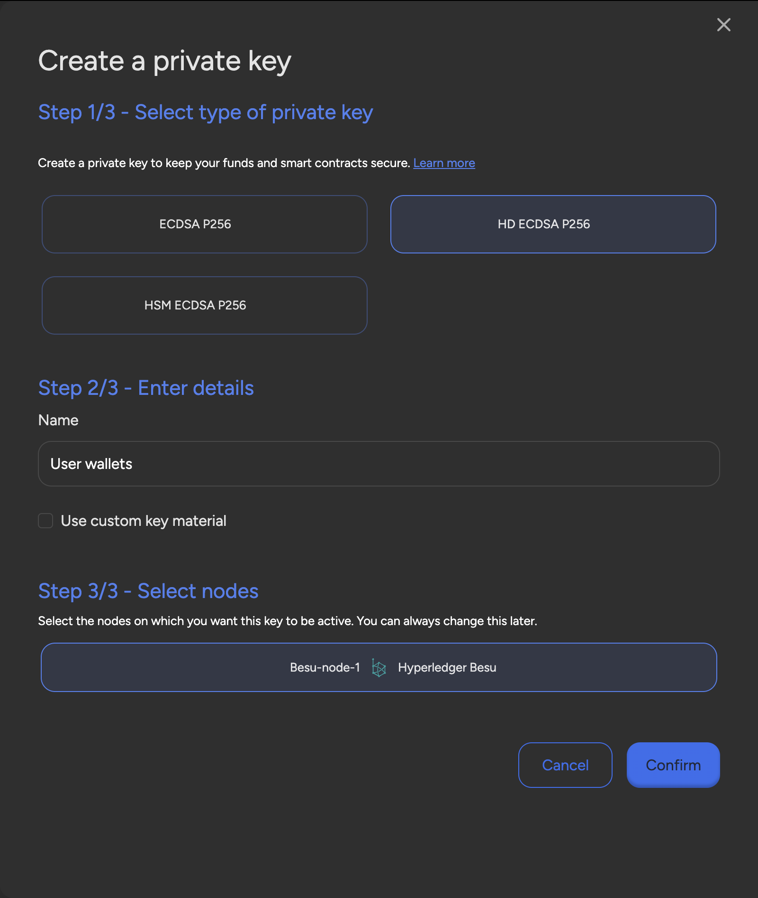
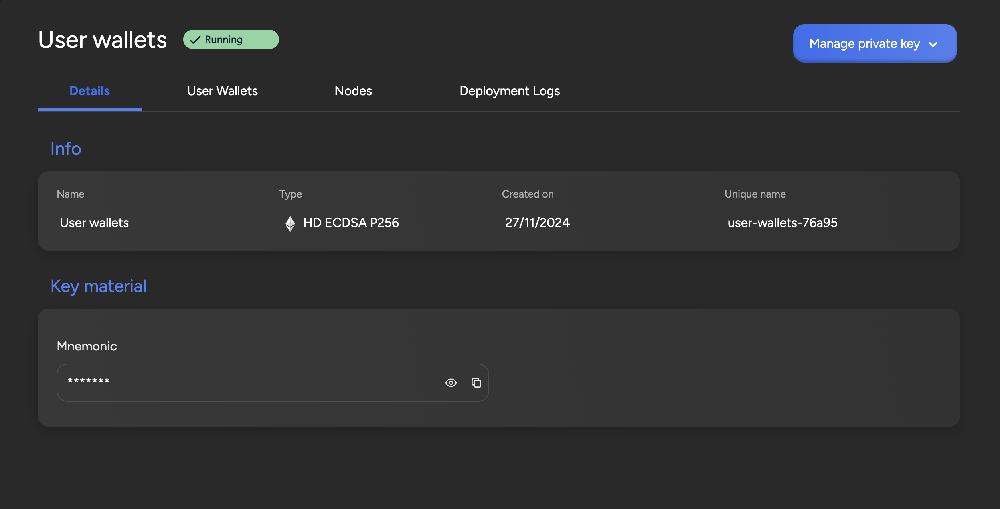
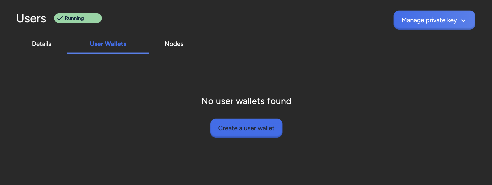
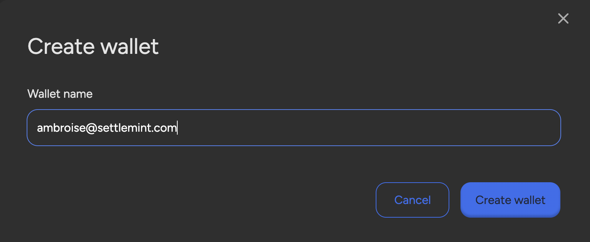
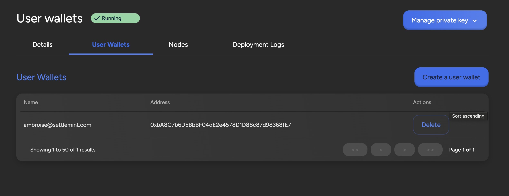

import { Tabs, Tab } from "fumadocs-ui/components/tabs";
import { Callout } from "fumadocs-ui/components/callout";
import { Steps } from "fumadocs-ui/components/steps";
import { Card } from "fumadocs-ui/components/card";

SettleMint's **User Wallets** feature offers a production-ready solution for
managing infinite wallets with efficiency and scalability. This tool empowers
users with seamless wallet generation, ensuring **cost-effective management**
and eliminating additional expenses. By generating **unique addresses for each
user**, privacy is significantly enhanced, while improved performance ensures
faster, parallel transaction processing through separate nonces. User wallet
also simplifies wallet recovery since all wallets are derived from a single
master key. User wallets use the same signing proxy to sign transactions with
the corresponding user private key.

## Set up User Wallets

To set up your user wallets, navigate to your application, click **Private
keys** in the left navigation, and then click **Create a private key**. This
opens a form.

Select **HD ECDSA P256** as the private key type then, enter a **name** for your
deployment. You can also select the nodes or load balancers on which you want to
enable the user wallets. You can change this later if you want to use your user
wallets on a different node. Click **Confirm** to deploy the wallet.

## Create User Wallets

When your deployment status is **Running**, you can click on it to check the
details. You can see the Mnemonic from which the user wallets are generated
under **Key material**.

Upon initialization, the User Wallets section is empty. To create your first
user wallet, click on **Create a user wallet**.

This opens a form in which you must enter a wallet name.

The new user wallet appears in the list.

You can now see the address associated with that user. Remember that for
networks that require gas to perform a transaction, the user wallet should
contain enough funds to cover the gas price. You can fund it using the address
displayed in the list.
