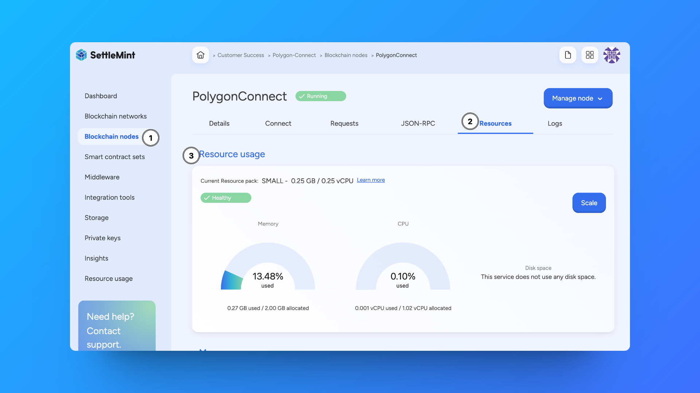
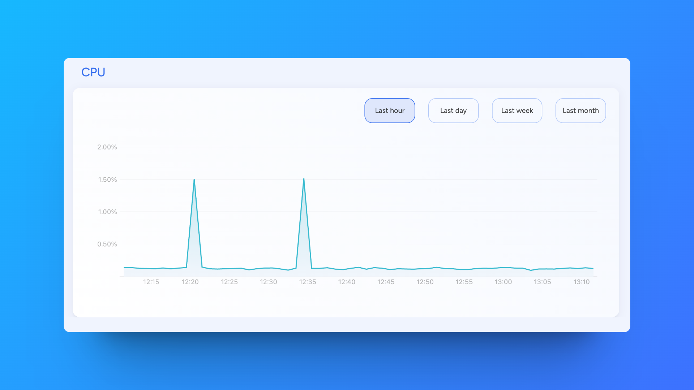

import { Callout } from "fumadocs-ui/components/callout";
import { Card } from "fumadocs-ui/components/card";
import { Steps } from "fumadocs-ui/components/steps";
import { Tab, Tabs } from "fumadocs-ui/components/tabs";

When you add a service (network, node, smart contract set, etc.), you select the
amount of resources to allocate to that service by choosing a small, medium or
large resource pack. Resources are the **memory**, **vCPU**, and **disk space**
you need to keep your services running. You can see the resources allocated to
your services at any time, and follow up on the current resource usage.

## Resource usage metrics

Navigate to your **application**. Click **Blockchain networks**, **Blockchain
nodes** or **Smart contracts** in the left navigation, depending on which
resource usage you want to see, and choose the relevant one from the list.

Open the **Metrics tab**.

Here you have clear visual representation of **used versus allocated** memory,
vCPU, and disk space.

Moreover, detailed graphs are available to check memory, vCPU, and disk space
usage for the last hour, day, week and month.

## Resource usage status

The **status** indicates whether or not your resources are still sufficient for
optimal functioning of the service.

The following statuses are defined:

- **Healthy** - the used resources are less than 75% of the allocated resources
- **Suboptimal** - the used resources are between 75% and 90% of the allocated
  resources
- **Critical** - the used resources are over 90% of the allocated resources

When the status is **Suboptimal**, and the current resource usage is about to
reach its limit, you will see a **warning** with the recommendation to scale
your resource pack to keep the service running.
