## Introducing the SettleMint SDK

<iframe
  width="100%"
  height="400"
  src="https://www.youtube.com/embed/LdzToQRlvGA?si=IQq4u2uSMQKs3xXE"
  title="Introducing the SettleMint SDK"
  allow="accelerometer; autoplay; clipboard-write; encrypted-media; gyroscope; picture-in-picture; web-share"
  referrerPolicy="strict-origin-when-cross-origin"
  allowFullScreen
></iframe>

We're excited to announce the release of the **SettleMint SDK**, a powerful
toolkit designed to streamline blockchain integration into modern applications.
This comprehensive solution provides developers with everything needed to build
and integrate blockchain solutions effectively.

**Key Features**

- **Comprehensive Integration**: Complete suite of tools for interacting with
  SettleMint's blockchain platform services including Smart Contracts, Smart
  Contract Portal Middleware, The Graph Middleware, IPFS, MinIO, and Blockchain
  Explorer
- **Modular Architecture**: Specialized packages that let you pick and choose
  the exact blockchain functionalities your application needs
- **Developer Experience**: Rich development tools with CLI capabilities and
  extensive documentation to accelerate your development process
- **Enterprise Ready**: Production-grade components with built-in support for
  Next.js, GraphQL, and other enterprise technologies
- **Type Safety**: Full TypeScript support across all packages, ensuring strong
  typing and modern development patterns

The SDK simplifies blockchain development by providing pre-built components,
utilities, and integrations while maintaining high standards for type safety,
performance, and developer experience. Whether you're building a new blockchain
application or integrating blockchain capabilities into an existing system, the
SettleMint SDK provides the tools you need.

The SDK is open source and available under the FSL Software License. To get
started, visit our [SDK documentation](/building-with-settlemint/dev-tools/sdk/)
or explore the [SDK GitHub repository](https://github.com/settlemint/sdk).

> This is just the beginning! We'll be continuously expanding the SDK's
> capabilities based on developer feedback and needs. Stay tuned for more
> updates and features.

## Introducing Dev Tools

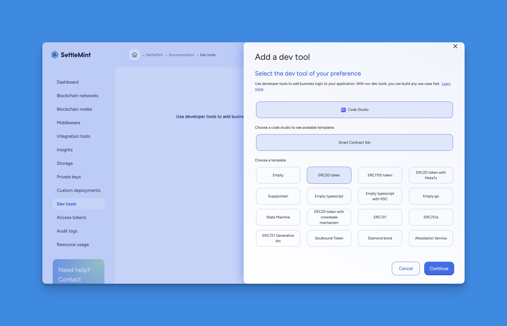

We've made some exciting changes to improve your development experience:

**What's New**

- We've introduced a new **Dev Tools** section that will host various services
  aimed at making the development of decentralized applications easier
- The first tool we're launching is **Code Studio** - our Integrated Development
  Environment (IDE) based on Visual Studio Code
- Smart contract sets are now available as the first type of Code Studio
- For more information on Dev Tools, please refer to the
  [Dev Tools documentation](/building-with-settlemint/dev-tools/dev-tools)

**What's Changed**

- The "Smart contract sets" service has moved into Dev Tools
- Don't worry - all the same great features of Smart contract sets are still
  there, just in a new home!

**Coming Soon**

Stay tuned for more types of Code Studios that will make building decentralized
applications even easier!

---

**Note**: All existing Smart contract sets functionality remains unchanged -
we've just reorganized things to make room for more developer tools.

## Zeto Smart Contract Set

We're excited to introduce the Zeto Smart Contract Set, bringing comprehensive
zero-knowledge token capabilities to the SettleMint platform.

### Token Types

#### Fungible Tokens

1. **Zeto_Anon**

   - Basic anonymous transfers
   - Privacy-preserving transactions
   - Standard fungible features

2. **Zeto_AnonEnc**

   - Encrypted anonymous transfers
   - Enhanced privacy features
   - Encrypted transaction data

3. **Zeto_AnonNullifier**

   - Anonymous with nullifiers
   - Prevents double-spending
   - Transaction tracking without revealing details

4. **Zeto_AnonNullifierKyc**

   - KYC-enabled anonymous transfers
   - Regulatory compliance features
   - Identity verification while maintaining privacy

5. **Zeto_AnonEncNullifier**

   - Encrypted transfers with nullifiers
   - Combined encryption and tracking
   - Maximum privacy with spending controls

6. **Zeto_AnonEncNullifierKyc**
   - KYC-enabled encrypted transfers
   - Full suite of privacy features
   - Compliant with regulatory requirements

#### Non-Fungible Tokens

1. **Zeto_NfAnon**

   - Basic anonymous NFTs
   - Private ownership
   - Hidden transfer history

2. **Zeto_NfAnonNullifier**
   - NFTs with nullifiers
   - Trackable unique assets
   - Privacy-preserving ownership transfers

### Zero-Knowledge DVP (Delivery vs Payment)

- Atomic swaps between any token types
- Private order matching
- Secure settlement verification

### Testing, Deployment & Trusted Setup

- Fast test deployments with pre-configured environments
- Local development setup
- Production deployment helpers & MPC trusted setup guides

### Subgraph Integration

Pre-configured subgraph templates for all contracts

### Open Source Zeto Deployment

- Zeto smart contracts repository:
  [github.com/settlemint/solidity-zeto](https://github.com/settlemint/solidity-zeto)

## Simplified Subgraph Deployments

We've significantly simplified the subgraph deployment process. Here's what's
changed:

**Previously:**

- Required deploying a smart contract set
- Required IPFS deployment
- Middleware needed explicit connections to both smart contract set and IPFS
- Subgraphs could only be deployed to middlewares from their connected smart
  contract set

**Now:**

- Deploy middlewares independently without a smart contract set or IPFS required
- Deploy subgraphs from any smart contract set to any middleware within an
  application

**Key Benefits:**

- Simplified architecture: Reduced deployment complexity and dependencies
- Cost efficiency: Reuse graph middlewares across different smart contract sets
- Enhanced flexibility: Freedom to deploy subgraphs from any smart contract set
  to any middleware

## Run anything as a custom deployment

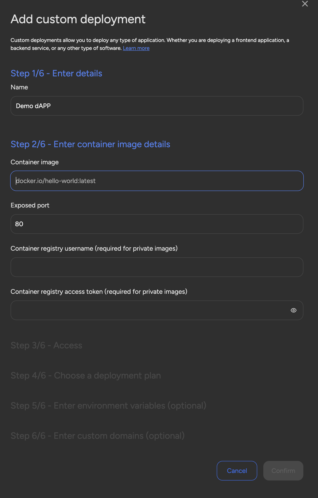

SettleMint is excited to announce a powerful new feature: **Run Anything with
Custom Deployments**! This feature revolutionizes how users can deploy
decentralized applications (dApps) on our platform, offering unprecedented
flexibility and control. Whether you’re developing a fintech platform, an NFT
marketplace, or a DeFi solution, Custom Deployments let you seamlessly integrate
your custom-built front-end and web technologies while leveraging the robust
blockchain backend that SettleMint provides.

With **Custom Deployments**, you now have the freedom to design applications
according to your specific needs. This includes using custom domains for a more
professional appearance, integrating advanced functionalities, and selecting the
best infrastructure for your use case. The platform allows for flexible
application design, which means you can use your preferred frameworks,
programming languages, and design architectures without limitations. For
instance, a fintech company developing a peer-to-peer lending platform can now
deploy a user-friendly interface that meets their precise user requirements,
streamlining the entire deployment process.

Moreover, this feature unlocks enhanced scalability and security for your dApps.
With SettleMint’s scalable infrastructure, you can handle high traffic and
performance peaks seamlessly, ensuring your application grows as your user base
expands. Additionally, our secure environment ensures your deployments meet the
highest security standards, making Custom Deployments perfect for businesses
that need to maintain trust and reliability with their users, such as investment
firms launching asset tokenization platforms or DeFi platforms managing
cross-chain transfers.

## Integration of external consortia

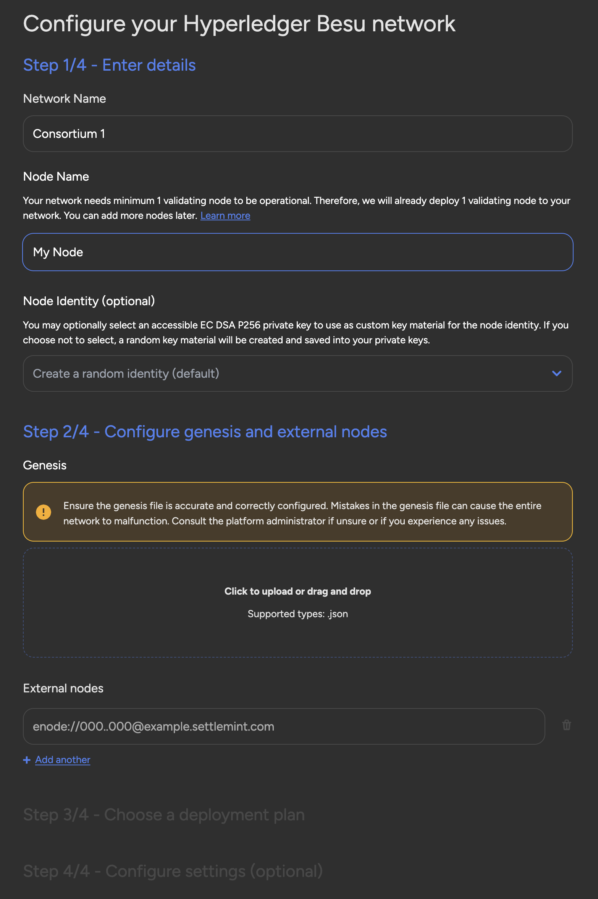

We’re excited to introduce a new feature in SettleMint that lets you connect
directly to existing Hyperledger Besu and Quorum blockchain networks run by
other organizations. This is a big win for businesses already involved in
blockchain consortia or those looking to join one. With this feature, you can
create nodes on the SettleMint platform and easily integrate with these
permissioned networks, making collaboration with external partners more
streamlined and secure.

For companies working within consortia, this feature simplifies the process of
joining networks that are already up and running. Whether you’re part of a
supply chain network, a financial services consortium, or any other multi-party
blockchain setup, you can now seamlessly connect without needing to build or
manage the entire network yourself. This opens the door to stronger
collaboration and more efficient operations, as all members of the consortium
can easily contribute while maintaining control over their own nodes.

By allowing organizations to integrate into these existing networks, this
feature helps businesses accelerate their blockchain journey. It’s a powerful
tool for enhancing transparency, security, and trust between partners in a
consortium. With SettleMint, you can now tap into the benefits of shared
blockchain networks with minimal setup, helping your enterprise grow and
innovate alongside trusted collaborators.

## Support the Soneium Network

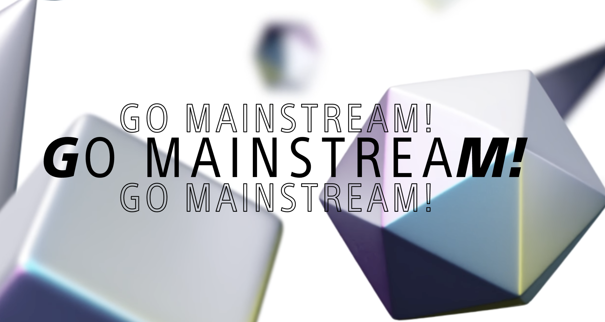

SettleMint’s support for the Soneium testnet is a significant boost for
developers wanting to build on this efficient blockchain platform. Soneium is
designed for scalability and offers a great environment for testing
decentralized applications (dApps) before going live. With this integration,
developers can take advantage of SettleMint’s powerful tools while experimenting
with Soneium’s features, like low transaction costs and high processing speed.
This makes it easier for teams to test their applications effectively and make
quick adjustments as needed.

By supporting the Soneium testnet, SettleMint improves the development
experience by providing a secure and flexible space for developers to refine
their applications. Users can easily deploy their dApps on the Soneium testnet,
benefiting from its advanced features while using SettleMint’s straightforward
interface and tools. This partnership not only encourages innovation but also
helps developers create more reliable and efficient blockchain solutions,
supporting the growth and adoption of the Soneium ecosystem.

SettleMint is also committed to supporting the Soneium mainnet as soon as it
goes live. This means that developers who have been testing their applications
on the Soneium testnet can seamlessly transition to the mainnet without any
disruptions. By providing immediate support for the mainnet, SettleMint ensures
that developers can launch their dApps confidently, leveraging the full
capabilities of the Soneium blockchain from day one. This approach not only
streamlines the deployment process but also allows teams to continue building on
the solid foundation they established during their testing phase, making it
easier to bring innovative solutions to the market.

## User Wallet Manager

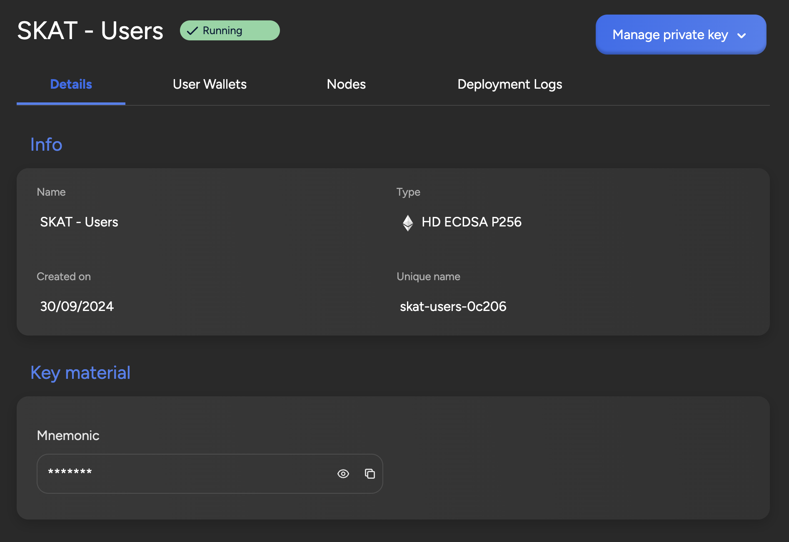

The User Wallet Manager feature within SettleMint provides a sophisticated and
elegant solution for account management and identity masking through the use of
Hierarchical Deterministic (HD) wallets. These HD wallets generate a structured
hierarchy of private/public key pairs from a single master seed, allowing users
to create a unique address for every transaction. This approach not only
enhances privacy and security—since the addresses are related but not publicly
linked—but also streamlines the management of keys. Users can efficiently create
multiple child wallets under a single parent wallet, making it easy to
categorize funds and back up their assets securely.

One of the most significant benefits of the User Wallet Manager is its ability
to mask user identity on a per-transaction basis. This feature provides an
unlimited supply of account addresses, each with its own unique, untraceable
private key. Organizations can manage different transaction classes or allocate
accounts for various end users, significantly enhancing operational flexibility.
This capability is especially beneficial for businesses that require distinct
accounts for different functions, enabling them to avoid key reuse and duplicate
signing, which can pose security risks.

Moreover, the User Wallet Manager’s HD wallet functionality greatly simplifies
asset management for both individuals and enterprises. By allowing businesses to
partition separate wallets within their organization, it enhances organizational
efficiency and security. The ability to recover entire wallet structures from a
single master seed minimizes the risk associated with losing individual keys,
making it an attractive option for financial services looking to deliver a
secure blockchain solution.

## Customize Kubernetes deployment settings

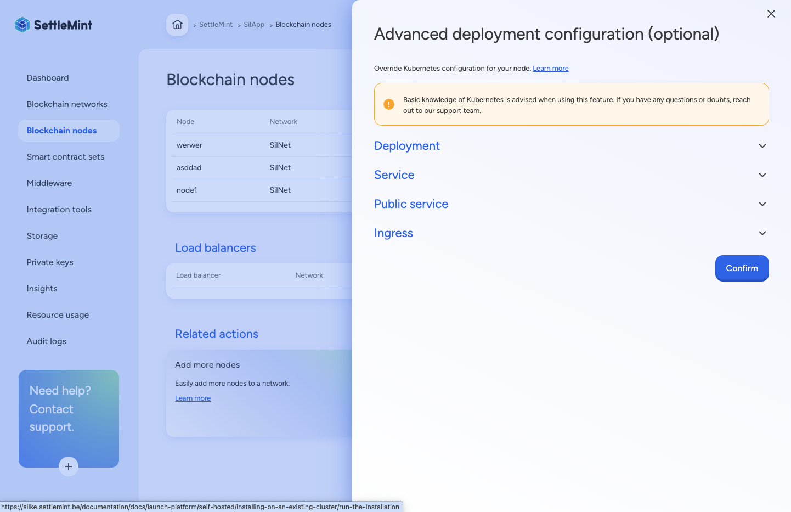

The feature to customize Kubernetes deployment settings within SettleMint offers
users an intuitive user interface (UI) that simplifies the management of
deployed services in self-managed installations. This UI provides a
comprehensive set of options for adjusting key deployment parameters, such as
annotations, labels, tolerations, affinity, and node selectors. By making these
customization options readily accessible, SettleMint enables users to tailor
their Kubernetes configurations to better align with their specific operational
needs and infrastructure requirements, fostering a more efficient and optimized
deployment process.

One of the standout benefits of this feature is its ability to facilitate
seamless integration into existing infrastructure. Organizations often have
unique requirements based on their operational environment, and the
customization options provided by SettleMint empower users to implement any
necessary settings effortlessly. This flexibility ensures that deployments can
adhere to organizational policies and best practices while maintaining
compatibility with the broader Kubernetes ecosystem. By allowing users to
specify their desired configurations directly through the UI, SettleMint reduces
the complexity typically associated with Kubernetes management, allowing teams
to focus on their core business objectives.

Moreover, the customization of deployment settings significantly enhances the
scalability and resilience of services within the Kubernetes environment. By
leveraging advanced features like affinity and tolerations, users can optimize
resource allocation and improve workload distribution across nodes, leading to
better performance and reliability. The ability to modify labels and annotations
also aids in effective resource management, enabling users to implement advanced
monitoring, logging, and orchestration strategies tailored to their needs.
Overall, this feature empowers users to harness the full potential of their
Kubernetes deployments, ensuring they can operate efficiently and effectively
within their own customized infrastructure.

## Support QBFT for Besu

QBFT (Quorum Byzantine Fault Tolerance) is the latest consensus algorithm now
available in Hyperledger Besu on the SettleMint platform. This
proof-of-authority consensus mechanism is designed to provide enhanced security,
scalability, and performance for enterprise blockchain networks. QBFT ensures
that all participating nodes in the network agree on the state of the
blockchain, even in the presence of potentially malicious actors or network
failures. By utilizing a leader-based system with rotating block proposers, QBFT
maintains network integrity while allowing for efficient transaction processing.

Compared to its predecessor, IBFTv2, QBFT offers several significant
improvements. First and foremost, QBFT provides immediate transaction finality,
meaning that once a block is added to the chain, it's considered final and
cannot be reversed. This feature is particularly crucial for financial
applications where transaction certainty is paramount. Additionally, QBFT boasts
enhanced performance metrics, with faster block times and higher transaction
throughput. The algorithm also incorporates improved security measures,
including protection against certain types of attacks that could potentially
compromise IBFTv2 networks. These enhancements make QBFT a more robust and
efficient choice for enterprise-grade blockchain deployments.

We're excited to announce that QBFT is now the default consensus algorithm for
all new Hyperledger Besu networks deployed on the SettleMint platform. This
means that users can immediately take advantage of QBFT's benefits when
launching their blockchain projects.

## Attestation Service

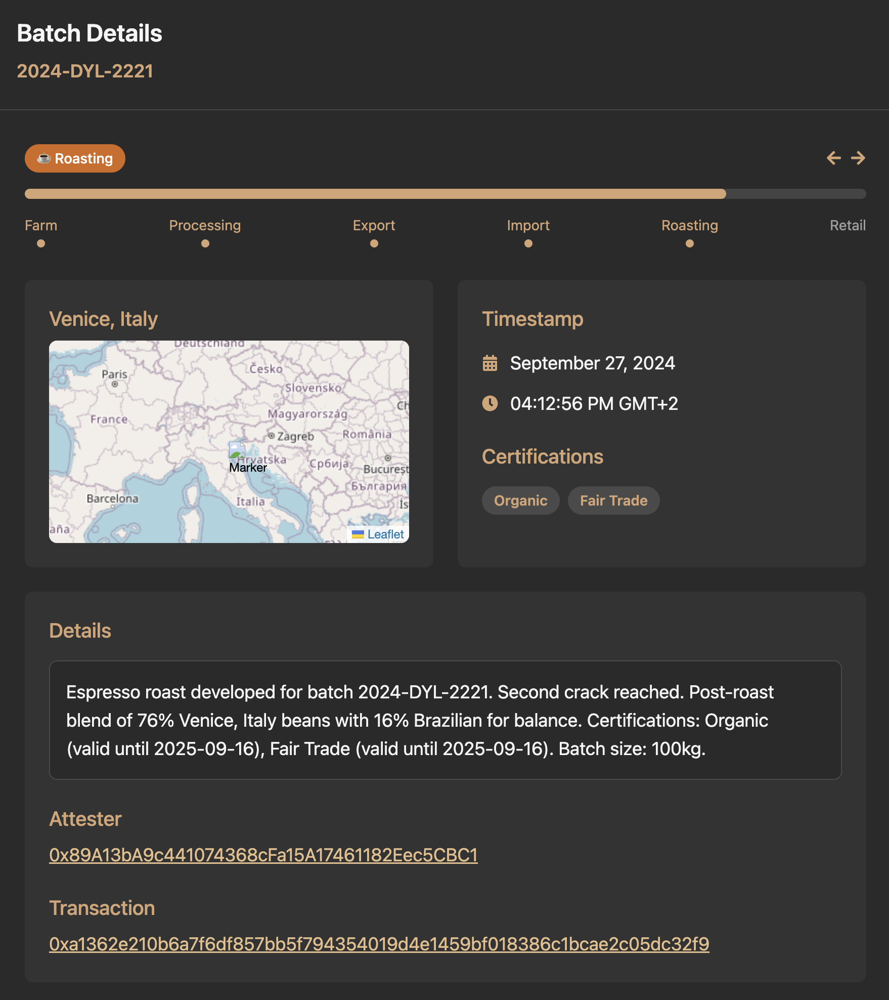

The Attestation Service is a groundbreaking framework designed to facilitate the
creation, management, and verification of attestations on EVM cpmpatible
blockchains (public or cosortium). By leveraging the decentralized and immutable
nature of blockchain technology, it allows individuals and organizations to
issue verifiable statements of fact, which can include anything from identity
verification to compliance with regulatory standards. This service empowers
users to maintain control over their data while providing transparency and
trustworthiness to various processes.

One of the most remarkable aspects of the Attestation Service is its potential
to streamline numerous processes across various industries. For instance, in the
realm of education, institutions can issue verified diplomas and certifications
that are tamper-proof, ensuring that employers can trust the qualifications of
job candidates. In healthcare, medical professionals can share validated
credentials, thus enhancing patient safety and care quality. The Attestation
Service also plays a crucial role in compliance-related scenarios, allowing
businesses to demonstrate adherence to regulations and standards seamlessly,
reducing the burden of paperwork and audits.

The versatility of the Attestation Service extends to a wide array of use cases,
making it an invaluable tool for both individuals and enterprises. Beyond
identity verification and compliance, EAS can be applied to create transparent
voting systems, enhance reputation management in decentralized finance (DeFi),
and even support peer-to-peer lending by validating the creditworthiness of
borrowers. Moreover, in the realm of environmental sustainability, it can help
track and verify carbon credits, ensuring that claims about carbon offsets are
accurate and trustworthy. Overall, the Ethereum Attestation Service stands as a
transformative solution, unlocking new possibilities for trust and verification
in our increasingly digital world.

## Customize Genesis, Bootnode lists and key material

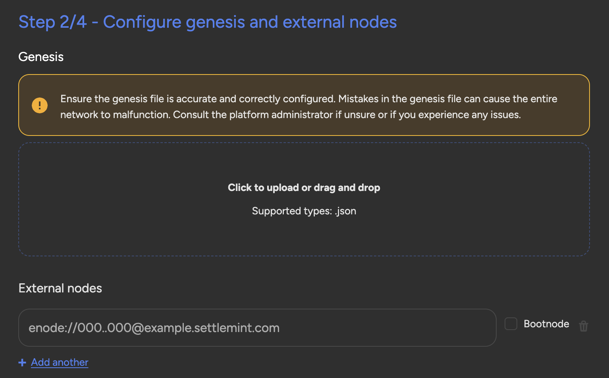

You can now create new consortium networks where you have the capability to
customize literally everything.

1. You can build your own genesis files,
2. Import them from external sources
3. Customize boot node lists and the key material used for your nodes

This allows you to do a variety of use cases that were impossible before.

For example, you can migrate between different networks and different instances
of the SettleMint platform. You can execute your own hard forks, customize
settings that are not customizable via the UI, join external consortia that are
restricted by identity or just in general join any external network you want.

## Audit logs

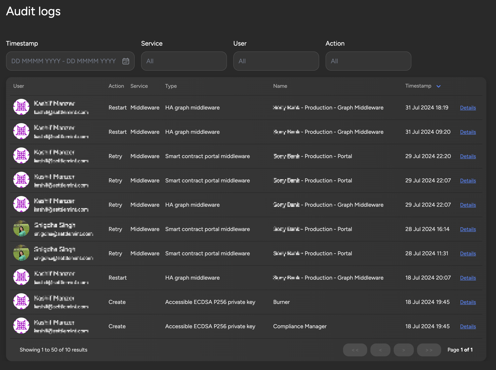

Every application and organization/workspace now has full access to the audit
log. This will help you ensure maximum compliance in enterprise environments.

## Smart Contract Portal

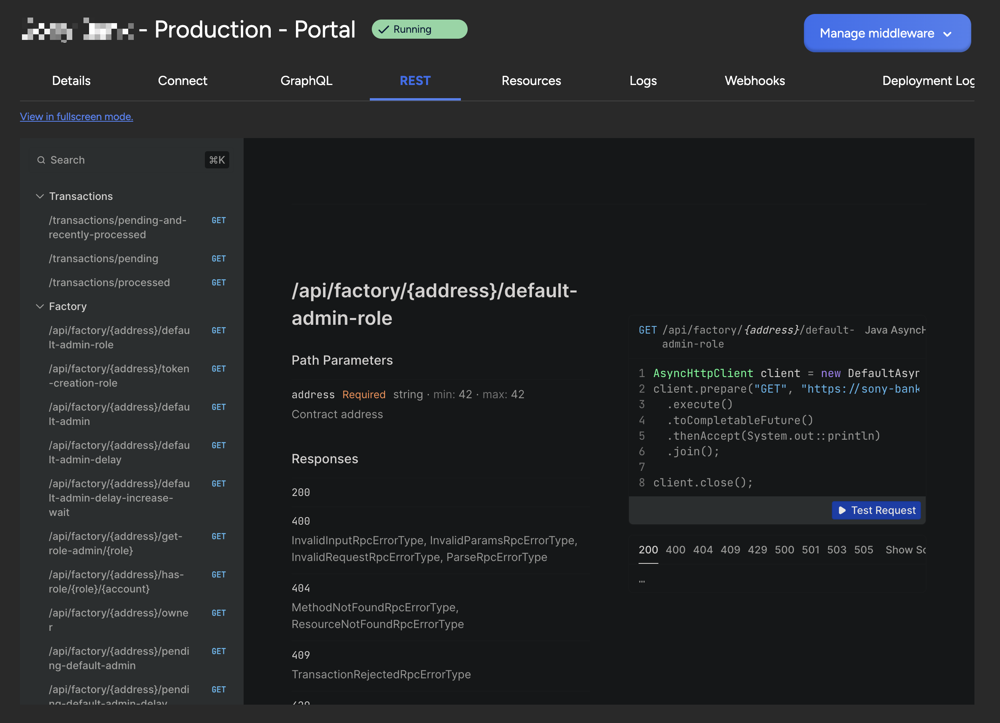

The Smart Contract Portal is a middleware which creates an easy to use api on
top of your smart contracts. It can be used with all EVM-compatible chains like
Ethereum, Hyperledger Besu, Polygon, Binance Smart Chain, Avalanche, etc. You
can run it on your own blockchain nodes (both public and permissioned) or on a
Load Balancer. Benefits of using the smart contract portal:

1. Simplified Integration: APIs allow developers to interact with complex smart
   contract functions through familiar interfaces, reducing the need to
   understand blockchain-specific languages and protocols.

2. Data Aggregation: APIs can consolidate data from multiple smart contracts,
   providing a unified view.

3. Improved Performance: GraphQL optimizes data fetching, ensuring that clients
   retrieve only the necessary data in a single request, reducing network load
   and improving performance.

4. Stack agnostic: Teams are free to choose their own technology stack.

## Installation guide for GCP

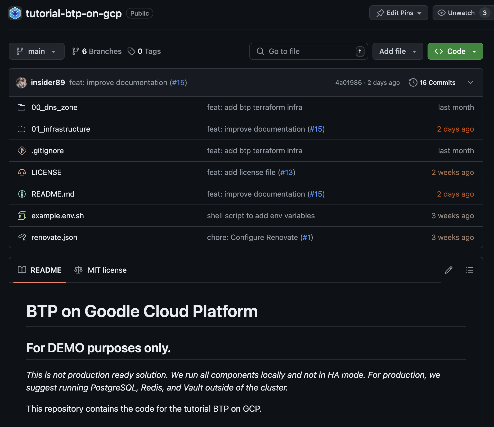

Getting started with the self-managed platform might seem daunting, but in
practice it is not that complex. To showcase this we have open-sourced a
complete guide and Terraform module to do so on GCP. From 0 to hero in about 30
minutes!

Get started today on
[https://github.com/settlemint/tutorial-btp-on-gcp ](https://github.com/settlemint/tutorial-btp-on-gcp)

## Hashgraph Hedera

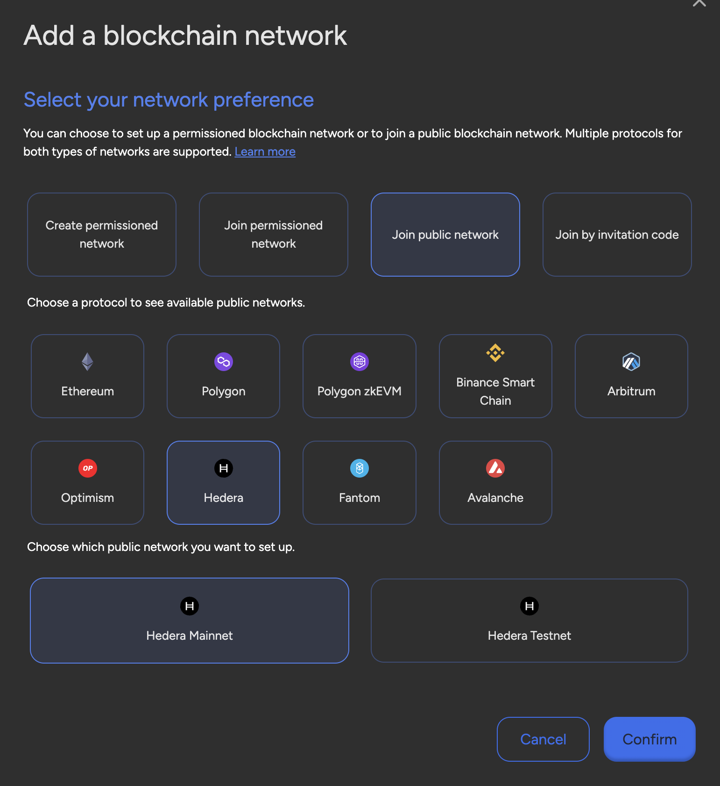

Hedera is a public distributed ledger technology (DLT) network that was launched
in August 2018 by Hedera Hashgraph, LLC. It uses the Hashgraph consensus
algorithm, which is a unique and novel approach to achieving consensus in a
distributed network.

Hedera's native cryptocurrency is called HBAR, and it is used to power the
network’s services, including smart contracts, file storage, and regular
transactions.

Hedera focuses on providing high throughput, low latency, and fair transaction
ordering, making it suitable for enterprise-grade applications. Unlike
blockchain-based systems, Hedera’s Hashgraph algorithm ensures fast, fair, and
secure transactions without compromising decentralization. We support, the
Hedera Mainnet and the Hedera Testnet.

## Embedded o11y infrastructure

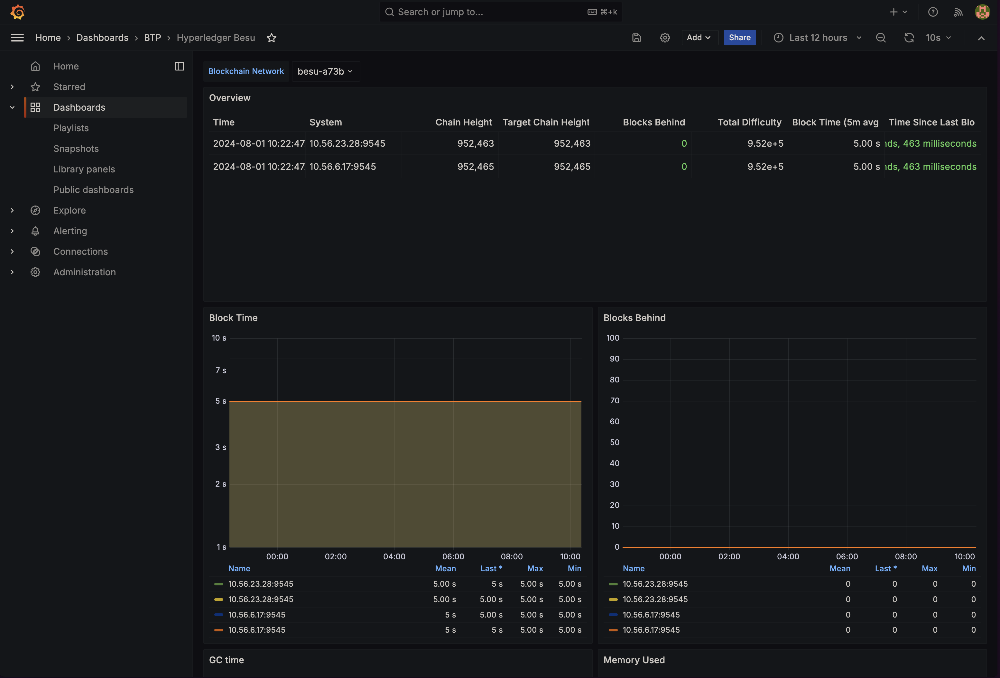

The platform now includes a complete observability suite. It powers the resource
metrics and logs in the platform UI, and includes a Grafana instance for
operation personel to track any metric they wish to follow.

## Polygon Amoy

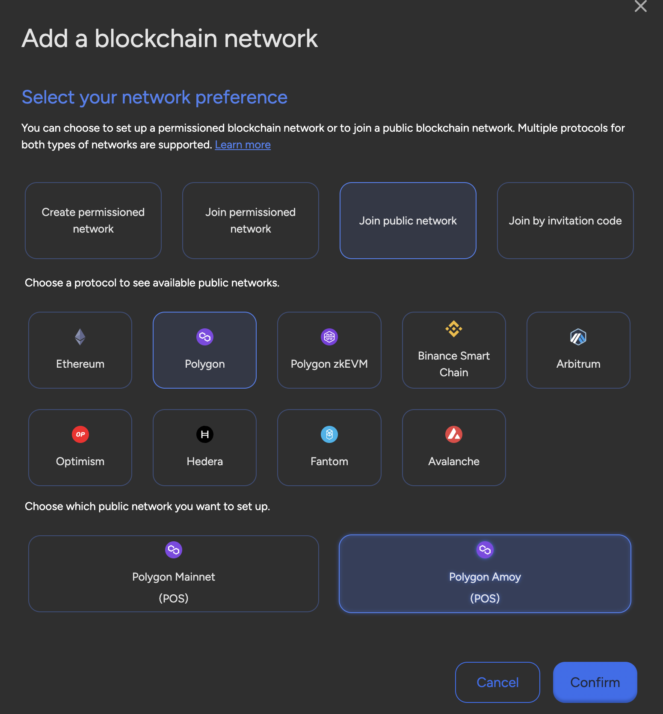

The beloved and widely used Mumbai testnet for Polygon PoS uses Ethereum Goerli
testnet as its root chain. This means Mumbai counts on Goerli for block
production.  But Goerli is currently scheduled for deprecation, by the end of
Q1 2024. The Amoy testnet for Polygon PoS is the replacement and has been
launched, a new testnet that provides a low-stakes environment to build, test,
and break things.  Amoy will use Ethereum Sepolia testnet as the root (L1)
chain. Developers deploying on Amoy can continue to count on the availability of
essential validators, infra, faucets, tooling, and more, in a sustainable and
future-proof environment. Now available in the SettleMint platform.

> Any Mumbai nodes will cease to function in the near future, please migrate
> your applications as soon as possible.

## Managed Platform v7

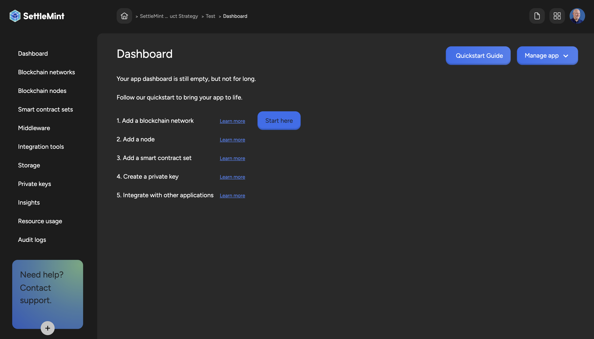

The managed platform has been upgraded to the same codebase as the earlier
Self-Managed release, providing a secure and more importantly, low barrier entry
to transofring your organisation with Blockchain

## Self-Managed platform v7

Fully modular overhaul of the self managed platform to enable maximum
flexibility in its deployment and feature parity with the Managed Platform

- New and improved Helm chart to deploy the platform on your own infrastructure

- Fully customisable and configurable via the Helm values

- Complete feature parity, from services to service deployment with the Managed
  platform (same codebase and helm chart)

- Dramatically improved performance in restrictive environments

- [Open-Source Smart Contract](https://github.com/settlemint) sets and the
  ability to build custom sets from these templates and add them as default
  options in the platform

Get in touch with your SettleMint contact to upgrade or start a trial
