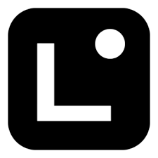

import { Card, Cards } from 'fumadocs-ui/components/card';
import { Callout } from 'fumadocs-ui/components/callout';
import { Tabs, Tab } from 'fumadocs-ui/components/tabs';
import { Step, Steps } from 'fumadocs-ui/components/steps';

  

    
  

  

    

      Linea is Consensys' production zkEVM rollup that delivers sub-cent transaction fees, rapid block finality, and Ethereum security without sacrificing developer experience. With native integrations to MetaMask, Infura, and leading Consensys tooling, Linea accelerates enterprise-grade deployments on Ethereum.
    

  

## Why launch applications on Linea?

<Cards>
  <Card title="Ethereum Security" description="Zero-knowledge proofs inherit Ethereum's security while providing deterministic finality for mission-critical use cases." />
  <Card title="Native Tooling" description="First-class support from MetaMask, Infura, Besu, and Truffle reduces integration time for enterprise teams." />
  <Card title="Cost Efficiency" description="Average fees below $0.05 enable micro-transactions, loyalty experiences, and data-rich workflows." />
  <Card title="Global Ecosystem" description="100+ DeFi, gaming, and infrastructure partners available through Linea's Voyage and Builder programs." />
</Cards>

<Callout type="info">
  **Consensys Backing**: Linea is operated by Consensys, the team behind MetaMask and Infura, providing long-term roadmap stability, compliance readiness, and commercial support SLAs for regulated industries.
</Callout>

## What differentiates Linea's zkEVM?

<Tabs items={['Proof System', 'Developer Ergonomics', 'Business Readiness']}>
  <Tab value="Proof System">
    - **Type 2 zkEVM**: Bytecode-level compatibility with the EVM for seamless contract migration.
    - **Advanced Compression**: Multi-proof aggregation reduces settlement costs on Ethereum mainnet.
    - **Deterministic Finality**: Validity proofs finalize within minutes, eliminating reorg risk for high-value workflows.
    - **Shared Sequencing**: Roadmap toward decentralized sequencers to distribute ordering responsibility.
  </Tab>
  <Tab value="Developer Ergonomics">
    - **MetaMask Snaps & SDKs**: Ship user journeys faster with native wallet integrations.
    - **Linea Voyage Testnets**: Incentivized testing environments to validate throughput before mainnet.
    - **Infura Endpoints**: Production-grade RPC infrastructure with global load balancing and analytics.
    - **Open-Source Tooling**: Full support for Hardhat, Foundry, Truffle, and Solidity debugging workflows.
  </Tab>
  <Tab value="Business Readiness">
    - **Compliance Partnerships**: Integrations with on-chain monitoring, KYC, and reporting providers.
    - **Enterprise Support**: Dedicated Consensys success plans and incident response.
    - **Stablecoin Liquidity**: Deep USDC and ETH liquidity pools for instant settlement.
    - **Launch Programs**: Marketing and co-selling opportunities through Linea Builder initiatives.
  </Tab>
</Tabs>

## Available Networks

<Cards>
  <Card 
    title="Linea Mainnet" 
    description="Production zkEVM network secured by Ethereum. Ideal for consumer-scale applications needing low fees, rapid finality, and seamless MetaMask adoption."
  />
  <Card 
    title="Linea Sepolia" 
    description="Go-to testnet for staging deployments with faucet availability, L2 data availability testing, and configurable throughput scenarios."
  />
</Cards>

<Callout type="tip">
  **Smooth Migration**: Deploy existing Solidity contracts without refactoring thanks to Linea's bytecode-level equivalence and robust compatibility testing.
</Callout>

## Linea zkEVM architecture at a glance

<Steps>
  <Step>
    **Rollup Sequencing**

    Transactions are batched by Linea's sequencer and committed to Ethereum with data availability guarantees, preserving ordering and timestamping for audits.
  </Step>

  <Step>
    **Zero-Knowledge Proving**

    Proofs are generated using Consensys' lattice-based prover pipeline that balances throughput with cost efficiency, enabling predictable settlement windows.
  </Step>

  <Step>
    **Settlement on Ethereum**

    Aggregated proofs are validated on Ethereum mainnet contracts, ensuring finality anchored in Ethereum's Proof of Stake consensus.
  </Step>

  <Step>
    **Ecosystem Tooling**

    Developers access analytics, monitoring, and DevOps support through Consensys' platform services, ensuring successful production rollouts.
  </Step>
</Steps>

<Callout type="info">
  Linea offers enterprise-grade SLAs, optional private support channels, and extensive compliance tooling integrations—ideal for regulated use cases and multinational deployments.
</Callout>
