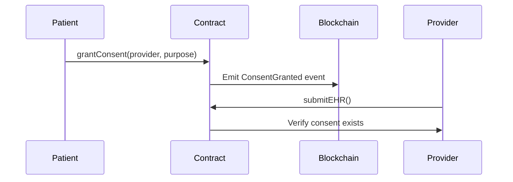

A healthcare smart contract is a blockchain-based program designed to automate and securely manage various processes within the healthcare ecosystem, such as patient data access, provider accreditation, insurance claim processing, and treatment record keeping. These contracts enforce logic through code, ensuring that only authorized entities can perform sensitive actions like registering patients, submitting medical claims, or accessing health records. By using cryptographic consent and role-based access control, healthcare smart contracts give patients greater control over their data while reducing the administrative overhead for providers and insurers. All interactions are logged immutably, providing transparency and accountability for regulators and auditors.

The use of healthcare smart contracts supports a wide range of applications, including the creation of national electronic health record systems, streamlined insurance claim workflows, public health campaign tracking, and secure sharing of health credentials. These contracts help address major challenges in the healthcare sector such as data fragmentation, fraud, manual processing delays, and lack of traceability. They ensure compliance with legal frameworks by encoding privacy rules directly into the system and by enabling real-time auditability of care delivery and financial transactions.


## Disclaimer

This smart contract implementation is provided for educational and illustrative
purposes only. It represents a conceptual framework for blockchain-based land
registry systems.

Key considerations before any production use:

- **Legal Compliance**: healthcare systems are highly regulated and vary
  significantly by jurisdiction. This implementation would require substantial
  modification to meet specific legal requirements in any given location.

- **Security Review**: The contract should undergo comprehensive security
  auditing by qualified blockchain security professionals before handling real
  user or financial transactions.

- **No Warranty**: The authors and contributors disclaim all liability for any
  use of this software. Users assume all risks associated with implementation
  and operation.

- **Consultation Required**: Any organization considering use of this technology
  should obtain advice from qualified legal counsel, and blockchain security experts before deployment.


```solidity
// SPDX-License-Identifier: MIT
pragma solidity ^0.8.19;

import "@openzeppelin/contracts-upgradeable/proxy/utils/Initializable.sol";
import "@openzeppelin/contracts-upgradeable/proxy/utils/UUPSUpgradeable.sol";
import "@openzeppelin/contracts-upgradeable/access/AccessControlUpgradeable.sol";
import "@openzeppelin/contracts-upgradeable/utils/CountersUpgradeable.sol";
import "@openzeppelin/contracts-upgradeable/security/PausableUpgradeable.sol";
import "@openzeppelin/contracts-upgradeable/security/ReentrancyGuardUpgradeable.sol";

contract NationalHealthcareSystem is 
    Initializable,
    UUPSUpgradeable,
    AccessControlUpgradeable,
    PausableUpgradeable,
    ReentrancyGuardUpgradeable
{
    using CountersUpgradeable for CountersUpgradeable.Counter;

    // ========== CONSTANTS ==========
    bytes32 public constant ADMIN_ROLE = keccak256("ADMIN_ROLE");
    bytes32 public constant PROVIDER_ROLE = keccak256("PROVIDER_ROLE");
    bytes32 public constant AUDITOR_ROLE = keccak256("AUDITOR_ROLE");
    
    // ICD-10 code length validation
    uint256 public constant MIN_DIAGNOSIS_CODE_LENGTH = 3;
    uint256 public constant MAX_DIAGNOSIS_CODE_LENGTH = 7;

    // ========== STRUCTS ==========
    struct Patient {
        address walletAddress;
        bytes32 nationalIdHash; // SHA-3 hashed national ID
        bool isActive;
        uint256 registrationDate;
        uint256 lastUpdated;
    }

    struct Provider {
        string name;
        string licenseNumber;
        string providerType; // "HOSPITAL"|"CLINIC"|"LAB"
        bool isActive;
        bool isSuspended;
        uint256 registrationDate;
        uint256 lastUpdated;
    }

    struct Consent {
        address providerAddress;
        bool isGranted;
        uint256 grantDate;
        uint256 revokeDate;
        string purpose; // "TREATMENT"|"CLAIMS"|"RESEARCH"
    }

    struct EHR {
        string ipfsHash;
        address providerAddress;
        string documentType; // "PRESCRIPTION"|"LAB_RESULT"|"IMAGE"
        uint256 timestamp;
        bytes32 dataHash; // Hash of original data for integrity
    }

    struct InsuranceClaim {
        address patientAddress;
        address providerAddress;
        string diagnosisCode; // ICD-10
        uint256 amountRequested;
        uint256 amountApproved;
        ClaimStatus status;
        uint256 submissionDate;
        uint256 approvalDate;
        uint256 settlementDate;
        string denialReason;
    }

    enum ClaimStatus {
        PENDING,
        APPROVED,
        DENIED,
        SETTLED
    }

    // ========== STATE VARIABLES ==========
    CountersUpgradeable.Counter private _patientIds;
    CountersUpgradeable.Counter private _claimIds;

    mapping(uint256 => Patient) private _patients;
    mapping(address => Provider) private _providers;
    mapping(address => mapping(address => Consent)) private _consents;
    mapping(address => EHR[]) private _patientEHRs;
    mapping(uint256 => InsuranceClaim) private _claims;
    mapping(bytes32 => bool) private _registeredNationalIds;
    mapping(address => uint256) private _addressToPatientId;
    mapping(string => uint256) private _licenseToProviderCount;

    // ========== EVENTS ==========
    event PatientRegistered(uint256 indexed patientId, address indexed walletAddress);
    event PatientUpdated(uint256 indexed patientId, bool isActive);
    event ProviderRegistered(address indexed providerAddress, string providerType);
    event ProviderUpdated(address indexed providerAddress, bool isActive, bool isSuspended);
    event ConsentGranted(address indexed patientAddress, address indexed providerAddress, string purpose);
    event ConsentRevoked(address indexed patientAddress, address indexed providerAddress);
    event EHRAdded(address indexed patientAddress, address indexed providerAddress, string documentType, string ipfsHash);
    event ClaimSubmitted(uint256 indexed claimId, address indexed patientAddress, string diagnosisCode);
    event ClaimApproved(uint256 indexed claimId, uint256 amountApproved);
    event ClaimDenied(uint256 indexed claimId, string reason);
    event ClaimSettled(uint256 indexed claimId);
    event EmergencyPaused(address indexed admin);
    event EmergencyUnpaused(address indexed admin);

    // ========== MODIFIERS ==========
    modifier onlyActiveProvider() {
        require(
            _providers[msg.sender].isActive && !_providers[msg.sender].isSuspended,
            "Provider not active"
        );
        _;
    }

    modifier onlyValidPatient(address patientAddress) {
        require(_addressToPatientId[patientAddress] != 0, "Patient not registered");
        _;
    }

    modifier onlyWithConsent(address patientAddress) {
        require(
            _consents[patientAddress][msg.sender].isGranted,
            "Consent not granted"
        );
        _;
    }

    modifier validDiagnosisCode(string memory code) {
        bytes memory codeBytes = bytes(code);
        require(
            codeBytes.length >= MIN_DIAGNOSIS_CODE_LENGTH && 
            codeBytes.length <= MAX_DIAGNOSIS_CODE_LENGTH,
            "Invalid diagnosis code"
        );
        _;
    }

    // ========== INITIALIZATION ==========
    /// @custom:oz-upgrades-unsafe-allow constructor
    constructor() {
        _disableInitializers();
    }

    function initialize(address superAdmin) public initializer {
        __AccessControl_init();
        __UUPSUpgradeable_init();
        __Pausable_init();
        __ReentrancyGuard_init();

        _setupRole(DEFAULT_ADMIN_ROLE, superAdmin);
        _setupRole(ADMIN_ROLE, superAdmin);
        _setupRole(AUDITOR_ROLE, superAdmin);
    }

    function _authorizeUpgrade(address newImplementation) 
        internal 
        override 
        onlyRole(DEFAULT_ADMIN_ROLE) 
    {}

    // ========== PATIENT REGISTRY (ENHANCED) ==========
    function registerPatient(
        address walletAddress,
        bytes32 nationalIdHash,
        bytes calldata governmentSignature
    ) external onlyRole(ADMIN_ROLE) whenNotPaused nonReentrant {
        require(!_registeredNationalIds[nationalIdHash], "Patient already registered");
        require(_addressToPatientId[walletAddress] == 0, "Wallet already registered");
        require(_verifyGovernmentSignature(walletAddress, nationalIdHash, governmentSignature), "Invalid signature");

        _patientIds.increment();
        uint256 patientId = _patientIds.current();

        _patients[patientId] = Patient({
            walletAddress: walletAddress,
            nationalIdHash: nationalIdHash,
            isActive: true,
            registrationDate: block.timestamp,
            lastUpdated: block.timestamp
        });

        _registeredNationalIds[nationalIdHash] = true;
        _addressToPatientId[walletAddress] = patientId;

        emit PatientRegistered(patientId, walletAddress);
    }

    function updatePatientStatus(uint256 patientId, bool isActive) external onlyRole(ADMIN_ROLE) {
        require(_patients[patientId].walletAddress != address(0), "Patient not found");
        _patients[patientId].isActive = isActive;
        _patients[patientId].lastUpdated = block.timestamp;

        emit PatientUpdated(patientId, isActive);
    }

    // ========== PROVIDER REGISTRY (ENHANCED) ==========
    function registerProvider(
        address providerAddress,
        string memory name,
        string memory licenseNumber,
        string memory providerType,
        bytes calldata accreditationProof
    ) external onlyRole(ADMIN_ROLE) whenNotPaused {
        require(!_providerExists(providerAddress), "Provider already registered");
        require(_verifyAccreditation(providerAddress, licenseNumber, providerType, accreditationProof), "Invalid accreditation");

        _providers[providerAddress] = Provider({
            name: name,
            licenseNumber: licenseNumber,
            providerType: providerType,
            isActive: true,
            isSuspended: false,
            registrationDate: block.timestamp,
            lastUpdated: block.timestamp
        });

        _licenseToProviderCount[licenseNumber]++;
        _grantRole(PROVIDER_ROLE, providerAddress);

        emit ProviderRegistered(providerAddress, providerType);
    }

    function suspendProvider(address providerAddress, bool suspend) external onlyRole(ADMIN_ROLE) {
        require(_providerExists(providerAddress), "Provider not found");
        _providers[providerAddress].isSuspended = suspend;
        _providers[providerAddress].lastUpdated = block.timestamp;

        emit ProviderUpdated(providerAddress, _providers[providerAddress].isActive, suspend);
    }

    // ========== CONSENT MANAGEMENT (ENHANCED) ==========
    function grantConsent(
        address providerAddress,
        string memory purpose
    ) external onlyValidPatient(msg.sender) whenNotPaused {
        require(_providerExists(providerAddress), "Provider not found");
        require(!_consents[msg.sender][providerAddress].isGranted, "Consent already granted");

        _consents[msg.sender][providerAddress] = Consent({
            providerAddress: providerAddress,
            isGranted: true,
            grantDate: block.timestamp,
            revokeDate: 0,
            purpose: purpose
        });

        emit ConsentGranted(msg.sender, providerAddress, purpose);
    }

    function revokeConsent(address providerAddress) external onlyValidPatient(msg.sender) {
        require(_consents[msg.sender][providerAddress].isGranted, "No active consent");

        _consents[msg.sender][providerAddress].isGranted = false;
        _consents[msg.sender][providerAddress].revokeDate = block.timestamp;

        emit ConsentRevoked(msg.sender, providerAddress);
    }

    // ========== EHR MANAGEMENT (ENHANCED) ==========
    function addEHR(
        address patientAddress,
        string memory ipfsHash,
        string memory documentType,
        bytes32 dataHash
    ) external onlyActiveProvider onlyWithConsent(patientAddress) whenNotPaused nonReentrant {
        _patientEHRs[patientAddress].push(EHR({
            ipfsHash: ipfsHash,
            providerAddress: msg.sender,
            documentType: documentType,
            timestamp: block.timestamp,
            dataHash: dataHash
        }));

        emit EHRAdded(patientAddress, msg.sender, documentType, ipfsHash);
    }

    // ========== CLAIMS MANAGEMENT (ENHANCED) ==========
    function submitClaim(
        address patientAddress,
        string memory diagnosisCode,
        uint256 amountRequested,
        string[] calldata supportingEHRs
    ) external onlyActiveProvider onlyWithConsent(patientAddress) validDiagnosisCode(diagnosisCode) 
      whenNotPaused nonReentrant returns (uint256) {
        
        _claimIds.increment();
        uint256 claimId = _claimIds.current();

        _claims[claimId] = InsuranceClaim({
            patientAddress: patientAddress,
            providerAddress: msg.sender,
            diagnosisCode: diagnosisCode,
            amountRequested: amountRequested,
            amountApproved: 0,
            status: ClaimStatus.PENDING,
            submissionDate: block.timestamp,
            approvalDate: 0,
            settlementDate: 0,
            denialReason: ""
        });

        emit ClaimSubmitted(claimId, patientAddress, diagnosisCode);
        return claimId;
    }

    function approveClaim(
        uint256 claimId,
        uint256 approvedAmount,
        string memory approvalNotes
    ) external onlyRole(ADMIN_ROLE) whenNotPaused {
        require(_claims[claimId].status == ClaimStatus.PENDING, "Claim not pending");
        require(approvedAmount <= _claims[claimId].amountRequested, "Amount exceeds request");

        _claims[claimId].status = ClaimStatus.APPROVED;
        _claims[claimId].amountApproved = approvedAmount;
        _claims[claimId].approvalDate = block.timestamp;

        emit ClaimApproved(claimId, approvedAmount);
    }

    function denyClaim(
        uint256 claimId,
        string memory reason
    ) external onlyRole(ADMIN_ROLE) whenNotPaused {
        require(_claims[claimId].status == ClaimStatus.PENDING, "Claim not pending");

        _claims[claimId].status = ClaimStatus.DENIED;
        _claims[claimId].denialReason = reason;
        _claims[claimId].approvalDate = block.timestamp;

        emit ClaimDenied(claimId, reason);
    }

    // ========== EMERGENCY FUNCTIONS ==========
    function emergencyPause() external onlyRole(DEFAULT_ADMIN_ROLE) {
        _pause();
        emit EmergencyPaused(msg.sender);
    }

    function emergencyUnpause() external onlyRole(DEFAULT_ADMIN_ROLE) {
        _unpause();
        emit EmergencyUnpaused(msg.sender);
    }

    // ========== VIEW FUNCTIONS ==========
    function getPatientConsents(address patientAddress) external view returns (Consent[] memory) {
        uint256 count;
        address[] memory providers = _getAllProviders();
        
        // First pass to count valid consents
        for (uint i = 0; i < providers.length; i++) {
            if (_consents[patientAddress][providers[i]].isGranted) {
                count++;
            }
        }

        // Second pass to populate array
        Consent[] memory result = new Consent[](count);
        uint256 index;
        for (uint i = 0; i < providers.length; i++) {
            if (_consents[patientAddress][providers[i]].isGranted) {
                result[index] = _consents[patientAddress][providers[i]];
                index++;
            }
        }

        return result;
    }

    // ========== PRIVATE HELPERS ==========
    function _providerExists(address providerAddress) private view returns (bool) {
        return bytes(_providers[providerAddress].licenseNumber).length > 0;
    }

    function _getAllProviders() private view returns (address[] memory) {
        // Implementation would track provider addresses separately
        // Simplified for demonstration
        return new address[](0);
    }

    function _verifyGovernmentSignature(
        address walletAddress,
        bytes32 nationalIdHash,
        bytes calldata signature
    ) private pure returns (bool) {
        // Implementation would verify signed message from government authority
        return true;
    }

    function _verifyAccreditation(
        address providerAddress,
        string memory licenseNumber,
        string memory providerType,
        bytes calldata proof
    ) private pure returns (bool) {
        // Implementation would verify provider accreditation
        return true;
    }
}
```

Here's a comprehensive Markdown documentation for the National Healthcare Smart Contract System:

### Purpose
The Healthcare Smart Contract System is a blockchain-based solution designed to:

- Securely manage patient health records
- Streamline insurance claim processing
- Maintain provider accreditation
- Ensure regulatory compliance through decentralized technology

### Key Components

| Component | Description |
|-----------|-------------|
| Patient Registry | Manages citizen enrollment with KYC verification |
| Provider Network | Accredits healthcare facilities and professionals |
| Consent Ledger | Tracks granular data access permissions |
| EHR System | Stores encrypted health record references |
| Claims Processor | Automates insurance claim lifecycle |

## Architecture

### Technical Stack

```solidity
- Ethereum Virtual Machine (EVM) compatible
- Solidity 0.8.19
- OpenZeppelin Upgradeable Contracts
- UUPS Proxy Pattern
- IPFS for decentralized storage
```

### Contract Inheritance

![Inheritance Diagram]
```
NationalHealthcareSystem
├── Initializable
├── UUPSUpgradeable
├── AccessControlUpgradeable
├── PausableUpgradeable
└── ReentrancyGuardUpgradeable
```

### Data Flow

1. **Registration**:
   - Patients enroll with government-verified credentials
   - Providers submit accreditation proofs

2. **Consent**:
   - Patients grant/revoke access to specific providers
   - Consent records timestamped on-chain

3. **EHR Management**:
   - Providers submit encrypted health data to IPFS
   - Content hashes stored on-chain

4. **Claims Processing**:
   - Providers submit claims with diagnosis codes
   - Admins approve/deny with documented reasons
   - Approved claims marked as settled

## Core Features

### 1. Patient Management

**Functions**:
- `registerPatient()`: Government-verified enrollment
- `updatePatientStatus()`: Activate/deactivate records
- `getPatientConsents()`: View all granted permissions

**Data Structure**:
```solidity
struct Patient {
    address walletAddress;
    bytes32 nationalIdHash; // SHA-3 hashed
    bool isActive;
    uint256 registrationDate;
    uint256 lastUpdated;
}
```

### 2. Provider Network

**Verification Process**:
1. Submit license and accreditation proof
2. Admin reviews off-chain documents
3. Contract records on-chain status

**Key Functions**:
- `registerProvider()`: With credential verification
- `suspendProvider()`: Immediate access revocation
- `getProviderDetails()`: View full profile

### 3. Consent Management

**Features**:
- Purpose-specific consent ("TREATMENT", "CLAIMS", "RESEARCH")
- Time-stamped grant/revoke records
- Provider-specific access control

**Flow**:


### 4. Electronic Health Records

**Storage Model**:
- Off-chain: Encrypted data on IPFS
- On-chain: Content-addressed references with:
  - Data integrity hashes
  - Document classification
  - Submission timestamps

**Access Control**:
```solidity
require(
    hasRole(PROVIDER_ROLE, msg.sender) &&
    _consents[patient][msg.sender].isGranted,
    "Access denied"
);
```

### 5. Insurance Claims

**Lifecycle States**:
```solidity
enum ClaimStatus {
    PENDING,
    APPROVED,
    DENIED,
    SETTLED
}
```

**Validation Checks**:
- Active provider status
- Valid patient consent
- ICD-10 code formatting
- Supporting EHR references

## Security Model

### Access Control Matrix

| Role | Permissions |
|------|-------------|
| DEFAULT_ADMIN | Full system control, upgrades |
| ADMIN_ROLE | Manage patients/providers, process claims |
| PROVIDER_ROLE | Submit EHRs and claims |
| AUDITOR_ROLE | Read-only access to all data |

### Protection Mechanisms

1. **Reentrancy Guards**:
   - Applied to all state-changing functions
   - Uses OpenZeppelin's nonReentrant modifier

2. **Input Validation**:
   ```solidity
   modifier validDiagnosisCode(string memory code) {
       require(bytes(code).length >= 3, "Invalid code");
       _;
   }
   ```

3. **Emergency Stops**:
   - Circuit breaker pattern
   - Pause all non-essential functions

4. **Data Integrity**:
   - IPFS content hashing
   - On-chain hash verification

