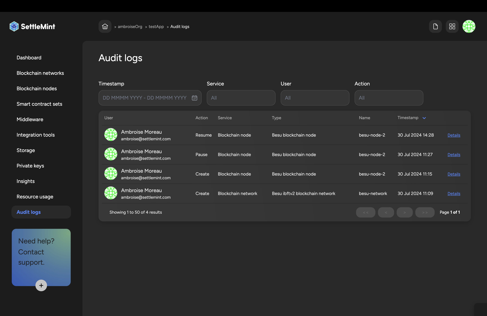

import { Tabs, Tab } from 'fumadocs-ui/components/tabs'
import { Callout } from 'fumadocs-ui/components/callout'
import { Steps } from 'fumadocs-ui/components/steps'
import { Card } from 'fumadocs-ui/components/card'

  <Card>
    ### Key Benefits
    - Compliance tracking
    - Activity accountability
    - Issue troubleshooting
    - Data integrity
  </Card>

  <Card>
    ### Available Filters
    - Timestamp ranges
    - Service types
    - User actions
    - Event categories
  </Card>

## Access Audit Logs

<Steps>
  ### Navigate to Logs
  Access from application menu on the left

  ### Apply Filters
  Use available filters:
  - Timestamp: Select time range
  - Service: Choose specific service
  - User: Filter by user
  - Action: Filter by action type

  ### View Details
  Examine detailed log entries
</Steps>

## Log Categories

  <Card>
    ### System Events
    - Service deployments
    - Configuration changes
    - Resource scaling
    - System updates
  </Card>

  <Card>
    ### User Actions
    - Resource creation
    - Permission changes
    - Token management
    - Access attempts
  </Card>

<Callout type="info">
Audit logs provide essential tracking for regulatory compliance and security monitoring.
</Callout> 