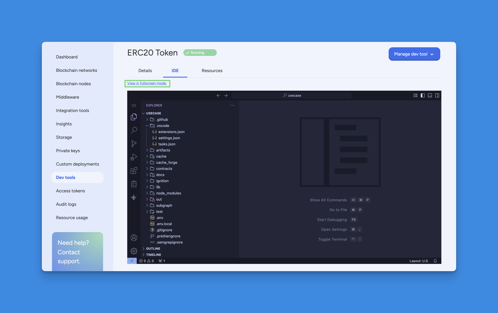
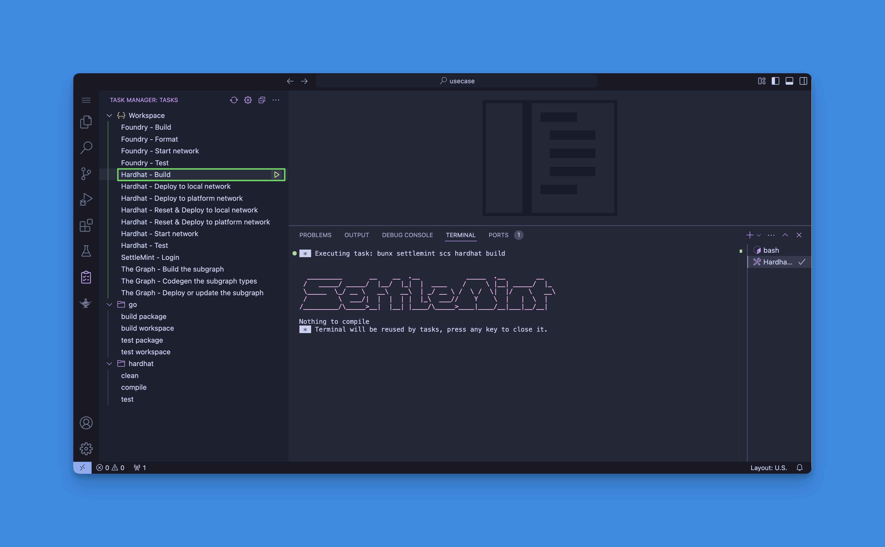
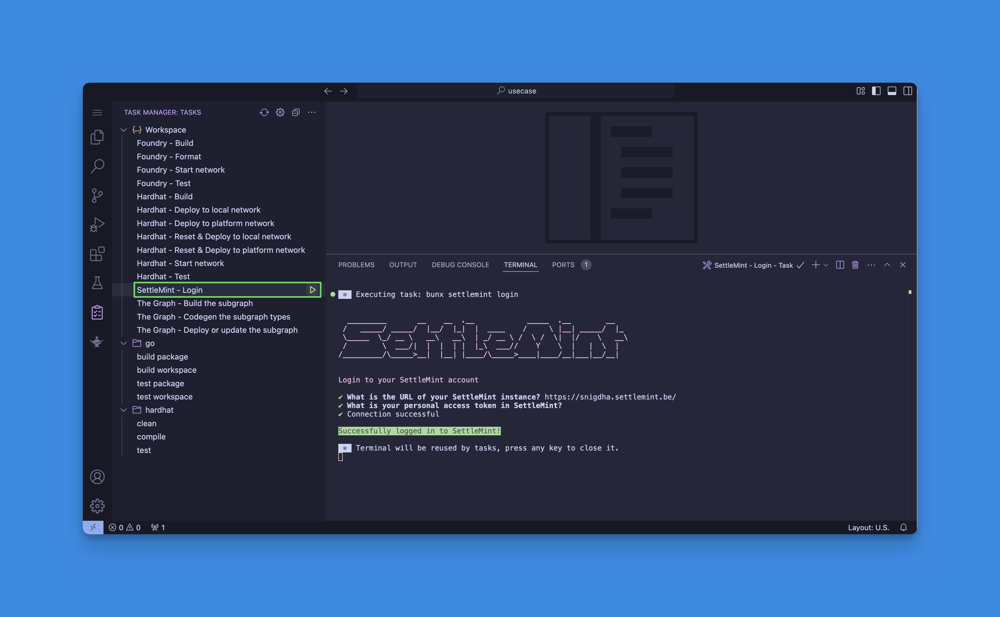
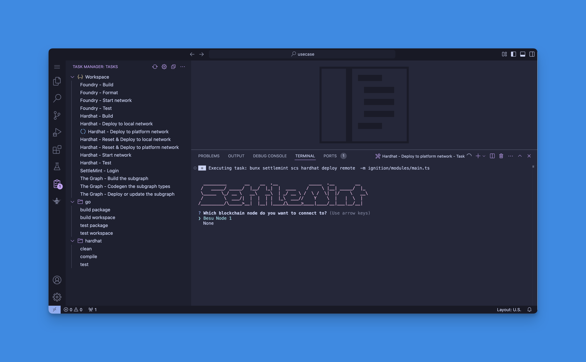

import Tabs from '@theme/Tabs';
import TabItem from '@theme/TabItem';


You can deploy your contracts to a network in the platform or a local development network. This guide covers both Platform UI and SDK CLI approaches.

<Tabs>
  <TabItem value="platform-ui" label="Platform UI">

  Follow these steps to deploy your smart contract through the Platform UI:

  1. Open the IDE by clicking on your smart contract set.
     
     

  2. Click on the **Task Manager** button.
     
     

  3. First compile your contract by running either:
     - **Hardhat - Build** task
       
     - **Foundry - Build** task
       

  4. To deploy to a platform network:
     - Run the **SettleMint - Login** task
       
     - Run the **Hardhat - Deploy to platform network** task
       
     - Select your node and private key when prompted
       

  5. To deploy locally:
     - Run the **Hardhat - Start local network** task
       
     - Run the **Hardhat - Deploy to local network** task
     - 
       

  </TabItem>
  
  <TabItem value="sdk-cli" label="SDK CLI">

  ## Prerequisites

  First, authenticate yourself and connect to your application:

  ```bash
  # Login to the platform
  settlemint login

  # Connect to your application
  settlemint connect
  ```

  ## Using Hardhat

  Hardhat provides a complete development environment. Here's how to use it:

  ```bash
  # Step 1: Build your smart contracts
  settlemint scs hardhat build

  # Step 2: Choose your deployment target
  # For local development:
  settlemint scs hardhat network     # Start a local network
  settlemint scs hardhat deploy local  # Deploy to local network

  # For production:
  settlemint scs hardhat deploy remote  # Deploy to platform network

  # Development tools:
  settlemint scs hardhat test    # Run your test suite
  settlemint scs hardhat script  # Execute deployment scripts
  ```

  ## Using Foundry

  Foundry offers fast compilation and testing. Here's how to use it:

  ```bash
  # Step 1: Build your smart contracts
  settlemint scs foundry build

  # Step 2: Test and format
  settlemint scs foundry test    # Run your test suite
  settlemint scs foundry format  # Format your contract code

  # Step 3: Local development
  settlemint scs foundry network  # Start a local network for testing
  ```

  ## Working with Subgraphs

  If you need to index your smart contract data:

  ```bash
  # Step 1: Generate TypeScript types from your schema
  settlemint scs subgraph codegen

  # Step 2: Build the subgraph
  settlemint scs subgraph build

  # Step 3: Deploy to the Graph node
  settlemint scs subgraph deploy [subgraph-name]
  ```

  :::note Important
  Before deployment, ensure:
  - You're authenticated (`settlemint login`)
  - You're connected to your application (`settlemint connect`)
  - Your smart contracts are compiled
  - For remote deployment: you have a running node and sufficient funds
  :::

  ### Environment Configuration

  When using `settlemint connect`, you'll be prompted to configure:
  - Workspace selection
  - Application selection
  - Blockchain node selection
  - The Graph instance selection
  - HD Private Key selection
  - Application access token creation

  This configuration is stored locally and used for subsequent commands.

  </TabItem>
</Tabs>

## Project Structure

The typical folder structure of a SettleMint smart contract set includes:

- **`contracts/`**: Contains the Solidity smart contracts
- **`test/`**: Contains both Hardhat (TypeScript) and Foundry (Solidity) tests
- **`script/`**: Deployment and interaction scripts
- **`lib/`**: Optional Solidity libraries
- **`ignitions/`**: Hardhat deployment configurations
- **`out/`**: Compilation artifacts
- **`foundry.toml`**: Foundry configuration
- **`hardhat.config`**: Hardhat configuration
- **`subgraphs/`**: The Graph indexing configurations

## Customize smart contracts

You can customize your smart contracts using the built-in IDE. The smart contract sets include a Generative AI plugin to assist with development. [Learn more about the AI plugin here.](./5_AI_plugin.md)
