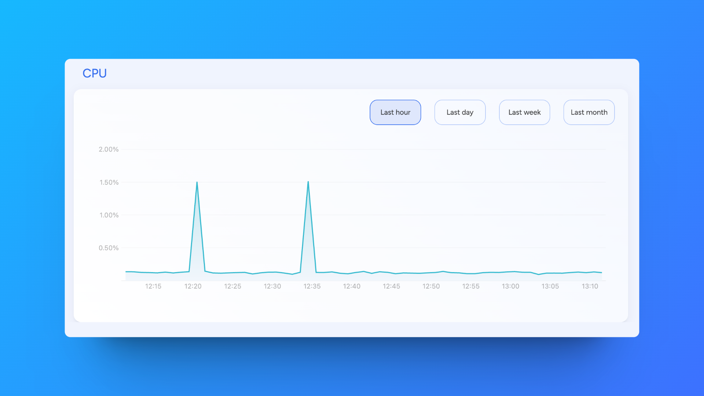

import { Tabs, Tab } from 'fumadocs-ui/components/tabs'
import { Callout } from 'fumadocs-ui/components/callout'
import { Steps } from 'fumadocs-ui/components/steps'
import { Card } from 'fumadocs-ui/components/card'

# Resource Usage

  <Card>
    ### Monitored Resources
    - Memory allocation
    - vCPU usage
    - Disk space
    - Network bandwidth
  </Card>

  <Card>
    ### Monitoring Features
    - Real-time metrics
    - Historical data
    - Usage trends
    - Alert thresholds
  </Card>

## Resource Metrics

<Steps>
  ### Access Metrics
  Navigate to your service's **Metrics tab**

  ### View Resources
  Monitor:
  - Memory usage vs allocation
  - vCPU utilization
  - Disk space consumption
  - Performance graphs
</Steps>

### Status Levels

  <Card>
    ### Healthy
    - Under 75% usage
    - Optimal performance
    - No action needed
  </Card>

  <Card>
    ### Suboptimal
    - 75-90% usage
    - Performance impact
    - Consider scaling
  </Card>

  <Card>
    ### Critical
    - Over 90% usage
    - Immediate action
    - Scale resources
  </Card>

<Callout type="warning">
When status is **Suboptimal**, consider scaling your resource pack to maintain performance.
</Callout> 