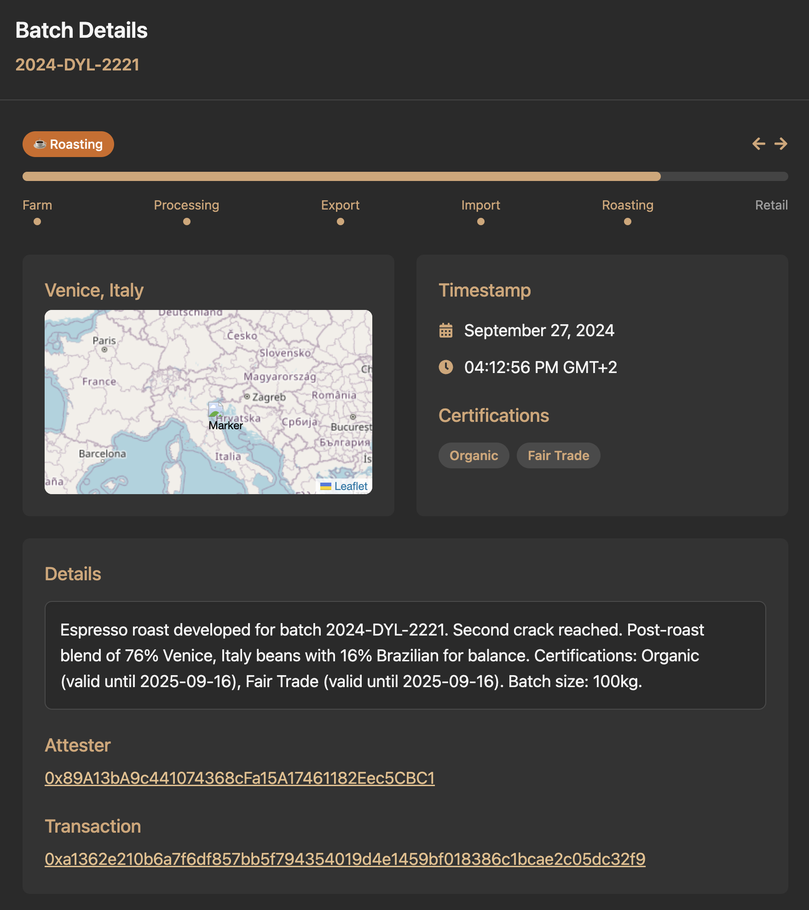

## Attestation Service

The Attestation Service is a groundbreaking framework designed to facilitate the
creation, management, and verification of attestations on EVM cpmpatible
blockchains (public or cosortium). By leveraging the decentralized and immutable
nature of blockchain technology, it allows individuals and organizations to
issue verifiable statements of fact, which can include anything from identity
verification to compliance with regulatory standards. This service empowers
users to maintain control over their data while providing transparency and
trustworthiness to various processes.

One of the most remarkable aspects of the Attestation Service is its potential
to streamline numerous processes across various industries. For instance, in the
realm of education, institutions can issue verified diplomas and certifications
that are tamper-proof, ensuring that employers can trust the qualifications of
job candidates. In healthcare, medical professionals can share validated
credentials, thus enhancing patient safety and care quality. The Attestation
Service also plays a crucial role in compliance-related scenarios, allowing
businesses to demonstrate adherence to regulations and standards seamlessly,
reducing the burden of paperwork and audits.

The versatility of the Attestation Service extends to a wide array of use cases,
making it an invaluable tool for both individuals and enterprises. Beyond
identity verification and compliance, EAS can be applied to create transparent
voting systems, enhance reputation management in decentralized finance (DeFi),
and even support peer-to-peer lending by validating the creditworthiness of
borrowers. Moreover, in the realm of environmental sustainability, it can help
track and verify carbon credits, ensuring that claims about carbon offsets are
accurate and trustworthy. Overall, the Ethereum Attestation Service stands as a
transformative solution, unlocking new possibilities for trust and verification
in our increasingly digital world.
