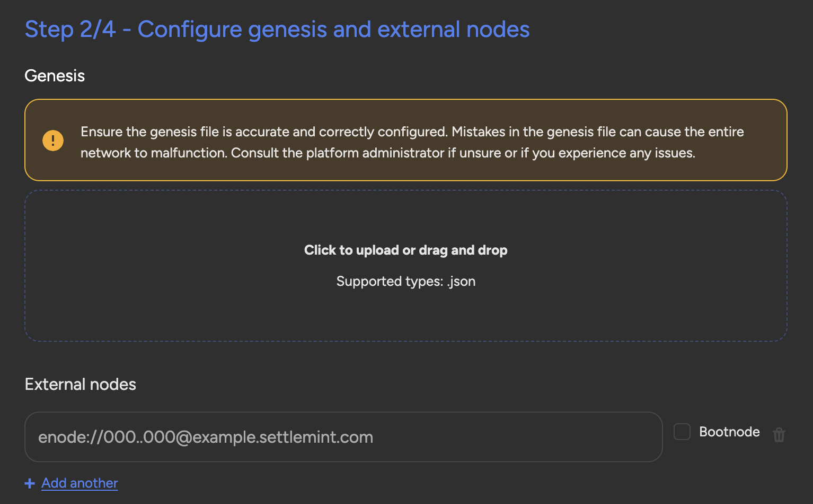

## Customize Genesis, Bootnode lists and key material

You can now create new consortium networks where you have the capability to
customize literally everything.

1. You can build your own genesis files,
2. Import them from external sources
3. Customize boot node lists and the key material used for your nodes

This allows you to do a variety of use cases that were impossible before.

For example, you can migrate between different networks and different instances
of the SettleMint platform. You can execute your own hard forks, customize
settings that are not customizable via the UI, join external consortia that are
restricted by identity or just in general join any external network you want.
