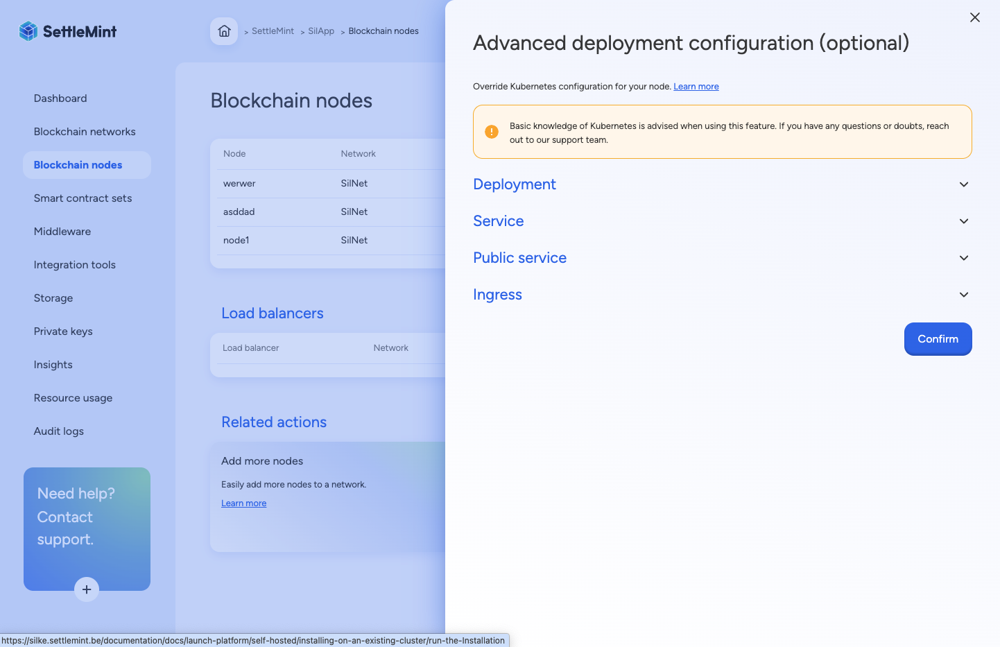

## Customize Kubernetes deployment settings

The feature to customize Kubernetes deployment settings within SettleMint offers
users an intuitive user interface (UI) that simplifies the management of
deployed services in self-managed installations. This UI provides a
comprehensive set of options for adjusting key deployment parameters, such as
annotations, labels, tolerations, affinity, and node selectors. By making these
customization options readily accessible, SettleMint enables users to tailor
their Kubernetes configurations to better align with their specific operational
needs and infrastructure requirements, fostering a more efficient and optimized
deployment process.

One of the standout benefits of this feature is its ability to facilitate
seamless integration into existing infrastructure. Organizations often have
unique requirements based on their operational environment, and the
customization options provided by SettleMint empower users to implement any
necessary settings effortlessly. This flexibility ensures that deployments can
adhere to organizational policies and best practices while maintaining
compatibility with the broader Kubernetes ecosystem. By allowing users to
specify their desired configurations directly through the UI, SettleMint reduces
the complexity typically associated with Kubernetes management, allowing teams
to focus on their core business objectives.

Moreover, the customization of deployment settings significantly enhances the
scalability and resilience of services within the Kubernetes environment. By
leveraging advanced features like affinity and tolerations, users can optimize
resource allocation and improve workload distribution across nodes, leading to
better performance and reliability. The ability to modify labels and annotations
also aids in effective resource management, enabling users to implement advanced
monitoring, logging, and orchestration strategies tailored to their needs.
Overall, this feature empowers users to harness the full potential of their
Kubernetes deployments, ensuring they can operate efficiently and effectively
within their own customized infrastructure.
