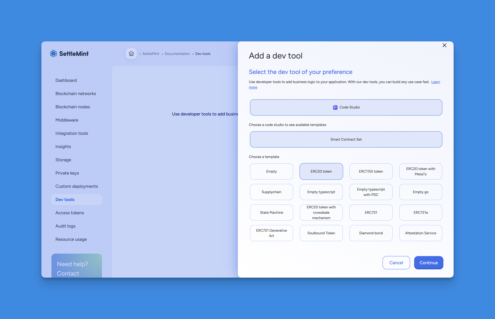

## Introducing Dev Tools

We've made some exciting changes to improve your development experience:

**What's New**

- We've introduced a new **Dev Tools** section that will host various services
  aimed at making the development of decentralized applications easier
- The first tool we're launching is **Code Studio** - our Integrated Development
  Environment (IDE) based on Visual Studio Code
- Smart contract sets are now available as the first type of Code Studio
- For more information on Dev Tools, please refer to the
  [Dev Tools documentation](/building-with-settlemint/dev-tools/dev-tools)

**What's Changed**

- The "Smart contract sets" service has moved into Dev Tools
- Don't worry - all the same great features of Smart contract sets are still
  there, just in a new home!

**Coming Soon**

Stay tuned for more types of Code Studios that will make building decentralized
applications even easier!

---

**Note**: All existing Smart contract sets functionality remains unchanged -
we've just reorganized things to make room for more developer tools.
