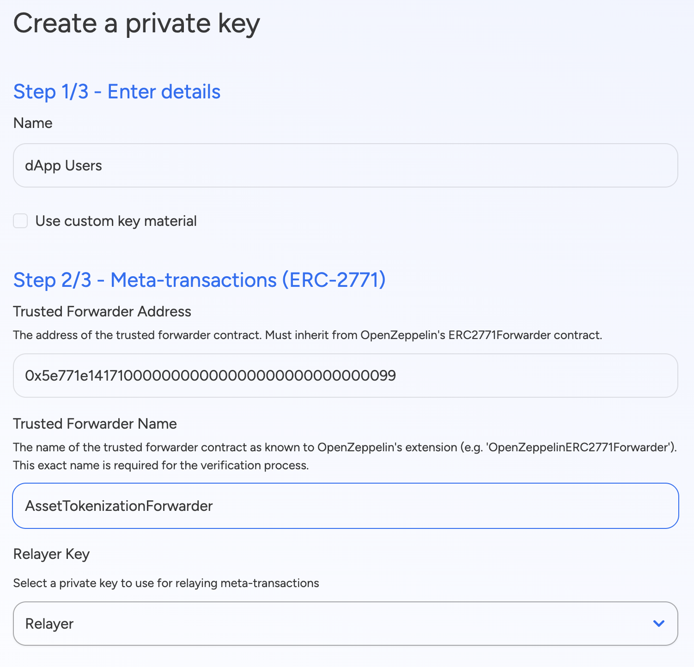
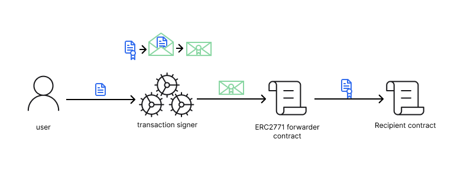

# ERC-2771 Meta-Transactions Integration

## Overview

The SettleMint platform now supports ERC-2771 meta-transactions, enabling gas-less transactions for end users. With this integration, transaction fees can be covered by a designated relayer instead of the end user, significantly improving the user experience for blockchain applications. This implementation is based on OpenZeppelin's ERC2771Forwarder contract, providing a secure and standardized approach to meta-transactions.

## Key Features

### Gas-less Transactions

- **Fee Abstraction**: End users can interact with blockchain applications without holding native tokens for gas
- **Improved Onboarding**: Remove the friction of acquiring tokens before using your application
- **Enterprise-ready**: Ideal for business applications where users shouldn't be concerned with blockchain mechanics

### Secure Implementation

- **OpenZeppelin Standard**: Built on the battle-tested ERC2771Forwarder implementation
- **EIP-712 Signatures**: Uses cryptographically secure typed data signatures
- **Request Validation**: Comprehensive validation including deadline checks and nonce management

### Seamless Integration

- **Automatic Handling**: Our signer manages the complexity of meta-transactions behind the scenes
- **Simple Configuration**: Easy setup process when creating private keys
- **Cross-Contract Support**: Works with any contract that implements the ERC-2771 standard

## Getting Started

To enable meta-transactions for your private keys:

1. When creating a new private key, enable the meta-transactions option
2. Enter the Forwarder contract address
3. Provide the name of the Forwarder contract
4. Assign a relayer key that will pay the gas costs

## How Meta-Transactions Work

Meta-transactions allow users to interact with the blockchain without paying for gas. While the user experience remains simple, here's what happens behind the scenes in the SettleMint platform:

1. The user sends a regular transaction to our transaction signer
2. Our system detects that the private key is configured for meta-transactions
3. A structured message is created and signed (using EIP-712) with the key of the user
4. This message is wrapped inside a normal transaction that is signed by the relayer
5. The transaction is sent to the Forwarder contract with the user's signed message as payload
6. The Forwarder contract thoroughly validates the message, verifies the signature, prevents replay attacks through nonce tracking,
7. If everything checks out it then forwards the call to the destination contract

All this complexity is managed by the SettleMint platform - you only need to enable the feature and assign a relayer. From the user's perspective, transactions work as normal but don't require gas.

## Use Cases

- **Consumer Applications**: Eliminate the need for users to purchase crypto before using your dApp
- **Enterprise Solutions**: Allow employees to interact with blockchain applications without managing tokens
- **Gaming & NFTs**: Enable in-game purchases and NFT minting without interrupting gameplay
- **Identity & Governance**: Facilitate voting and credential management without gas concerns
- **Web2-like UX**: Create familiar user experiences that hide blockchain complexity

