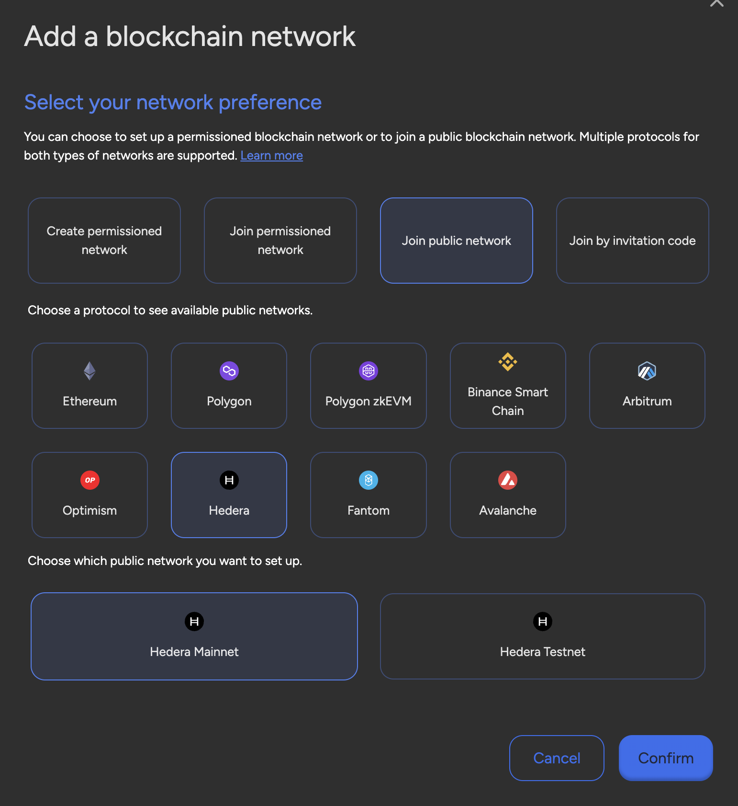

## Hashgraph Hedera

Hedera is a public distributed ledger technology (DLT) network that was launched
in August 2018 by Hedera Hashgraph, LLC. It uses the Hashgraph consensus
algorithm, which is a unique and novel approach to achieving consensus in a
distributed network.

Hedera's native cryptocurrency is called HBAR, and it is used to power the
network's services, including smart contracts, file storage, and regular
transactions.

Hedera focuses on providing high throughput, low latency, and fair transaction
ordering, making it suitable for enterprise-grade applications. Unlike
blockchain-based systems, Hedera's Hashgraph algorithm ensures fast, fair, and
secure transactions without compromising decentralization. We support, the
Hedera Mainnet and the Hedera Testnet.
