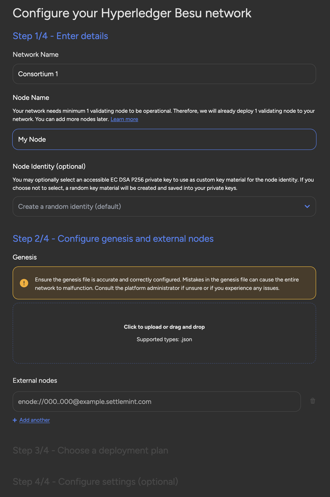

## Integration of external consortia

We're excited to introduce a new feature in SettleMint that lets you connect
directly to existing Hyperledger Besu and Quorum blockchain networks run by
other organizations. This is a big win for businesses already involved in
blockchain consortia or those looking to join one. With this feature, you can
create nodes on the SettleMint platform and easily integrate with these
permissioned networks, making collaboration with external partners more
streamlined and secure.

For companies working within consortia, this feature simplifies the process of
joining networks that are already up and running. Whether you're part of a
supply chain network, a financial services consortium, or any other multi-party
blockchain setup, you can now seamlessly connect without needing to build or
manage the entire network yourself. This opens the door to stronger
collaboration and more efficient operations, as all members of the consortium
can easily contribute while maintaining control over their own nodes.

By allowing organizations to integrate into these existing networks, this
feature helps businesses accelerate their blockchain journey. It's a powerful
tool for enhancing transparency, security, and trust between partners in a
consortium. With SettleMint, you can now tap into the benefits of shared
blockchain networks with minimal setup, helping your enterprise grow and
innovate alongside trusted collaborators.
