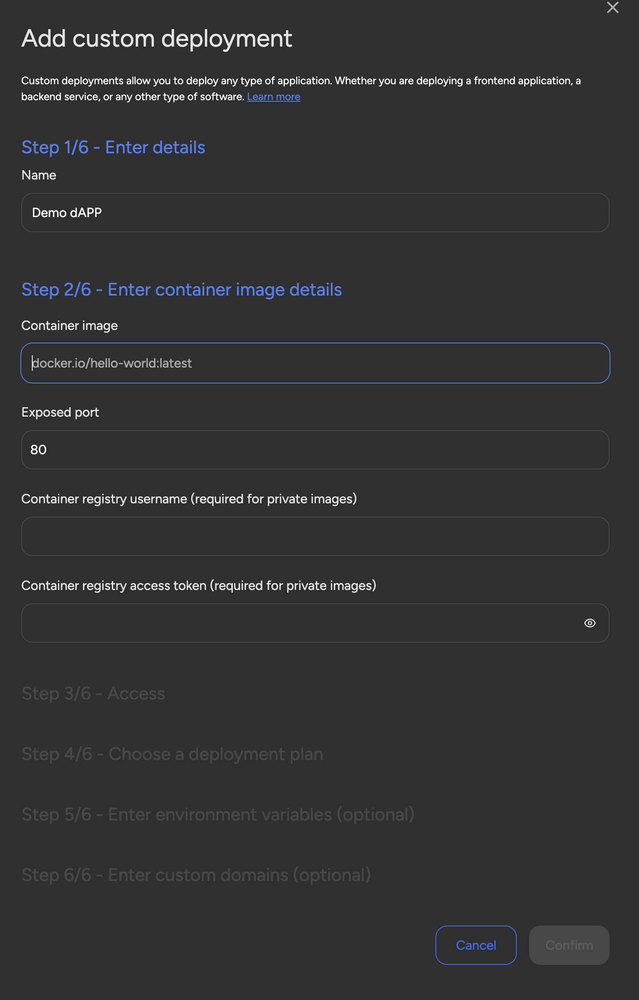

## Run anything as a custom deployment

SettleMint is excited to announce a powerful new feature: **Run Anything with
Custom Deployments**! This feature revolutionizes how users can deploy
decentralized applications (dApps) on our platform, offering unprecedented
flexibility and control. Whether you're developing a fintech platform, an NFT
marketplace, or a DeFi solution, Custom Deployments let you seamlessly integrate
your custom-built front-end and web technologies while leveraging the robust
blockchain backend that SettleMint provides.

With **Custom Deployments**, you now have the freedom to design applications
according to your specific needs. This includes using custom domains for a more
professional appearance, integrating advanced functionalities, and selecting the
best infrastructure for your use case. The platform allows for flexible
application design, which means you can use your preferred frameworks,
programming languages, and design architectures without limitations. For
instance, a fintech company developing a peer-to-peer lending platform can now
deploy a user-friendly interface that meets their precise user requirements,
streamlining the entire deployment process.

Moreover, this feature unlocks enhanced scalability and security for your dApps.
With SettleMint's scalable infrastructure, you can handle high traffic and
performance peaks seamlessly, ensuring your application grows as your user base
expands. Additionally, our secure environment ensures your deployments meet the
highest security standards, making Custom Deployments perfect for businesses
that need to maintain trust and reliability with their users, such as investment
firms launching asset tokenization platforms or DeFi platforms managing
cross-chain transfers.
