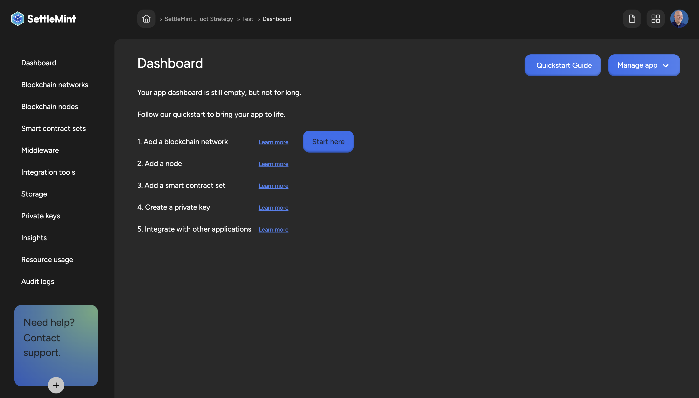

## Self-Managed platform v7

Fully modular overhaul of the self managed platform to enable maximum
flexibility in its deployment and feature parity with the Managed Platform

- New and improved Helm chart to deploy the platform on your own infrastructure

- Fully customisable and configurable via the Helm values

- Complete feature parity, from services to service deployment with the Managed
  platform (same codebase and helm chart)

- Dramatically improved performance in restrictive environments

- [Open-Source Smart Contract](https://github.com/settlemint) sets and the
  ability to build custom sets from these templates and add them as default
  options in the platform

Get in touch with your SettleMint contact to upgrade or start a trial
