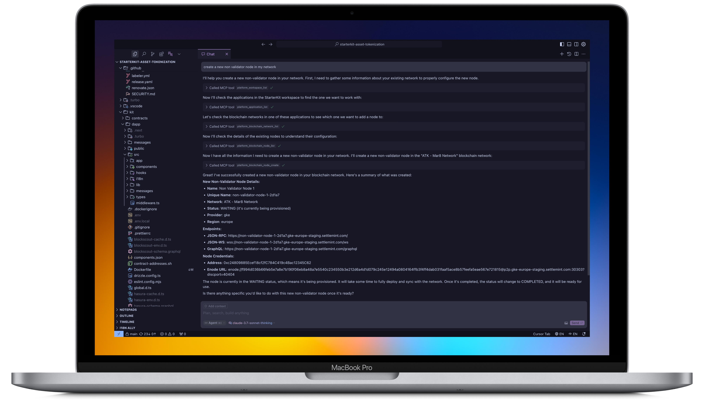

# SettleMint Model Context Provider (MCP)



## Overview

The SettleMint Model Context Provider (MCP) provides a seamless way to integrate
AI models, IDE tools, and AI agents with the SettleMint platform and your
deployed blockchain applications. This release introduces the core functionality
of the Model Context Protocol framework, enabling AI agents to interact with
blockchain data, smart contracts, and other external systems through a
standardized interface.

## Key Features

### Core MCP Framework

- **Standardized Protocol**: Define consistent patterns for AI models to request
  information and receive responses from external systems
- **Middleware Architecture**: Act as an intermediary between AI models and
  external data sources like blockchain networks, APIs, and file systems
- **Context-Aware AI**: Enable AI models to access real-time information and
  make informed decisions based on current data

### SettleMint Platform Integration

- **Blockchain Data Access**: Query live blockchain state, contract variables,
  and transaction history
- **Smart Contract Interaction**: Execute methods on deployed smart contracts
  through AI-driven commands
- **Cross-System Orchestration**: Coordinate actions across blockchain and
  off-chain systems with AI intelligence

### Development Tools

- **IDE Integration**: Seamless integration with popular AI-powered development
  environments:
  - Cursor (version 0.47.0 and up)
  - Claude Desktop
  - Cline (VS Code extension)
  - Windsurf

## Getting Started

To use the SettleMint MCP with your AI development environment, configure it
with:

```json
{
  "mcpServers": {
    "settlemint": {
      "command": "npx",
      "args": [
        "-y",
        "@settlemint/sdk-mcp@latest",
        "--path=/Users/llm/asset-tokenization-kit/",
        "--pat=sm_pat_xxx"
      ]
    }
  }
}
```

## Use Cases

- **AI-Enhanced Development**: Give your AI coding assistant context about your
  blockchain project files and environment
- **Data-Informed AI Agents**: Create AI systems that make decisions based on
  real-time blockchain data
- **Automated DeFi Management**: Build AI agents that monitor and adjust
  parameters for protocols like liquidity pools
- **Cross-Chain Coordination**: Enable AI to orchestrate actions across multiple
  systems with blockchain as the source of truth

## Documentation

For detailed information about using MCP with the SettleMint platform, refer to
our
[official documentation](https://console.settlemint.com/documentation/building-with-settlemint/dev-tools/mcp).

## License

The SettleMint SDK is released under the
[FSL Software License](https://fsl.software). See the
[LICENSE](https://github.com/settlemint/sdk/blob/main/LICENSE) file for more
details.
