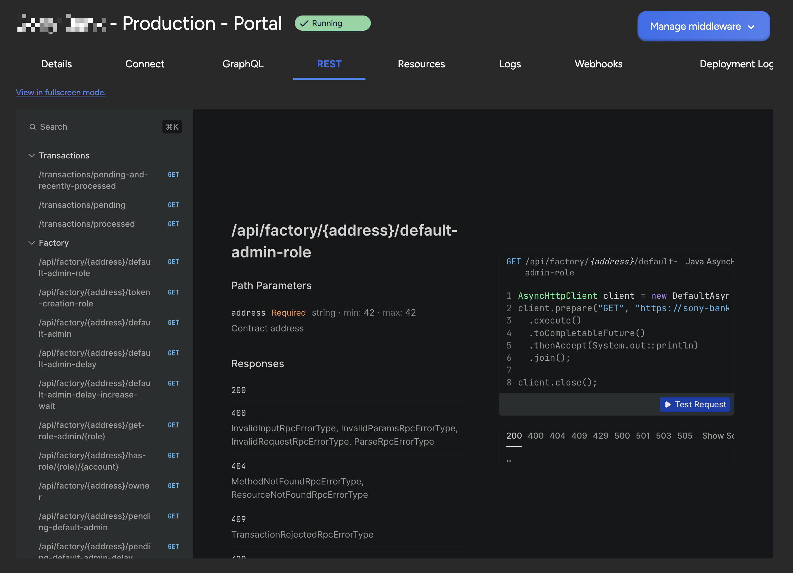

## Smart Contract Portal

The Smart Contract Portal is a middleware which creates an easy to use api on
top of your smart contracts. It can be used with all EVM-compatible chains like
Ethereum, Hyperledger Besu, Polygon, Binance Smart Chain, Avalanche, etc. You
can run it on your own blockchain nodes (both public and permissioned) or on a
Load Balancer. Benefits of using the smart contract portal:

1. Simplified Integration: APIs allow developers to interact with complex smart
   contract functions through familiar interfaces, reducing the need to
   understand blockchain-specific languages and protocols.

2. Data Aggregation: APIs can consolidate data from multiple smart contracts,
   providing a unified view.

3. Improved Performance: GraphQL optimizes data fetching, ensuring that clients
   retrieve only the necessary data in a single request, reducing network load
   and improving performance.

4. Stack agnostic: Teams are free to choose their own technology stack.
