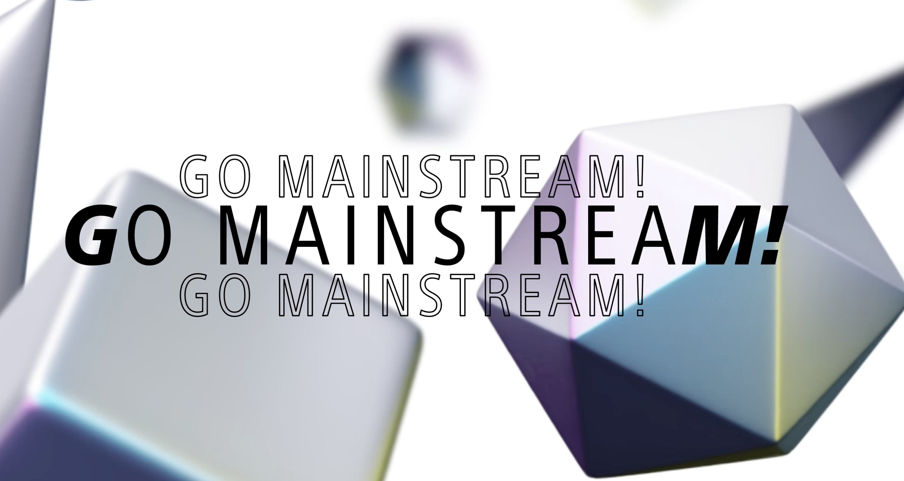

## Support the Soneium Network

SettleMint's support for the Soneium testnet is a significant boost for
developers wanting to build on this efficient blockchain platform. Soneium is
designed for scalability and offers a great environment for testing
decentralized applications (dApps) before going live. With this integration,
developers can take advantage of SettleMint's powerful tools while experimenting
with Soneium's features, like low transaction costs and high processing speed.
This makes it easier for teams to test their applications effectively and make
quick adjustments as needed.

By supporting the Soneium testnet, SettleMint improves the development
experience by providing a secure and flexible space for developers to refine
their applications. Users can easily deploy their dApps on the Soneium testnet,
benefiting from its advanced features while using SettleMint's straightforward
interface and tools. This partnership not only encourages innovation but also
helps developers create more reliable and efficient blockchain solutions,
supporting the growth and adoption of the Soneium ecosystem.

SettleMint is also committed to supporting the Soneium mainnet as soon as it
goes live. This means that developers who have been testing their applications
on the Soneium testnet can seamlessly transition to the mainnet without any
disruptions. By providing immediate support for the mainnet, SettleMint ensures
that developers can launch their dApps confidently, leveraging the full
capabilities of the Soneium blockchain from day one. This approach not only
streamlines the deployment process but also allows teams to continue building on
the solid foundation they established during their testing phase, making it
easier to bring innovative solutions to the market.
