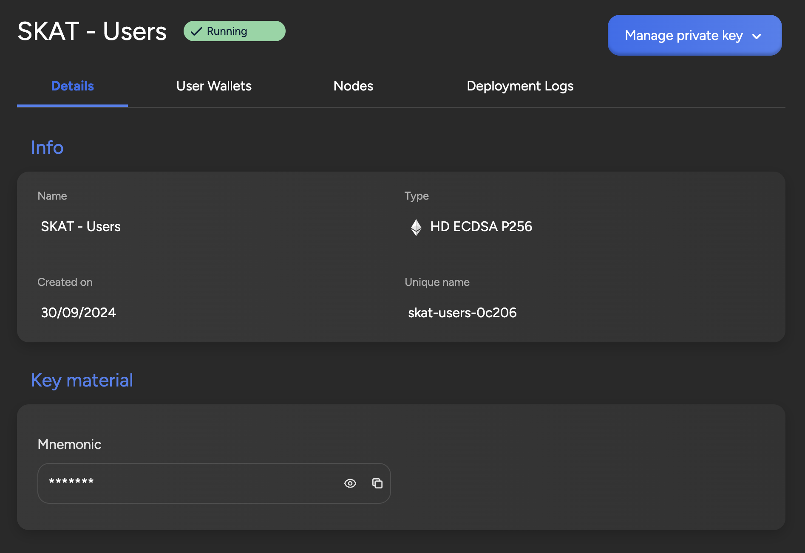

## User Wallet Manager

The User Wallet Manager feature within SettleMint provides a sophisticated and
elegant solution for account management and identity masking through the use of
Hierarchical Deterministic (HD) wallets. These HD wallets generate a structured
hierarchy of private/public key pairs from a single master seed, allowing users
to create a unique address for every transaction. This approach not only
enhances privacy and security—since the addresses are related but not publicly
linked—but also streamlines the management of keys. Users can efficiently create
multiple child wallets under a single parent wallet, making it easy to
categorize funds and back up their assets securely.

One of the most significant benefits of the User Wallet Manager is its ability
to mask user identity on a per-transaction basis. This feature provides an
unlimited supply of account addresses, each with its own unique, untraceable
private key. Organizations can manage different transaction classes or allocate
accounts for various end users, significantly enhancing operational flexibility.
This capability is especially beneficial for businesses that require distinct
accounts for different functions, enabling them to avoid key reuse and duplicate
signing, which can pose security risks.

Moreover, the User Wallet Manager's HD wallet functionality greatly simplifies
asset management for both individuals and enterprises. By allowing businesses to
partition separate wallets within their organization, it enhances organizational
efficiency and security. The ability to recover entire wallet structures from a
single master seed minimizes the risk associated with losing individual keys,
making it an attractive option for financial services looking to deliver a
secure blockchain solution.
