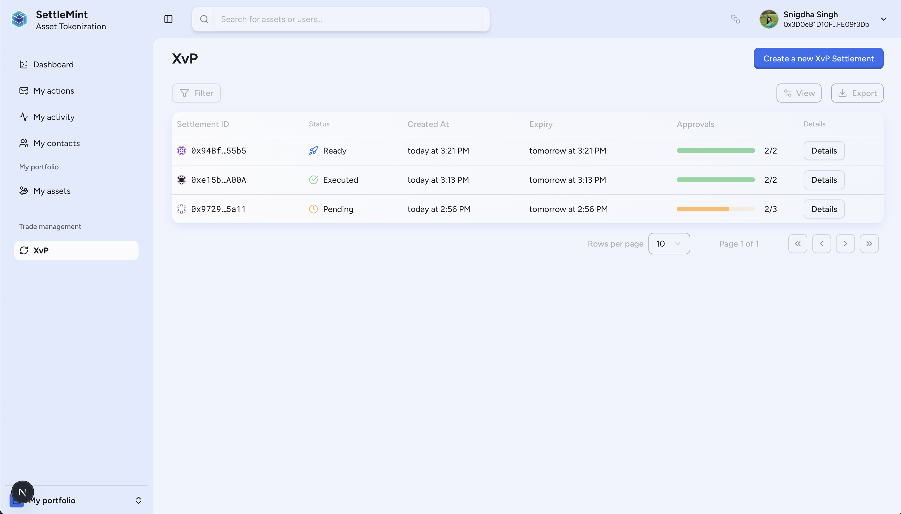

## Atomic settlement with X versus Payment (XvP) Settlement

We're excited to introduce X versus Payment (XvP) Settlement in the Asset
Tokenization Kit, a powerful new feature that enables atomic, trustless
settlements of digital assets between parties. This solution allows for
executing delivery-versus-payment (DvP), payment-versus-payment (PvP), or any
asset-versus-asset exchange in a single, indivisible transaction.

With XvP Settlement, you can configure multi-party transfers, set conditional
triggering based on predefined conditions, monitor settlements in real-time, and
program settlement parameters including expiration dates. The intuitive
interface makes it easy to create, approve, execute, and monitor settlements
throughout their lifecycle.

Each settlement is powered by a secure smart contract that follows best
practices for atomic exchanges, ensuring settlement integrity and security for
all participants.

[Learn more about X versus Payment Settlement](/application-kits/asset-tokenization/xvp-settlement)
