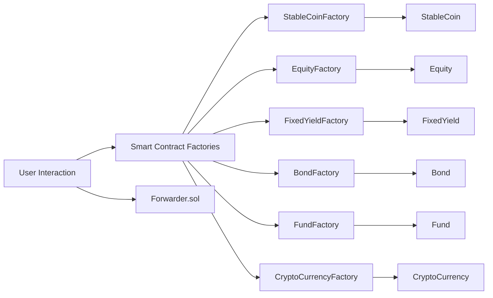
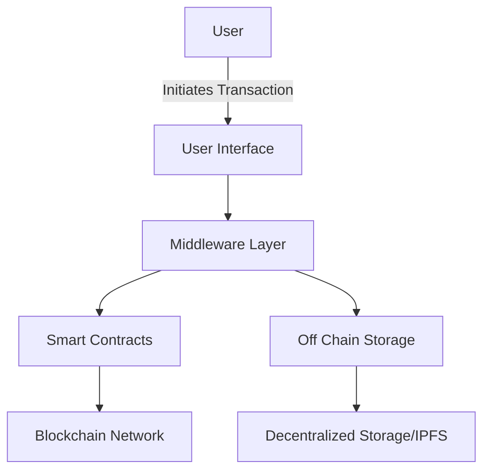

# Off the shelf starter kit features

The SettleMint asset tokenization starter kit offers a full suite of features
designed to accelerate asset tokenization. Below is an overview of the core
components that empower the platform:

## Smart Contracts

Our smart contract layer provides modular, secure, and extensible contracts for
various asset types. These include:

- **StableCoin Contracts**
  - _StableCoin.sol_ and _StableCoinFactory.sol_ enable the creation and
    management of stable tokens that mirror fiat or asset values.
- **Equity Tokens**
  - _Equity.sol_ and _EquityFactory.sol_ facilitate the tokenization of
    ownership shares in companies or projects.
- **Fixed Yield Instruments**
  - _FixedYield.sol_ and _FixedYieldFactory.sol_ provide tools for creating debt
    or income-generating tokens with defined yield characteristics.
- **Bond Contracts**
  - _Bond.sol_ and _BondFactory.sol_ allow the issuance of tokenized bonds,
    replicating traditional fixed income instruments.
- **Fund Contracts**
  - _Fund.sol_ and _FundFactory.sol_ manage collective investment schemes and
    pooled asset management.
- **Crypto Currency Tokens**
  - _CryptoCurrency.sol_ and _CryptoCurrencyFactory.sol_ offer functionality to
    launch digital currencies.
- **Utility Contracts**
  - _Forwarder.sol_ supports meta transactions, allowing gas-less interactions
    and enhancing user experience.

### Smart Contract Architecture

Below is a mermaid diagram illustrating the relationship between factory
contracts and their deployed token contracts:

## Middleware

The middleware layer acts as the bridge between the user interface and the
blockchain, providing:

- **Transaction Management:** Seamless handling of gas fees and meta
  transactions for a frictionless user experience.
- **Event Monitoring:** Real-time tracking of blockchain events to update the UI
  and trigger off chain processes.
- **Data Synchronization:** Integration with off chain storage to index and
  retrieve large datasets, ensuring the dapp remains responsive.

## Off Chain Storage

To optimize performance and scalability, the starter kit supports off chain
storage mechanisms:

- **Decentralized File Storage:** Integration with IPFS or similar systems for
  storing asset metadata, images, and documents.
- **Data Indexing:** Efficient indexing of blockchain events and asset data,
  providing quick access and enabling advanced analytics.

## User Interface

The dapp front-end is built with modern web technologies for a dynamic and
interactive experience:

- **React Based Interface:** Built with Next.js for fast server-side rendering
  and dynamic client-side interactions.
- **Interactive Components:** Custom components for displaying token details,
  market data, transaction histories, and more.
- **Comprehensive Documentation:** Integrated MDX pages (like this one) to guide
  users and developers through the system's features and capabilities.

### User Interaction Flow

The following mermaid diagram outlines the typical flow from user actions to
blockchain interactions and off chain services:

## Summary

The asset tokenization starter kit is a comprehensive solution that integrates:

- A **diverse set of smart contracts** for asset tokenization (StableCoin,
  Equity, FixedYield, Bond, Fund, and CryptoCurrency).
- A **middleware layer** that simplifies blockchain interactions and real-time
  data management.
- **Off chain storage** solutions to balance blockchain limitations with
  performance needs.
- A **dynamic user interface** designed to create a seamless experience for
  managing tokenized assets.

Explore the codebase and integrated documentation to learn more about how these
features come together to enable efficient asset tokenization.
