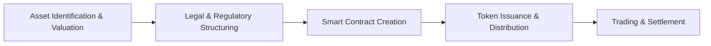

# What Is Asset Tokenization?

Asset tokenization is the process of converting the value of a real-world asset
or a digital asset into a digital token that is recorded on a blockchain. This
innovative concept enables fractional ownership, improved liquidity, and faster,
more transparent transactions.

## Introduction

In traditional finance, assets such as real estate, art, or equity are often
illiquid and require lengthy processes to buy, sell, or transfer. Asset
tokenization transforms these assets into digital tokens, making them easier to
trade, divide into smaller units, and manage. By leveraging blockchain
technology—most commonly Ethereum and other EVM-based platforms—tokenization
introduces a new level of efficiency and accessibility into asset management.

## Definition

**Asset Tokenization** is the process of representing ownership rights to an
asset through digital tokens on a blockchain. Each token typically stands for a
share of the underlying asset, be it physical (for example, real estate or
commodities) or digital (such as digital art or intellectual property). These
tokens are created using smart contracts, which define the asset's
characteristics, enforce compliance rules, and automatically manage transfers.

## How Asset Tokenization Works

The process begins with the identification and valuation of the asset. Experts
assess the asset thoroughly to determine its current market value, ensuring that
the number of digital tokens created accurately represents the underlying
asset's worth. This crucial step sets a solid foundation for the rest of the
tokenization process.

Next, a robust legal and regulatory framework is established. In this phase, a
legal structure—often in the form of a Special Purpose Vehicle (SPV) or a
similar entity—is put in place to hold the asset. This legal structuring
confirms that the digital token indeed represents a legitimate share of
ownership and complies with all applicable regulatory requirements.

Following the legal setup, developers create smart contracts that serve as the
operational backbone of asset tokenization. Using established token standards
like ERC-20, these smart contracts define the token's properties, establish
ownership rules, and automate the transfer process. The automation provided by
smart contracts simplifies administration and ensures that the terms of
ownership are enforced without manual intervention.

Once the smart contracts are deployed, tokens are issued and distributed to
investors or stakeholders. This phase involves generating the tokens and
providing them through a structured release mechanism, often accompanied by
offerings that adhere to regulatory standards. The tokens can then be
transferred or traded on secondary markets.

Finally, the trading and settlement phase takes place. Tokens can be exchanged
on blockchain-based platforms where each transaction is recorded immutably. This
ledger-based recording not only promotes transparency but also reduces the need
for traditional intermediaries, leading to more efficient and secure asset
transfers.

## Benefits of Asset Tokenization

Asset tokenization offers numerous advantages over traditional asset management
methods. One major benefit is the ability to enable fractional ownership. By
dividing a high-value asset into smaller, more accessible digital tokens,
tokenization democratizes investment opportunities, allowing a broader range of
investors to participate in markets such as real estate or fine art.

Another significant advantage is enhanced liquidity. Traditionally, many assets
suffer from prolonged sale processes and limited market activity. By tokenizing
these assets, they become more liquid, as the tokens can be traded quickly and
efficiently on digital platforms. This increased liquidity can lead to more
dynamic markets where assets can be bought and sold with ease.

Transparency and security are also markedly improved through asset tokenization.
Every transaction is recorded on an immutable blockchain ledger, ensuring that
all activity is transparent and secure. This feature greatly reduces the risk of
fraud and errors, instilling greater trust among all parties involved.

Faster settlements are another benefit, thanks to the automation inherent in
smart contracts. The use of automated processes allows for near-instantaneous
transaction settlements, dramatically reducing the delays and complexities
associated with traditional asset transfers.

Furthermore, asset tokenization expands market access on a global scale. With
blockchain technology enabling around-the-clock trading and connecting investors
worldwide, geographic and temporal barriers are minimized, opening up a wealth
of opportunities for diverse investors.

## Use Cases

### Financial Industry

In the financial industry, asset tokenization is revolutionizing the way
investments are made. Tokenized funds, for example, enable fractional
investments in private equity, hedge funds, and other vehicles, significantly
lowering the minimum entry barrier for investors. This fractionalization not
only broadens access but also enhances market liquidity.

Tokenization is also transforming the securities market. By converting stocks
and other financial instruments into digital tokens, investors can benefit from
24/7 trading and faster settlement processes, making capital markets more
accessible and efficient on a global scale.

Moreover, digital bonds represent a vital application of tokenization. Issuing
bonds on a blockchain simplifies the settlement process and reduces counterparty
risk, providing a more streamlined and secure method for debt financing.

### Real-World Assets

Turning to tangible assets, tokenization has significant implications for real
estate and commodities. In the real estate sector, property assets can be
divided into tokens, enabling investors to purchase fractions of high-value
properties. This approach not only makes real estate investment more accessible
but also improves the liquidity of these traditionally illiquid assets.

Similarly, tokenization is being applied to commodities such as gold and silver.
By representing these physical assets as digital tokens, investors can trade
commodities without the challenges of physical storage or transportation,
thereby modernizing commodity markets.

### Non-Financial Applications

Beyond the realm of finance, asset tokenization is creating exciting new
opportunities in non-financial sectors. High-value art and collectibles, once
reserved for a narrow segment of investors, can now be tokenized to allow
broader participation. This not only opens up alternative investment avenues but
also helps in preserving and monetizing cultural assets.

In the field of supply chain and logistics, tokenizing inventory and tracking
assets can significantly enhance transparency and efficiency. Such applications
facilitate better traceability of products throughout the supply chain,
contributing to overall operational improvements.

Furthermore, intellectual property such as patents and copyrights can be
tokenized, enabling innovative financing and revenue-sharing models that were
previously difficult to implement in traditional frameworks.

## Comparison with Traditional Asset Management

When compared with traditional asset management practices, asset tokenization
offers several notable improvements. For instance, the elimination of many
intermediaries reduces transaction costs considerably, as lower fees and
operational expenses are incurred during asset transfers.

Blockchain-based transactions also offer improved speed, executing trades almost
instantaneously. This rapid processing is a stark contrast to the slower, manual
processes characteristic of conventional asset management, and it greatly
enhances the overall efficiency of the market.

Additionally, the inherent transparency of blockchain technology means that
every transaction is permanently recorded on a public ledger. This not only
helps to mitigate the risk of fraud but also ensures that all operations are
conducted with a high degree of openness and reliability.

Finally, by enabling fractional ownership, asset tokenization expands the pool
of potential investors. This democratization of investment opportunities means
that a more diverse group of investors can participate in financial markets,
contributing to a more inclusive and dynamic economic ecosystem.

## Conclusion

Asset tokenization represents a transformative shift in how assets are managed,
traded, and invested. By converting ownership rights into digital tokens on a
blockchain, this process enhances liquidity, reduces transaction costs, and
democratizes investment opportunities on a global scale. As both the technology
and regulatory frameworks continue to evolve, asset tokenization is poised to
become a cornerstone of modern finance and asset management, paving the way for
a more inclusive, efficient, and transparent marketplace.
