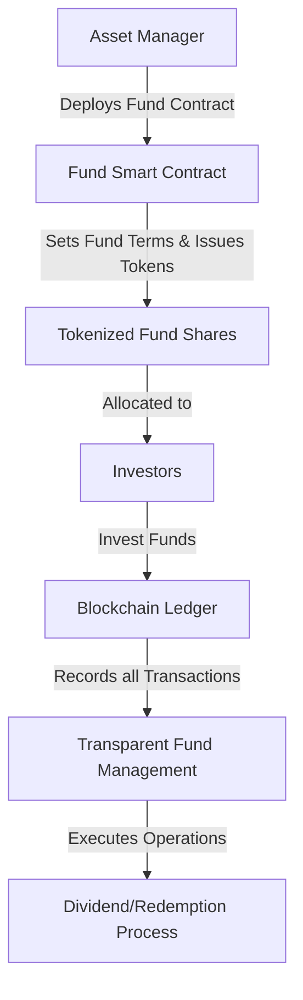
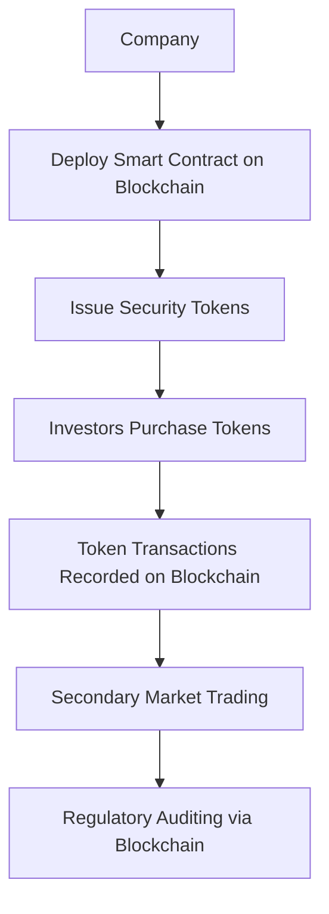
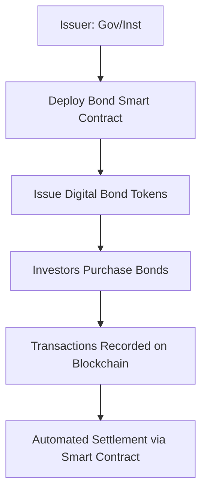
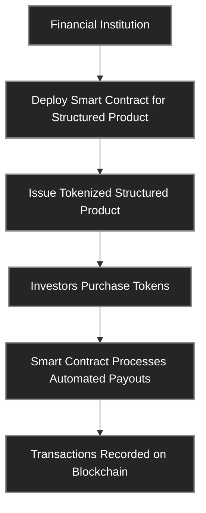
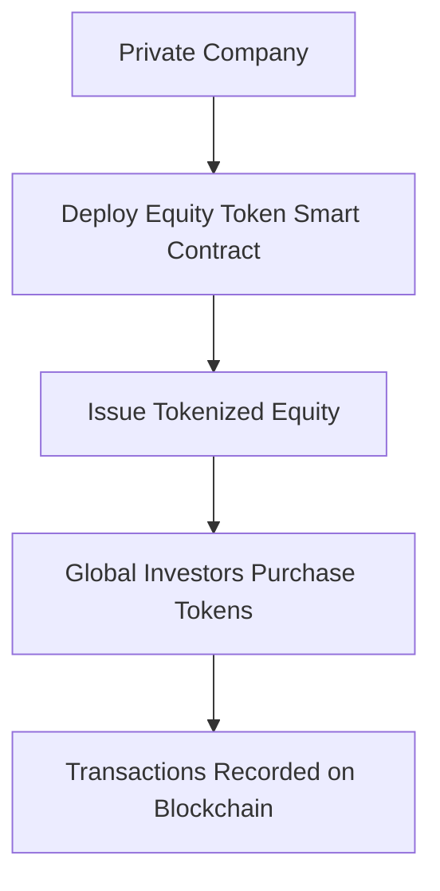
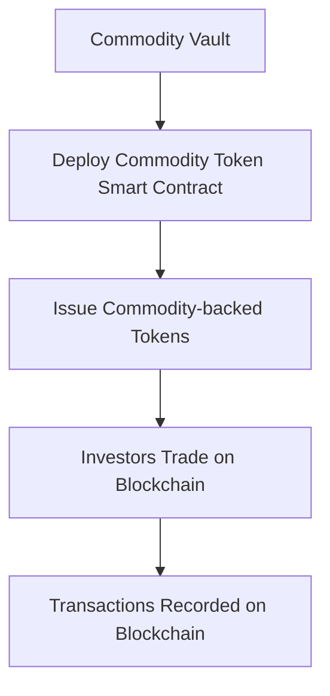
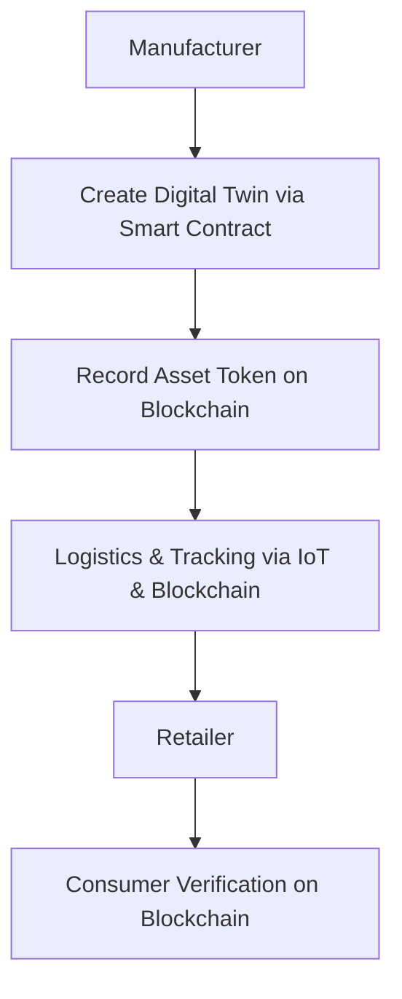
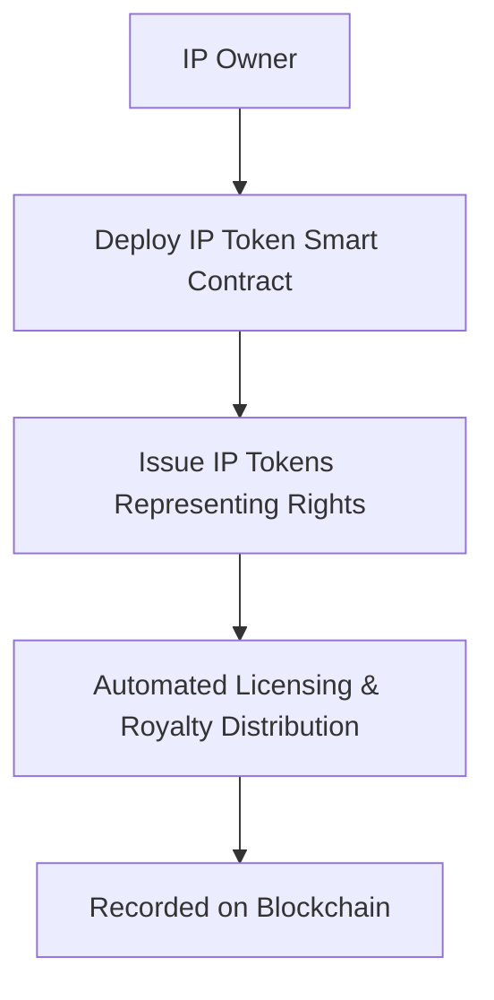
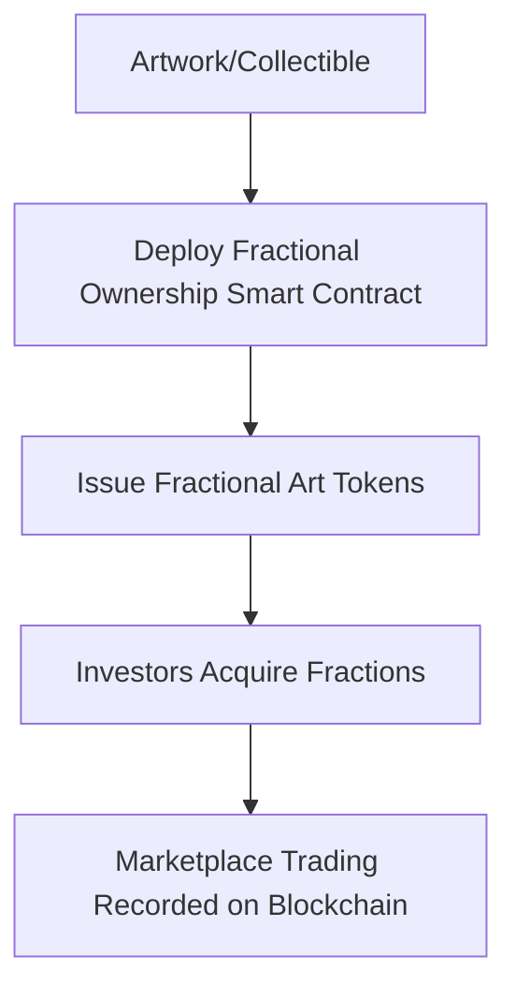
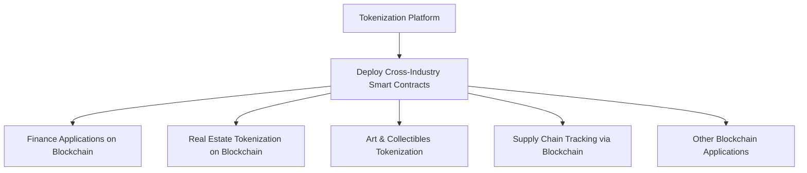

# Use Cases & Industry Applications

Asset tokenization is being applied across a wide array of industries and asset
classes. Key use cases span financial services – including fund management,
securities trading, and debt issuance – as well as non-financial domains like
real estate, supply chain, and art. Below we explore how tokenization is used in
various sectors, with examples illustrating the current state of adoption.

## Financial Industry Use Cases

### Fund Management (Tokenized Funds)

Asset managers are experimenting with tokenizing shares of investment funds
(private equity funds, venture funds, hedge funds, etc.). By issuing fund
ownership as blockchain tokens, managers can lower minimum investments, increase
liquidity for investors, and automate compliance. For instance, in 2023,
Hamilton Lane – a major private markets firm – partnered with Securitize to
launch a tokenized feeder fund on the Polygon (Ethereum-based) network, opening
access to a flagship $2.1B private equity fund to smaller qualified investors.
The tokenized fund units had a minimum investment of $20k (versus $5M
traditionally), demonstrating how tokenization enables broader participation.
BCG projects that such tokenized funds could accumulate over $600B in assets
by 2030. This use case promises new distribution channels for asset managers and
improved liquidity for typically illiquid fund interests.


<center>



</center>

### Equities & Securities

Tokenized equities refer to shares of companies represented as digital tokens
(often issued as regulated security tokens). This can apply to both publicly
traded stocks and private equity. In the public sphere, stock exchanges and
fintech firms are exploring tokenized stock trading to enable 24/7 markets and
fractional ownership. For example, security tokens have been issued for company
shares on alternative trading systems, and some jurisdictions (like
Switzerland's SDX and Seychelles' MERJ exchange) have listed tokenized equities.
Analysts believe tokenized stocks will be a leading segment by 2030, helping
drive the multi-trillion market growth. In private markets, tokenizing equity in
startups or SMEs via security token offerings (STOs) can provide access to
capital markets without a traditional IPO. While still early, these tokenized
securities use cases show how equity ownership can be made more liquid and
globally accessible on blockchain rails.

Below is a mermaid diagram illustrating the blockchain flow for tokenized
equities:

<center>



</center>

### Bonds & Fixed Income

Tokenized bonds are one of the most mature real-world use cases in blockchain
finance. Governments and institutions have issued digital bonds on Ethereum and
other networks to streamline issuance and settlement. A notable example is the
European Investment Bank (EIB), which in April 2021 issued a €100 million
two-year digital bond on the Ethereum blockchain – the inaugural bond of its
kind. The bond was issued, recorded, and settled using blockchain technology,
signaling high-level interest in on-chain debt instruments. Other examples
include Societe Generale's €100M bond tokenization (2020) and the World Bank's
bond-i on a private Ethereum-based ledger.

Below is a mermaid diagram illustrating the blockchain flow for tokenized bonds:

<center>



</center>

### Structured Products & Derivatives

Financial institutions are also looking at tokenizing structured products (like
collateralized debt, mortgage-backed securities, or bespoke investment notes)
and derivatives. By wrapping these instruments into blockchain tokens, they aim
to automate complex payout logic via smart contracts and widen distribution. For
instance, a structured note could be issued as a token that automatically pays
returns based on underlying asset performance, with the smart contract handling
calculations and cash flows.

Below is a mermaid diagram illustrating how structured products work on
blockchain:

<center>



</center>

### Private Equity & Private Markets

Beyond the fund context noted above, tokenization is enabling direct
participation in private equity and private debt assets. Private companies can
raise funds by issuing tokens that represent equity or revenue share, reaching a
global investor base. Likewise, investors can trade their stakes in private
businesses on secondary markets via security tokens, rather than waiting for an
IPO or acquisition.

Below is a mermaid diagram illustrating the blockchain process for private
equity:

<center>


</center>

### Commodities and Precious Metals

Tokenization has also entered commodity markets. The most prominent example is
tokenized gold. Companies issue tokens that are each backed by one fine troy
ounce of physical gold stored in vaults (e.g., PAX Gold, Tether Gold). Investors
can thus buy and trade gold-backed tokens 24/7 without dealing with physical
delivery. Other commodities are being tokenized on a smaller scale – e.g. silver
tokens, tokenized barrels of oil, and even tokenized carbon credits for ESG
trading.

Below is a mermaid diagram illustrating the blockchain flow for tokenized
commodities:

<center>



</center>

### Stablecoins

Another huge financial use case of tokenization, often considered separately, is
fiat currency tokenization via stablecoins. Stablecoins like USDT and USDC
represent fiat assets (USD reserves) as blockchain tokens, enabling instant
global transfers. They have grown to over $100B in circulation.

Below is a mermaid diagram illustrating the blockchain process for stablecoins:

<center>

```mermaid
flowchart TD
    A[Fiat Currency Reserve] --> B[Deploy Stablecoin Smart Contract]
    B --> C[Issue Stablecoin Tokens]
    C --> D[Global Blockchain Transfers]
    D --> E[Real-time Settlement on Blockchain]
   ```

</center >

## Non-Financial Applications

### Real Estate Tokenization

Real estate has emerged as one of the headline use cases for tokenization.
Property assets (buildings, land, or shares in real estate ventures) can be
tokenized to enable fractional ownership and easier transfer of ownership. This
helps unlock liquidity in an otherwise illiquid asset class. A landmark example
occurred in 2018 when a luxury Manhattan condo development (East Village, NYC)
became the first major property in Manhattan to be tokenized on Ethereum.

Below is a mermaid diagram illustrating the blockchain flow for real estate
tokenization:

<center>

```mermaid
flowchart TD
    A[Real Estate Property] --> B[Establish SPV & Deploy Real Estate Smart Contract]
    B --> C[Issue Tokenized Shares]
    C --> D[Global Investors Purchase Tokens]
    D --> E[Blockchain-based Ownership Records]
    E --> F[Secondary Market Trading on Blockchain]
```

</center>

### Supply Chain & Asset Tracking

Tokenization is being applied in supply chain management to improve transparency
and traceability of goods. By creating a digital token that represents a
physical item or batch, companies can track the item's provenance and ownership
as it moves through the supply chain on a blockchain ledger.

Below is a mermaid diagram illustrating the blockchain flow for supply chain &
asset tracking:

<center>



</center>
### Intellectual Property (IP) Tokenization

Tokenization is also transforming intangible assets like intellectual property
rights. Patents, copyrights, trademarks, and even royalties can be tokenized to
create new financing and monetization models.

Below is a mermaid diagram illustrating the blockchain flow for IP tokenization:

<center>    



</center>

### Art and Collectibles

The art world has seen a surge of interest in tokenization, especially with the
rise of NFTs (non-fungible tokens). This involves issuing tokens that represent
shares in a tangible artwork or collectible item.

Below is a mermaid diagram illustrating the blockchain flow for art and
collectibles:

<center>



</center>

### Other Emerging Use Cases

Virtually any asset or contractual right can be considered for tokenization.
This includes gaming assets, carbon credits, infrastructure projects, and even
government services.

Below is a mermaid diagram illustrating the blockchain flow across emerging use
cases:

  


In all these applications, Ethereum and EVM-based platforms are popular choices
due to their smart contract capabilities and developer community. Many early
tokenization projects use public Ethereum for its security and broad network, or
permissioned Ethereum variants (like Hyperledger Besu or Quorum) for enterprise
contexts requiring privacy. The flexibility of EVM smart contracts allows
complex ownership and compliance rules to be embedded directly into the token
(e.g., enforcing transfer restrictions for securities). As we'll see, while the
opportunities are vast, tokenization also introduces new considerations compared
to traditional systems, which we explore next.
