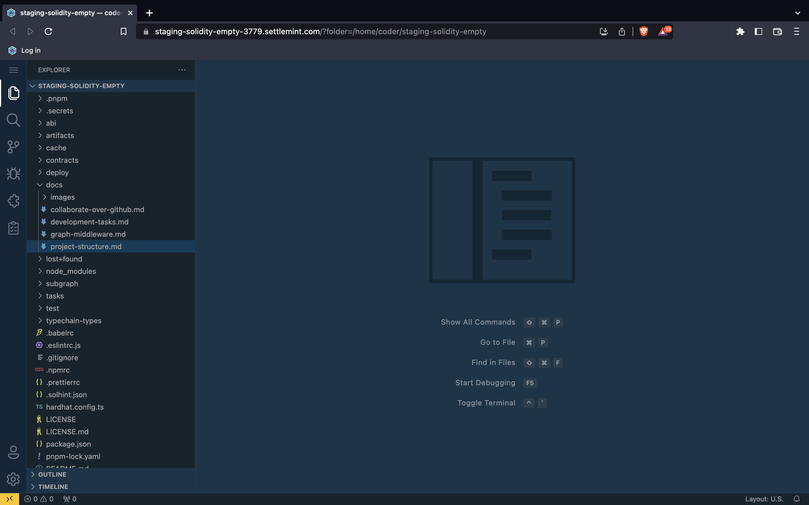

# Smart contracts IDE

The SettleMint IDE is the only tool you need to edit the smart contract set template you have selected, or **write** your own brand **new** smart contracts. The programming language used for your Optimism smart contracts is Solidity.

## Using the IDE

When you open the IDE, you land in an instance of Visual Studio Code similar to the image below.

On the left, in the **“Explorer”** panel, you can see all the folders and files related to the smart contract set.

The smart contract files are located in the **“contracts”** folder. You can edit them, or use them as they are if the template fits all your needs.

The **“deploy”** folder contains the scripts that enable the deployment of the smart contract set on the blockchain. You might have to edit these scripts if you add new arguments to the constructor of your smart contract.

The **“test”** folder contains a script that lets you test the functionalities of your smart contracts. You can add new ones if you edit the template. Do not hesitate to go through the test cases as they provide valuable information on how to use your smart contracts.

The **subgraph** folder holds all the files needed to index your smart contract using the Graph protocol.

## Scripts

Several scripts are defined in `package.json` to help you use the smart contract set:

- **lint** to lint your smart contracts, i.e. find the stylistic errors.
- **compile** to compile your smart contracts.
- **test** to run the test script in the “test” folder.
- **smartcontract:deploy** to deploy the smart contract set on the blockchain.
- **smartcontract:deploy:reset** to deploy from scratch after a first deployment.
- **graph:config** to create the middleware configuration file.
- **graph:compile** to compile the middleware files.
- **graph:codegen** to create the middleware schema.
- **graph:build** to build the middleware.
- **graph:deploy** to deploy the middleware.
- **graph:all** to execute all the graph scripts in one command.

:::warning Note

To execute the scripts related to the Graph middleware, you need a middleware instance in your app.

:::

You can execute these scripts in the terminal integrated with the IDE by running `yarn name-of-script`.
For example, to run the `smartcontract:deploy` task using the terminal, open a new terminal (ctrl + shift + \`) and run the command`yarn smartcontract:deploy`.

## Private key

To be able to deploy your smart contract set on the blockchain you need to have a private key enabled on your node to sign the transaction, and you need to fund this key with Ether to cover the cost for the transaction. You can create a private key and fund it in the **Private keys section** of your application. [More about private keys.](../../using-platform/12_private-keys.md)

## Template library

Every instance of the IDE contains a set of pre-built smart contract templates. These templates are easily customizable to match your specific use case. [Discover the smart contract set templates for Optimism.](../8_Optimism/Template-library/1_optimism-erc-20.md)

## Generative AI plugin

The integration of an OpenAI GPT plugin into the Smart Contract IDE of the SettleMint platform brings forth significant advantages for the fast development of new smart contracts. Generative AI technology empowers developers by providing them with automated code suggestions, smart contract templates, and code completion capabilities. This accelerates the development process by reducing manual effort and improving code efficiency.

Additionally, the interactive debugging and explanation features offered by the GPT plugin greatly benefit developers of all skill levels. Beginners can leverage the plugin’s explanations to understand complex concepts, improve their coding skills, and gain insights into best practices. Experienced developers can utilize the debugging features to quickly identify and resolve issues, leading to more robust and error-free smart contracts.

Overall, the integration of the OpenAI GPT plugin into the SettleMint platform’s Smart Contract IDE combines the power of generative AI and interactive debugging to enhance productivity, code quality, and learning opportunities for developers in the blockchain space.

You can find this plugin in the sidebar (magic lamp icon), in context menu and the action panel. The first time you use the plugin you will get asked for an OpenAI API key. Depending on your OpenAI API access you can use the default GPT 3.5 model or the GPT 4 model which is slower, but more accurate. Check out the settings in the IDE to configure this and other settings (like using your own Azure GPT service)

Here are some prompts to get you started:

- Write a Solidity ERC20 token representing a bond, based on OpenZeppelin. Include a bond repayment and coupon payments.
- Write a Solidity ERC721 token representing real estate, based on OpenZeppelin and allow fractional ownership of this NFT in the form of ERC20 tokens.
- Write The Graph indexing code that indexes an ERC721 token on the Ethereum Mainnet.

<iframe width="560" height="315" src="https://www.youtube-nocookie.com/embed/-e4weLqbYjk" title="YouTube video player" frameborder="0" allow="accelerometer; autoplay; clipboard-write; encrypted-media; gyroscope; picture-in-picture; web-share" allowfullscreen></iframe>
