This guide will show you how to build a full stack application using SettleMint, Polygon, wagmi and NextJS. If this is your first time using SettleMint, we recommend the Hello World Guide.

In this guide, you will learn how to connect a custom front end to your blockchain application using:

- SettleMint to deploy an ERC-20 smart contract to [Polygon](https://polygon.technology/developers)
- [wagmi](https://wagmi.sh/) and [NextJS](https://nextjs.org/) to build a frontend to transfer tokens
- [Web3Auth](https://web3auth.io/) to make the transfer and receive the tokens
  polygon
  To complete this guide, please have the following installed:
- [Bun](https://bun.sh/docs/installation)
- [The Metamask Wallet Extension](https://chrome.google.com/webstore/detail/metamask/nkbihfbeogaeaoehlefnkodbefgpgknn)
- A code editor (ex:[VSCode](https://code.visualstudio.com)).

At the end of this guide, you will have deployed an ERC-20 token smart contract to the Polygon Amoy Testnet and connected a front end to interact with this smart contract. The front end will allow us to send tokens that we created to any wallet address.

## Part 1: The Blockchain Application

### Create a New Blockchain Application

The first step is to create a new blockchain application on SettleMint. This is done by clicking on the grid icon in the top right and selecting `Create new application`.

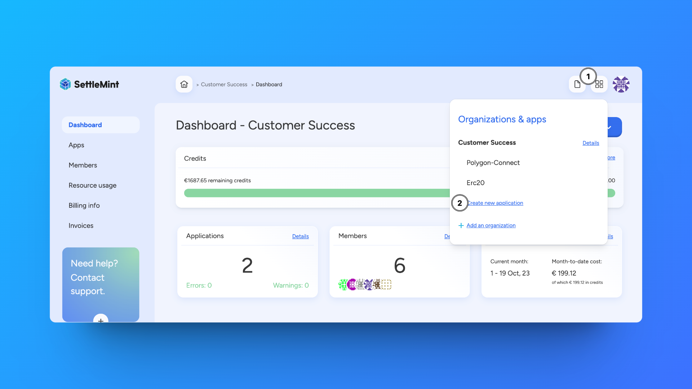

For this guide, we will name this application `TokenSender`.

### Add a Blockchain Network and Node

After creating an application, we need to create a Blockchain Network and Node to deploy to. This is done by clicking on the `Add a blockchain network` from the Application Dashboard.

We will deploy our smart contract to the Polygon Amoy Testnet like the image below:

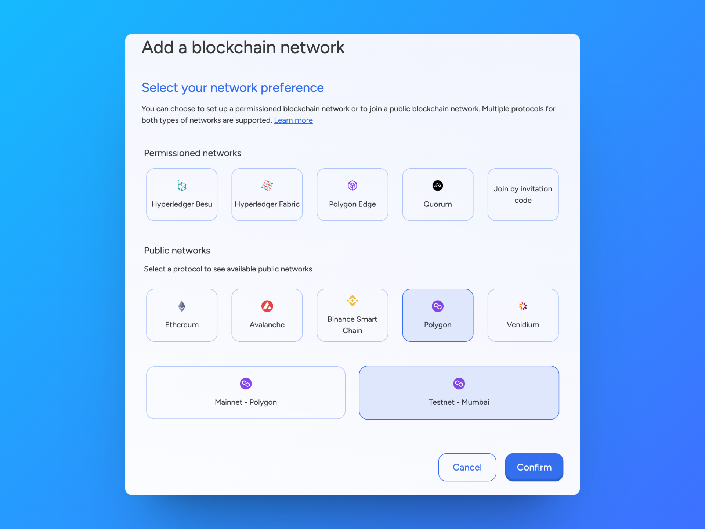

We can continue to use the `TokenSender` name for the naming of the network.

It is now time to choose a deployment plan. Here is the configuration most suitable for this application:

- **Type:** Shared
- **Cloud Provider:** Any
- **Region:** Closest to Your Location
- **Resource Pack:** Small

### Creating a Private Key

To deploy our smart contract and send tokens, we need funds to cover the transfer cost. To do this we will create a Private Key and then receive MATIC tokens, the native token of the Amoy testnet, from the faucet. Faucets allow us to get free test tokens to spend on a testnet.

To make a Private Key, click on the `Private Key` link on the right side of the dashboard. Once there, select `Create a Private Key`.

Below is the configuration you should use for your private key:

- **Private Key Type** Accessible EC DSA P256
- **Name** TokenSender
- **Node** TokenSender

Now that we have our private key address, we can copy the address and go to the [Polygon Faucet](https://faucet.polygon.technology/):

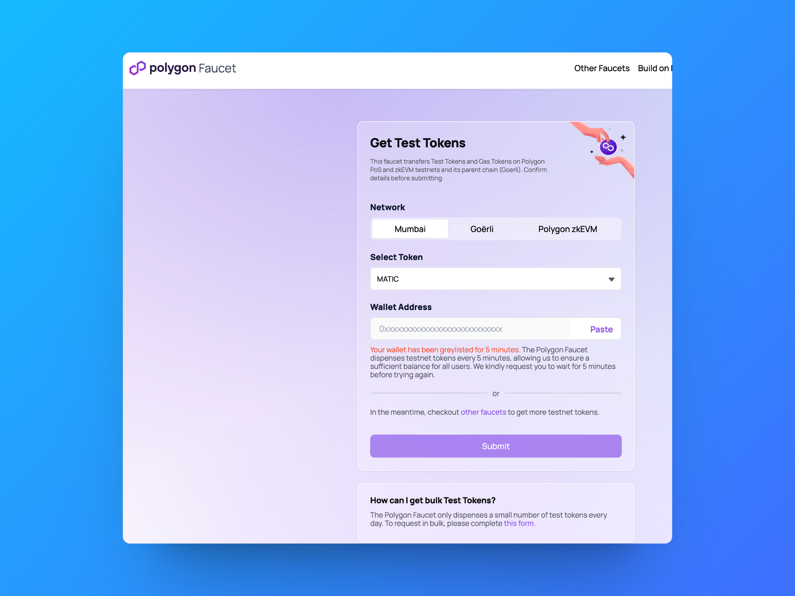

Insert your Wallet Address and click the `Submit` button. Depending on faucet traffic, you may have to perform some validation that you are a human.

You can confirm that you have received the test tokens by going to the `Balances` section of your `Private Keys`.

### Deploying the Smart Contract

We are now ready to create and deploy a smart contract. Click on `Dev tools` in the left sidebar. From there, select `Add a dev tool`, choose `Code Studio` and then `Smart Contract Set`.

You now have the option to select a smart contract set template. These are pre-built smart contract sets based on popular ERC standards and use cases.

For this guide, we will use the ERC-20 Token template:

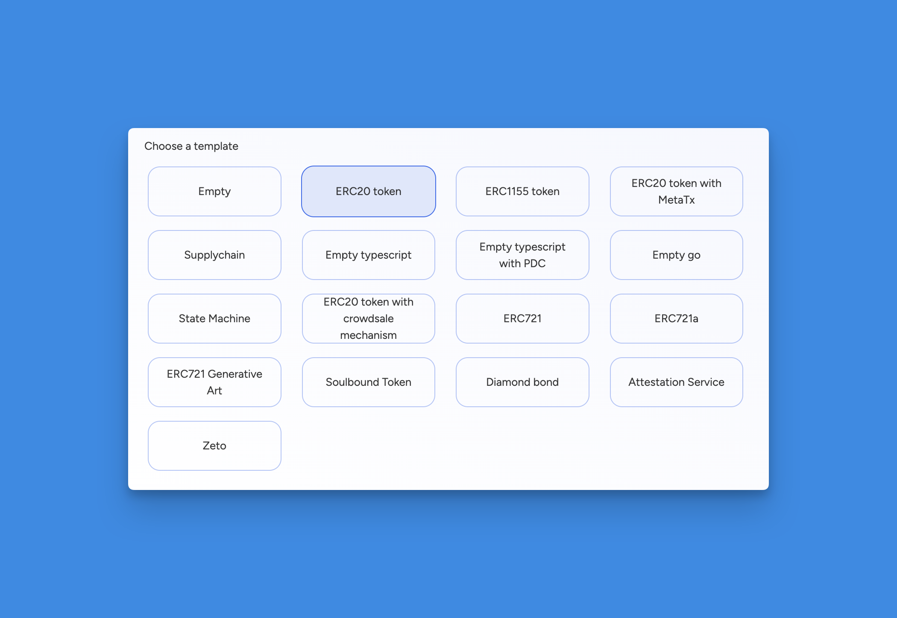

You can continue to use the naming and deployment plan that you used earlier for the other resources.

### Editing the Contract

Once that is deployed, we can go to the IDE and start editing our contract.

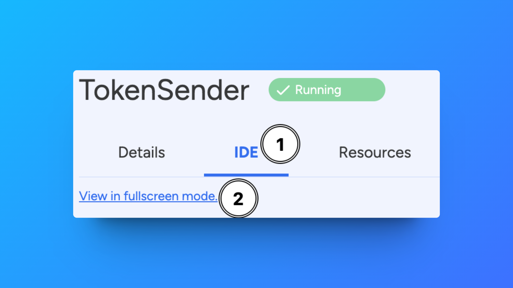

You can find the ERC20 contract on the left in the Explorer under `contracts/GenericERC20.sol`

We don't need to change anything in this contract's code. The current default is to deploy a token called `GenericToken` with a symbol `GT`.

To change this to something less generic, we can go to the `ignition/modules` folder and open the `main.ts` file. From there we can edit the below code block that starts on line 4:

**Before:**

```typescript
const counter = m.contract('GenericERC20', ['GenericERC20', 'GT']);
```

By editing this code block, you can create your token name and symbol:

**After:**

```typescript
const counter = m.contract('GenericERC20', ['DocumentationToken', 'DT']);
```

### Compile and Deploy the Contract

After making the changes, we can compile our contract code. This is done by selecting the `Task Manager` option on the left side.

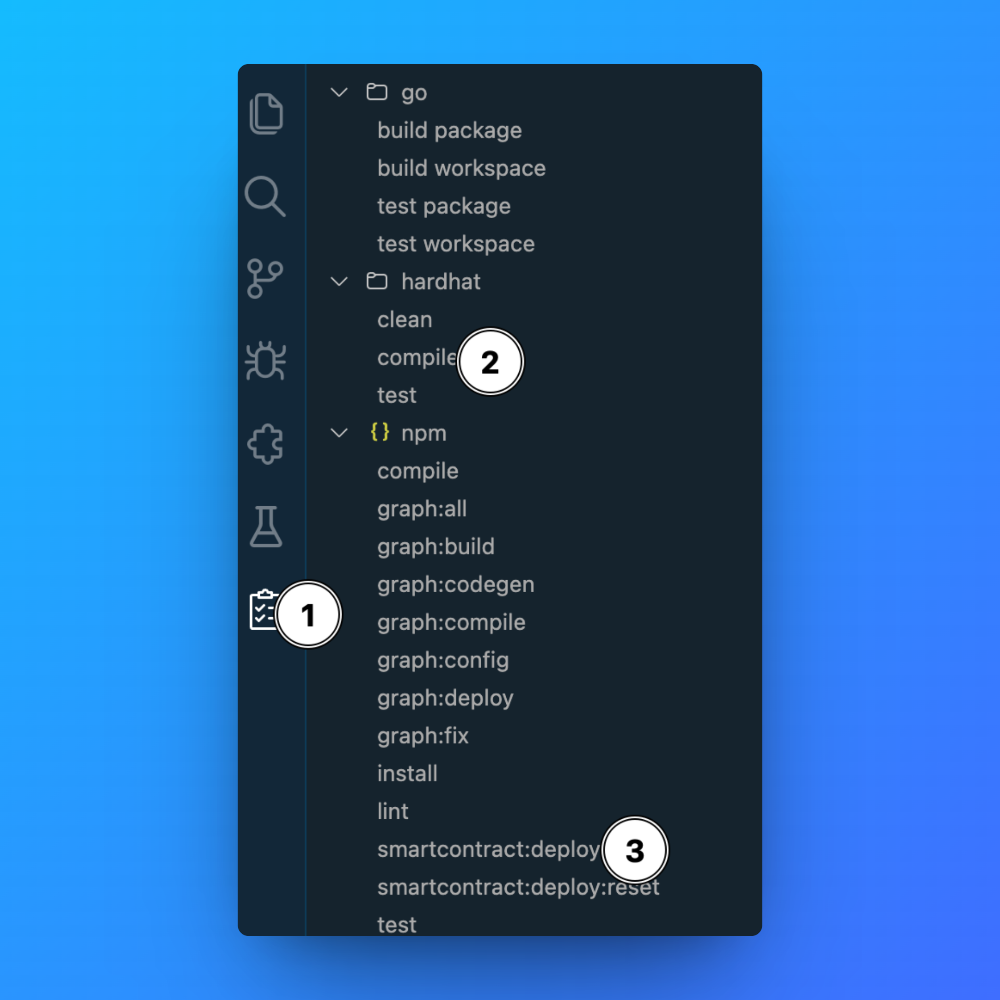

1. Select the `Task Manager` on the left
2. Compile the contract by selecting `Hardhat - Build`
3. Deploy the contract by selecting `Hardhat - Deploy to platform network`

If the deployment was successful, you will see a `deployed at 0x4251501F80cE773b594C0B6CEf1289b97b0`

## Part 2: Building the Frontend

Now that we have a deployed contract, let's build a front end to start interacting with it.

### Cloning the Template

To save some time for you, we have created a template that can be [found here](https://github.com/settlemint/settlemint-nextjs-wagmi). Clone this repository to get started.

### Installing the Dependencies

In addition to using NextJS, this template uses the:

- `wagmi` - to interact with the contract
- `web3auth` - to create a modal for connecting a wallet
- `tailwind` - for styling and design
- `connectkit` - connecting a wallet to your dApp

You can get all of these packages by running `bun install` in your terminal after cloning the repo.

After that is completed, open the folder in your favorite code editor.

### Adding the ABI

The first thing we will do is add the ABI and address of our deployed contract. This allows our front end to know where to read and write data to it. This information can be found in the smart contract set IDE where you deployed your contract.

Go to the `ignition/deployments/chain-46622/artifacts` folder in the file explorer and copy the `GenericERC20Module#GenericERC20.json` file to the `contractData` directory.

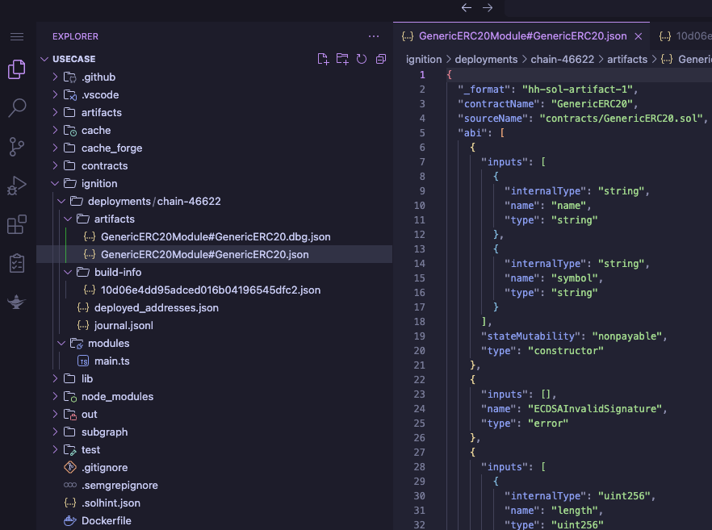

### Adding the access token

To connect to your node and middleware, you will need an access token. We recommend you use an application access token.

You can create an application access token by navigating to the application dashboard, and then clicking on the `Access Tokens` section in the left sidebar.

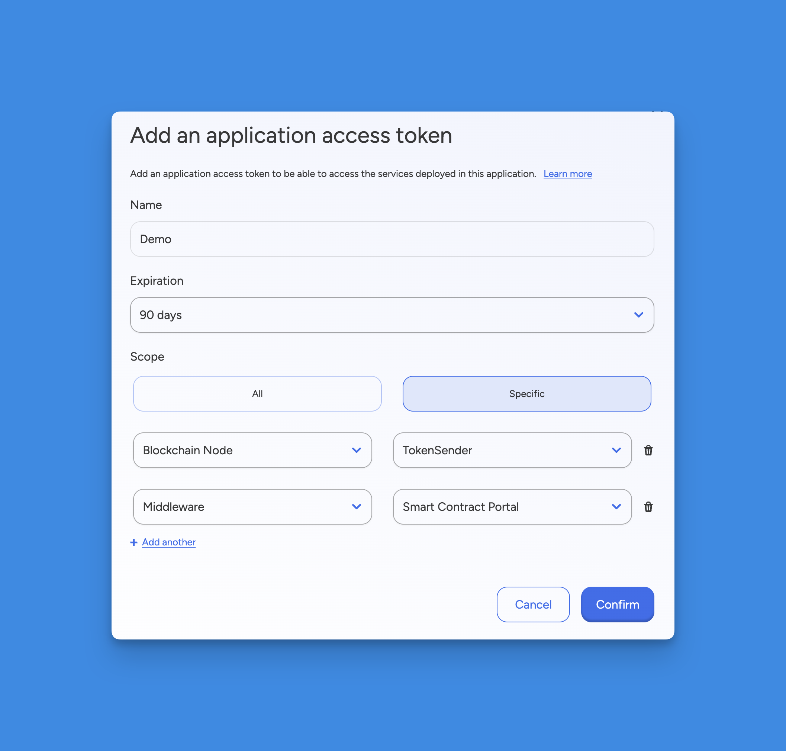

You can now create an application access token with an expiration and the scopes you want to use. For this guide, we recommend you create an access token scoped to your node and middleware.

You will now see your access token. Copy the token since you cannot see it again! Then, add it as the `BTP_TOKEN` variable value in the `.env` file.

### Configuring web3auth

To use web3auth, you will need to make an account a project. To set up an account and a project, follow [this guide](https://web3auth.io/docs/dashboard-setup).

After creating an account, you can create a new project. From there you will see that the project has been created and you can access the Project Details page.

On that page, you will find the `Project ID` like below:

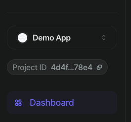

Copy your Project ID and add it as the `NEXT_PUBLIC_WALLETCONNECT_PROJECT_ID` variable value in the `.env` file.

### Adding environment variables

Open the `.env` file and add the remaining environment variables `BLOCKCHAIN_NODE`, `NEXT_PUBLIC_CONTRACT_ADDRESS` and `PORTAL_URL`.

```.env
# Base url of the application, used for SSR
NEXT_PUBLIC_SERVER_URL=http://localhost:3000

# API token
BTP_TOKEN=sm_pat_...

# Web3Modal - WalletConnect
NEXT_PUBLIC_WALLETCONNECT_PROJECT_ID=...

# Wagmi
# To get this URL go to the SettleMint platform and select the `Blockhain Nodes` option on the right.
# From there, select your deployed node and choose the `Connect` tab.
# Here you will find your `JSON-RPC` URL.
BLOCKCHAIN_NODE=https://blockchain-node.settlemint.com/

# Contracts
# To get this open the IDE of the deployed Smart Contract Set on the SettleMint platform.
# Open the `ignition/deployments/chain-46622/deployed_addresses.json` json file and copy the address.
NEXT_PUBLIC_CONTRACT_ADDRESS=0x...

# Portal
# To get this URL go to the SettleMint platform and select the `Middlewares` option on the right.
# From there, select your deployed smart contract portal middleware and choose the `Connect` tab.
# Copy the base url (without the `/graphql` or `/api` part).
PORTAL_URL=https://smart-contract-portal-middleware.settlemint.com
```

## Part 3: Running the Application

Now it's time to see what we have made. To get your application running, run the following command in your terminal:

```bash
bun dev
```

This will start your application locally on `localhost:3000`. Go to that address and you will now see the frontend using NextJS:
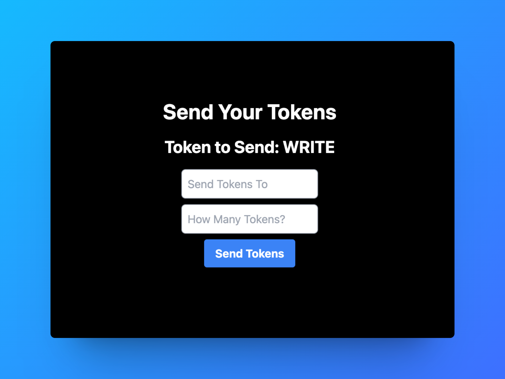

Using the `Smart Contract Portal Middleware` enables us to read different functions and values from our smart contract. In this template, we are reading the `symbol` function to display which token is connected to this smart contract.

This is done in this code block in `page.tsx`

```javascript
const { data } = useSuspenseQuery({
  queryKey: ['symbol'],
  queryFn: async () => {
    const response = await portal.GET('/api/generic-erc-20/{address}/symbol', {
      params: { path: { address } },
      parseAs: 'text'
    });
    return response.data;
  }
});
```

### Setting Up Metamask

To send some tokens that we just created, we need to add our private key to our Metamask wallet. You can retrieve your private key from the `Private Keys` section on SettleMint. This is the same location where we got the address earlier.

Copy your private key and open up your Metamask Extension. From there, select whatever account name is at the top of the window. Then scroll down until you see the `Import Account` option.

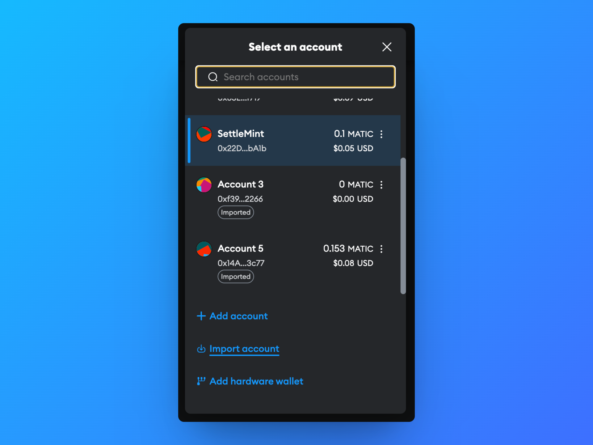

Select that option and paste into your private key. You now have access via Metamask to perform transactions from this account.

### Sending the Tokens

We are now ready to perform our first transaction from the front end.

In the first input box, insert any wallet address. It is good if you have access to that wallet to confirm that the transaction was sent.

In the second input box, insert the number of tokens you would like to send to the address.

Then click the `Send Tokens` button.

Your Metamask should now open up for you to sign the transaction. If not, make sure you have the correct wallet selected in Metamask before trying the transaction.

After clicking `Confirm`, you will see a `Tokens Sent` confirmation on your front end:

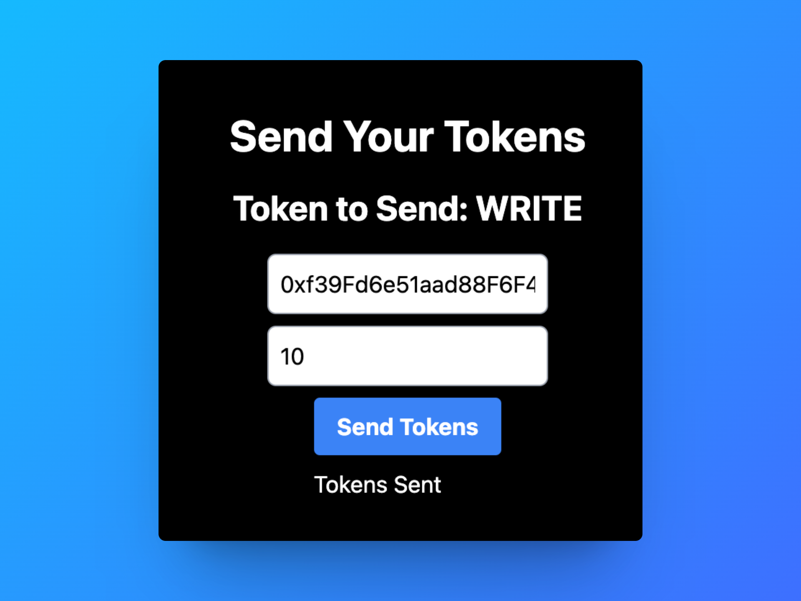

Congrats! You will now see the transaction confirmed in your Metamask activity.

## Next Steps

Now that you have built your custom frontend, you can now explore more [smart contract use cases](../guide-library) you can build on SettleMint!

## Deploy Your Frontend as a Custom Deployment

After building your custom frontend, you can deploy it on the SettleMint platform using the Custom Deployment feature. This allows you to host your frontend application alongside your blockchain components, providing a seamless integration within the SettleMint ecosystem.

For more detailed information on Custom Deployments, refer to the [Custom Deployment documentation](../../using-platform/custom-deployment).
