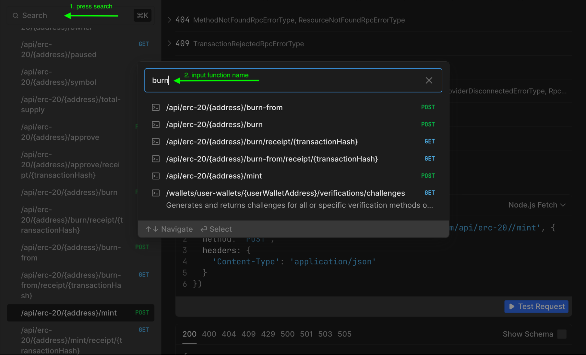

# Interacting with ERC-20 Tokens via the Smart Contract Portal

The ERC-20 standard is a cornerstone of the Ethereum ecosystem, providing a blueprint for creating fungible tokens that can seamlessly interact across various platforms and applications. This standard defines a set of essential functions and events that ensure tokens are interoperable, reliable, and straightforward to implement in decentralized applications.

Below are the Mint, Burn, and other core ERC-20 functions, along with explanations of their purpose and usage.

## Core ERC-20 Functions

| Function                                  | Purpose                                                                       |
| ----------------------------------------- | ----------------------------------------------------------------------------- |
| `totalSupply()`                           | Returns the total number of tokens in circulation.                            |
| `balanceOf(address)`                      | Returns the balance of a specified address.                                   |
| `transfer(address, uint256)`              | Transfers tokens from the caller's address to another address.                |
| `approve(address, uint256)`               | Authorizes a spender to spend a specific amount of the caller's tokens.       |
| `transferFrom(address, address, uint256)` | Transfers tokens from one address to another using an allowance.              |
| `allowance(address, address)`             | Returns the remaining tokens a spender is allowed to withdraw.                |
| `mint(address, uint256)`                  | Creates new tokens and adds them to the specified address (increases supply). |
| `burn(uint256)`                           | Destroys tokens from the caller's balance (reduces supply).                   |

## Prerequisites

Before you can interact with ERC-20 tokens, ensure you have:


1. **Launched a New ERC-20 Smart Contract Set:**
   - Follow the instructions [here](https://console.settlemint.com/documentation/docs/using-platform/15_dev-tools/0_code-studio/1_smart-contract-sets/3_add-smart-contract-set) to add a smart contract set.

2. **Deployed the ERC-20 Contract:**
   - Use the deployment guide [here](https://console.settlemint.com/documentation/docs/using-platform/15_dev-tools/0_code-studio/1_smart-contract-sets/4_deploying-a-contract) to deploy your contract.

3. **Set Up Your Smart Contract Portal and Import the ERC-20 ABI:**
   - Follow the instructions in the [Smart Contract Portal Guide](https://console.settlemint.com/documentation/docs/using-platform/7_middleware#the-smart-contract-portal-middleware) to set up your portal and import your ABI.


## Smart Contract Portal 

The Smart Contract Portal (SCP) provides an easy-to-use API layer over your smart contracts. It generates REST and GraphQL endpoints, enabling seamless interaction with smart contracts on EVM-compatible blockchains. This allows developers to perform operations without delving into blockchain-specific languages, facilitating integration and data aggregation.

Additionally, explore the [Smart Contract Portal Middleware](../using-platform/7_middleware.md#the-smart-contract-portal-middleware) for insights into middleware capabilities and integration.

### Searching and Using Functions

- **Function Search:**
  - Use the search bar to find functions like `burn`, `mint`, or `approve`. Simply type the function name or a part of it, and select the appropriate endpoint from the dropdown list.

- **Programming Language Selection:**
  - The SCP supports multiple programming languages, including JavaScript, Python, and cURL. After selecting a function, choose your preferred language to view and copy the code snippet.

 

## Mint Function with Smart Contract Portal (SCP)

```javascript
const authToken = "Replace with your auth token";
const baseUrl = "Replace with your portal base URL";
const contract = "Replace with your contract name";
const sender = "Replace with the sender's address";
const receiver = "Replace with the receiver's address";
const amount = 100; // Replace with the mint amount

const res = await fetch(`${baseUrl}/api/erc-20/${contract}/mint`, {
    method: 'POST',
    headers: {
        'Content-Type': 'application/json',
        'x-auth-token': `${authToken}`
    },
    body: JSON.stringify({
        from: sender, // Sender's address
        metadata: {}, // Add metadata if required
        input: {
            to: receiver, // Receiver's address
            amount: amount // Amount to mint
        }
    })
});

const data = await res.json();
console.log("Mint response:", data);
```

## Burn Function with Smart Contract Portal (SCP)

```javascript
const authToken = "Replace with your auth token";
const baseUrl = "Replace with your portal base URL";
const contract = "Replace with your contract Address";
const amount = 100; // Replace with the burn amount

const res = await fetch(`${baseUrl}/api/erc-20/${contract}/burn`, {
    method: 'POST',
    headers: {
        'Content-Type': 'application/json',
        'x-auth-token': `${authToken}`
    },
    body: JSON.stringify({
        from: "YOUR_SENDER_ADDRESS", // Replace with the sender's address
        metadata: {}, // Add metadata if required
        input: {
            amount: amount // Amount to burn
        }
    })
});

const data = await res.json();
console.log("Burn response:", data);
```
## Mint Function Using Ethers.js

```javascript
import { ethers } from "ethers";

async function mintTokens(contractAddress, recipient, amount, signer) {
    const abi = ["function mint(address to, uint256 amount) public returns (bool)"];
    const contract = new ethers.Contract(contractAddress, abi, signer);

    const tx = await contract.mint(recipient, ethers.parseUnits(amount.toString(), 18));
    console.log(`Transaction sent: ${tx.hash}`);
    await tx.wait();
    console.log("Tokens minted successfully");
}

// Example usage
const signer = new ethers.Wallet("YOUR_PRIVATE_KEY", ethers.provider); // Replace with your signer
await mintTokens("YOUR_CONTRACT_ADDRESS", "RECEIVER_ADDRESS", 100, signer); // Replace with your contract address, recipient, and amount
```

## Burn Function Using Ethers.js

```javascript
import { ethers } from "ethers";

async function burnTokens(contractAddress, amount, signer) {
    const abi = ["function burn(uint256 amount) public returns (bool)"];
    const contract = new ethers.Contract(contractAddress, abi, signer);

    const tx = await contract.burn(ethers.parseUnits(amount.toString(), 18));
    console.log(`Transaction sent: ${tx.hash}`);
    await tx.wait();
    console.log("Tokens burned successfully");
}

// Example usage
const signer = new ethers.Wallet("YOUR_PRIVATE_KEY", ethers.provider); // Replace with your signer
await burnTokens("YOUR_CONTRACT_ADDRESS", 100, signer); // Replace with your contract address and amount
```


## Key Notes

### Smart Contract Portal (SCP):

- Replace `YOUR_CONTRACT_NAME`, `YOUR_SENDER_ADDRESS`, and `YOUR_RECEIVER_ADDRESS` with actual values from your deployed ERC-20 contract.
- Ensure `authToken` and `baseUrl` are correctly set for SCP.

### Ethers.js:

- Make sure your ABI matches the contract's interface.
- The signer should have the necessary private key and be connected to the blockchain network.
- The signer should have the necessary private key and be connected to the blockchain network.