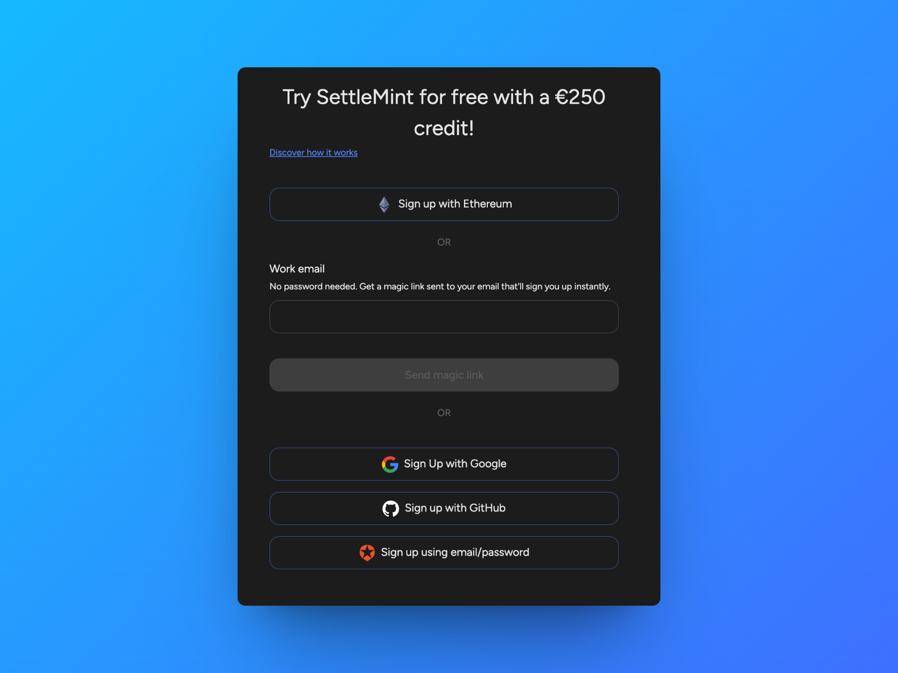

# Create an account

:::info Sign up and get €250 to try SettleMint

If you create an account on SettleMint you get €250 free credit to try out the platform. This gives you a unique opportunity to experience low-code blockchain, and see for yourself how easy and fast you can build blockchain applications.

:::

Navigate to [SettleMint](https://console.settlemint.com/) and follow these steps to create an account:

1. Choose to sign up with **Google**, **Github**, **Ethereum** or with a **magic link**.
   Magic links let you sign up and log in without a password. When you provide your email address, you get a magic link sent to your email that will sign you up instantly.

1. Enter your **first and last name**, and choose a name for your **organization**.
   An organization is the highest level of hierarchy in SettleMint. It's at this level that you create and manage blockchain applications, invite team members to collaborate, and manage billing. You can create as many organizations as you want. Choose a name that is easily recognizable in your dashboards (like your company name, department name, team name, etc.). You can change the name of your organization at any time. [More about organizations](3_about-organizations.md)

1. Choose a name for your first **blockchain application**.
   You may want to choose a name related to what you are building, e.g. track and trace, NFT, data exchange, etc. Names like "my first app" or "test app" are also fine. You can change the name of an application at any time. [More about applications](../../using-platform/0_create-an-application.md)

1. You're all set up now, and ready to start building your first application.

Start by [adding a network to your application](../../using-platform/1_add-a-network-to-an-application.md).
