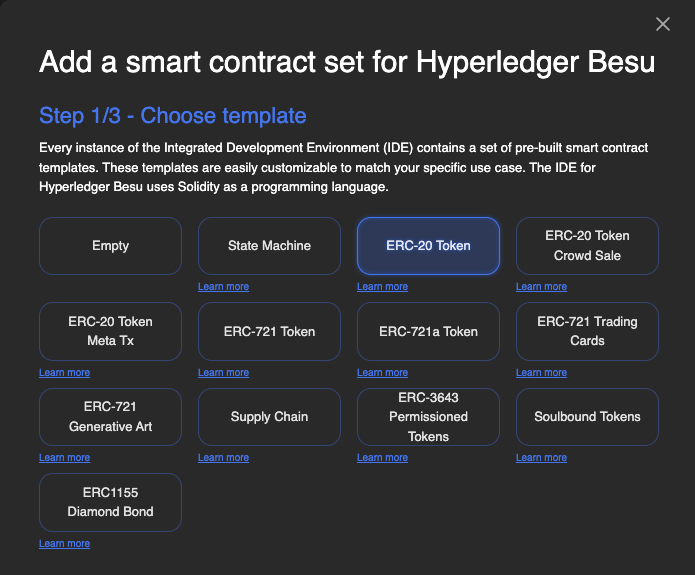

SettleMint's smart contract templates serve as open-source, ready-to-use foundations for blockchain application development, significantly accelerating the deployment process. These templates enable users to quickly customize and extend their blockchain applications, leveraging tested and community-enhanced frameworks to reduce development time and accelerate market entry.

 

### Open-Source Smart Contract Templates under the MIT License

Benefit from the expertise of the blockchain community and trust in the reliability of your smart contracts. These templates are vetted and used by major enterprises and institutions, ensuring enhanced security and confidence in your deployments.

### Create Your Own Smart Contract Templates for Your Consortium

Within the self-managed Blockchain Transformation Platform (BTP), you can create and add your own templates for use within your consortium. This fosters a collaborative environment where templates can be reused and built upon, promoting innovation and efficiency within your network.

To get started, visit: [SettleMint GitHub Repository](https://github.com/settlemint/solidity-empty)
