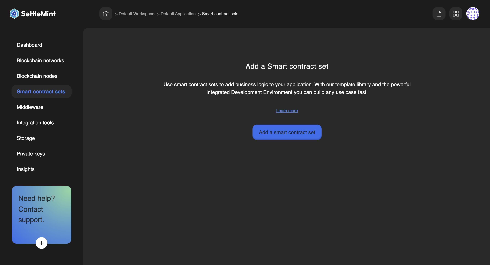
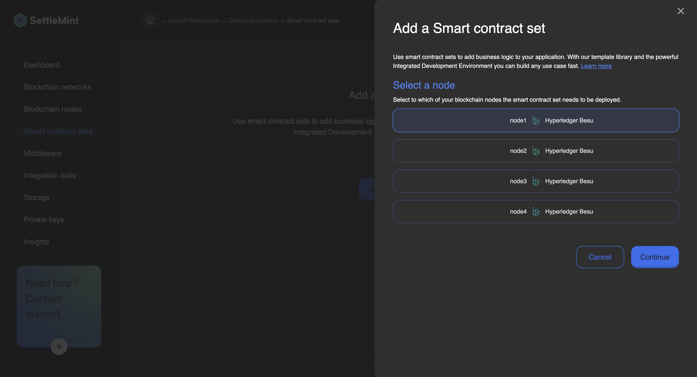
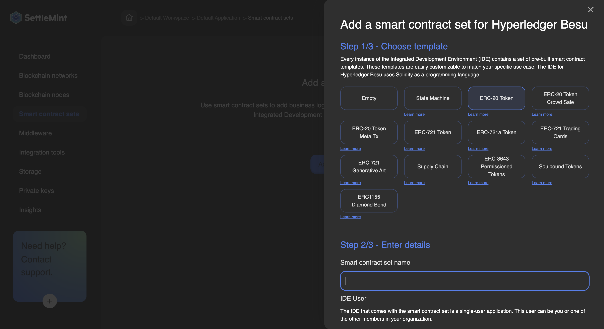
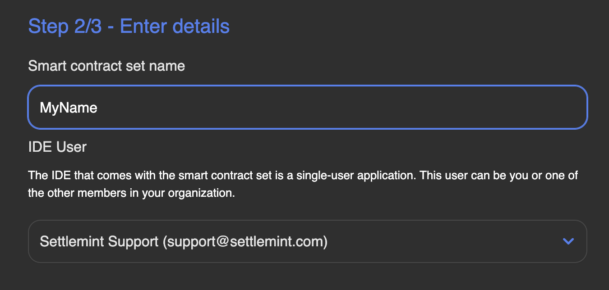
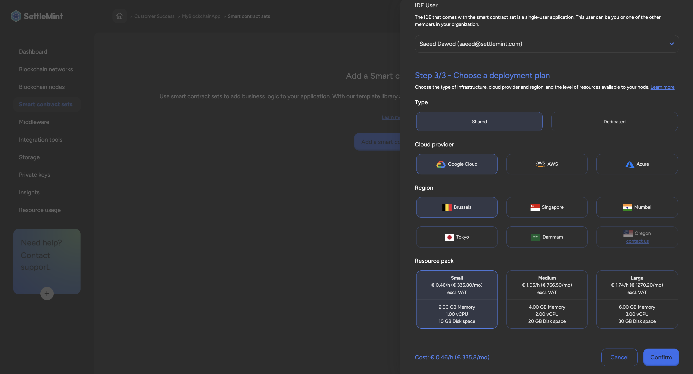

# Add a Smart contract set

By using smart contract sets, you can add **business logic** to your application.

Smart contract sets are programs that run on the blockchain and define the rules of your use case. They are self-executing with an 'if this, then that' pattern and activate when predefined conditions are met, such as a smart contract that transfers the ownership of a car once a certain amount of money is transferred to the seller's account.

To expedite the process of writing and deploying smart contracts, we offer a [template library](2_smart-contract-templates.md) and an Integrated Development Environment (IDE). The template library includes pre-built smart contract sets for specific use cases, which are easily customizable to match your needs.

## How to Add a Smart Contract Set

Navigate to the **application** where you want to add the smart contract set. Ensure you have a network with a node in place.

Click **Smart Contract Sets** in the left navigation, and then click **Add a Smart Contract Set**. This opens a form.

Follow these steps to add the smart contract set:

1. Navigate to **Smart Contract Sets** and press **Add a Smart Contract Set**.
   
2. Select which of your **blockchain nodes** the smart contract set needs to be deployed to, and click **Continue**.
   
3. Choose a **template**. The IDE instance will contain a set of pre-built smart contract templates for your selected use case.
   
4. Choose a **Smart Contract Set Name** that will be easily recognizable in your dashboards, then select the **IDE User**.
   The IDE that comes with the smart contract set is a single-user application. This user can be you or another member of your organization.
   
5. Choose a **Deployment Plan**. Select the type, cloud provider, region, and resource pack. [More about deployment plans](/docs/launch-platform/managed-cloud-deployment/13_deployment-plans.md).
   
6. Review the resource cost for this smart contract set displayed at the bottom of the form. Click **Confirm** to add the smart contract set.

You are now ready to use the IDE to configure the smart contract set to your needs and deploy it. You will see your deployed smart contracts in the **Details tab**.

For protocol-specific information, please refer to the relevant section in our blockchain guides:

- [Hyperledger Besu Smart Contracts IDE](/docs/blockchain-guides/1_Hyperledger-Besu/6_enterprise-ethereum-integration-tools.md)
- [Ethereum Smart Contracts IDE](/docs/blockchain-guides/0_Ethereum/5_ethereum-integration-tools.md)
- [Avalanche Smart Contracts IDE](/docs/blockchain-guides/2_Avalanche/5_avalanche-integration-tools.md)
- [Polygon Smart Contracts IDE](/docs/blockchain-guides/4_Polygon/5_polygon-integration-tools.md)
- [Hyperledger Fabric Smart Contracts IDE](/docs/blockchain-guides/5_Hyperledger-Fabric/6_hyperledger-fabric-integration-tools.md)
