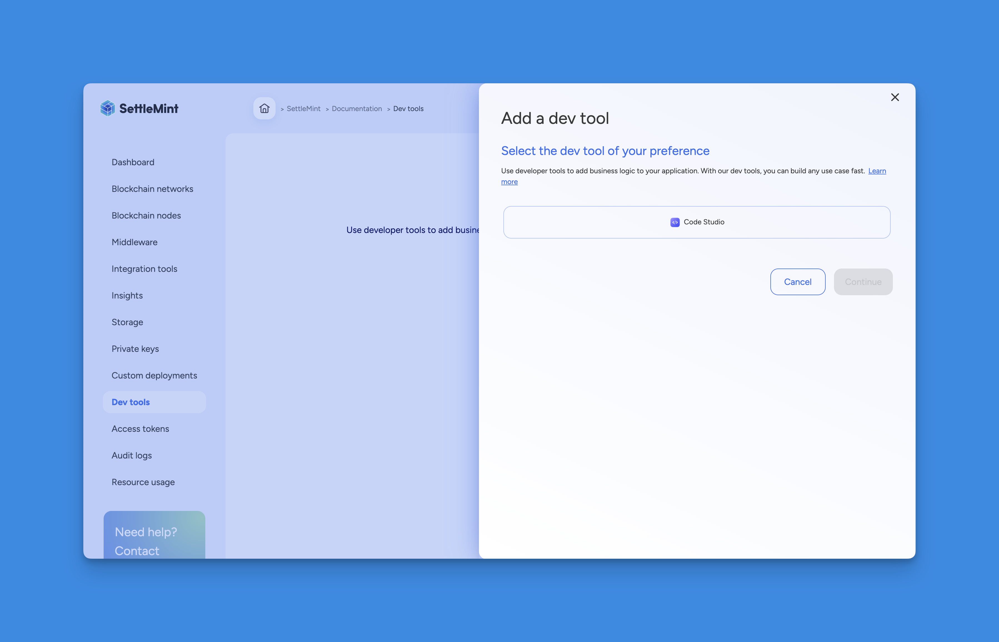
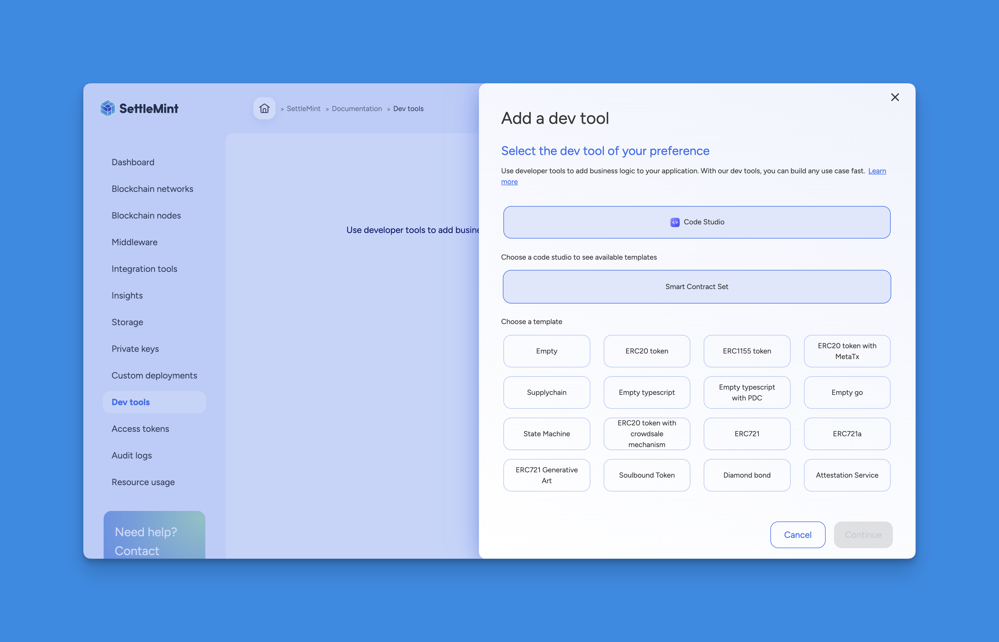
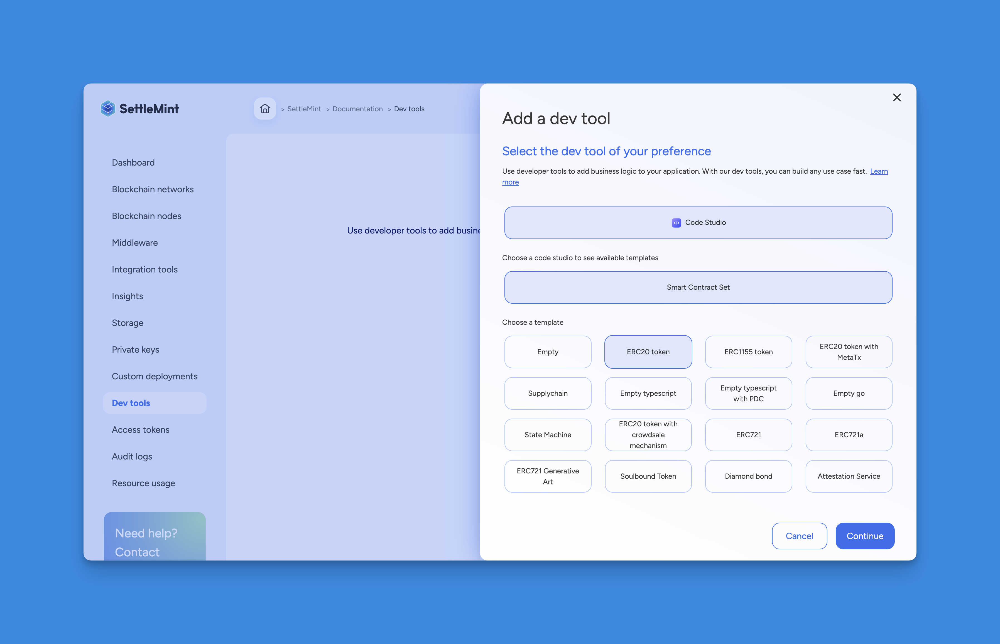
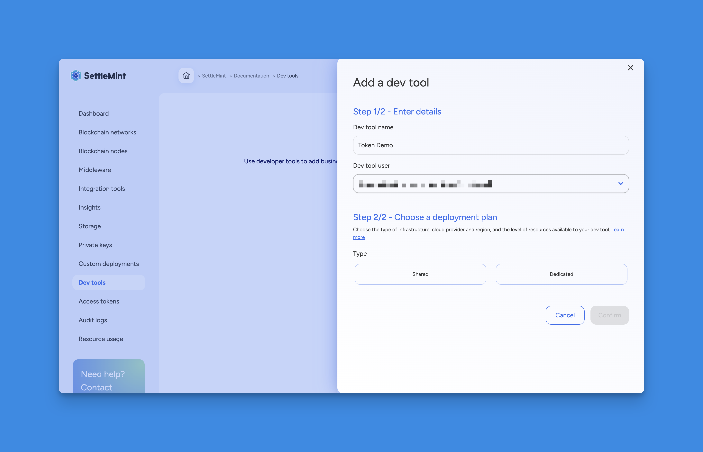
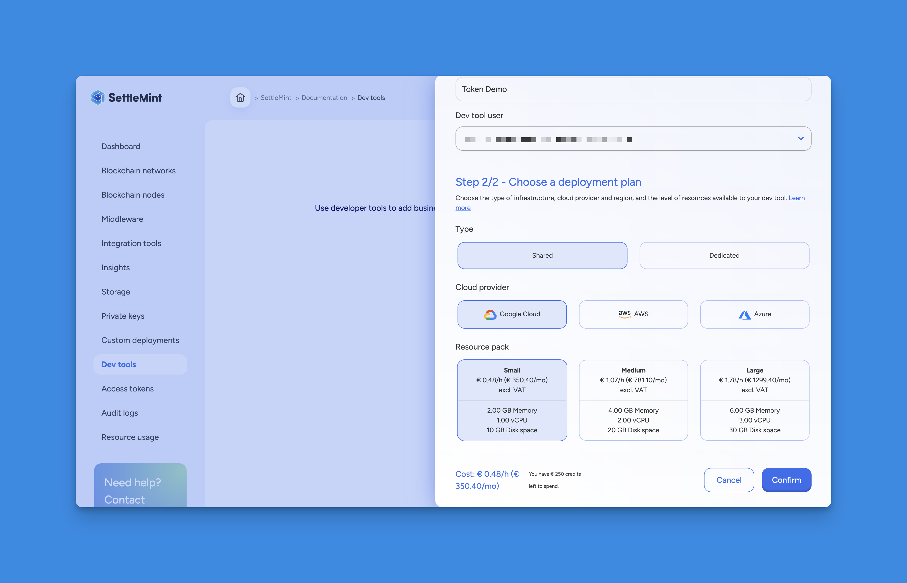

# Add a Smart Contract Set

By using smart contracts, you can add **business logic** to your application.

Smart contracts are programs that run on the blockchain and define the rules of your use case. They are self-executing with an 'if this, then that' pattern and activate when predefined conditions are met, such as a smart contract that transfers the ownership of a car once a certain amount of money is transferred to the seller's account.

## How to Add a Smart Contract Set

Navigate to the **application** where you want to add the Smart contract set.

Follow these steps to add the Smart contract set:

1. Navigate to **Dev tools** and click on **Add a Dev tool**.

   

2. Select **Code Studio** as the Dev tool type.

   

3. Choose **Smart Contract Set** as the Dev tool type.

   

4. Choose a **template**. The Code studio will contain the smart contracts for your selected template.

   

5. Click **Continue** to enter the name, user and deployment plan for your Smart contract set.

   

6. Enter a **Dev tool name** that will be easily recognizable in your dashboards, then choose the **Dev tool user**. The chosen user will be the only one with access to this Dev tool.

   

7. Choose a **Deployment Plan**. Select the type, cloud provider, region, and resource pack. [More about deployment plans](../../../../launch-platform/managed-cloud-deployment/3_deployment-plans.md).
8. Review the resource cost for this smart contract set displayed at the bottom of the form. Click **Confirm** to add the Smart contract set.

   

You are now ready to use the Smart contract set, configure it to your needs and deploy smart contracts!

For protocol-specific information, please refer to the relevant section in our blockchain guides:

- [Hyperledger Besu Smart Contracts IDE](/docs/blockchain-guides/1_Hyperledger-Besu/6_enterprise-ethereum-integration-tools.md)
- [Ethereum Smart Contracts IDE](/docs/blockchain-guides/0_Ethereum/5_ethereum-integration-tools.md)
- [Avalanche Smart Contracts IDE](/docs/blockchain-guides/2_Avalanche/5_avalanche-integration-tools.md)
- [Polygon Smart Contracts IDE](/docs/blockchain-guides/4_Polygon/5_polygon-integration-tools.md)
- [Hyperledger Fabric Smart Contracts IDE](/docs/blockchain-guides/5_Hyperledger-Fabric/6_hyperledger-fabric-integration-tools.md)
