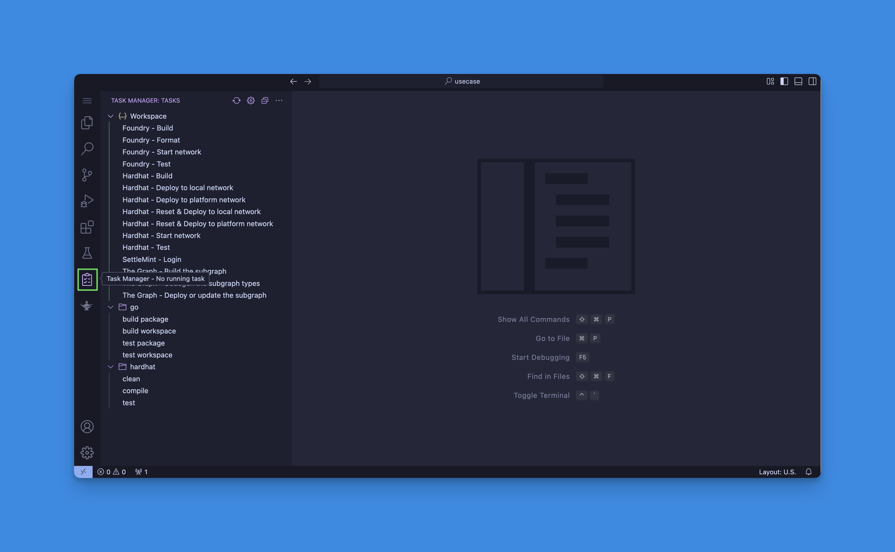
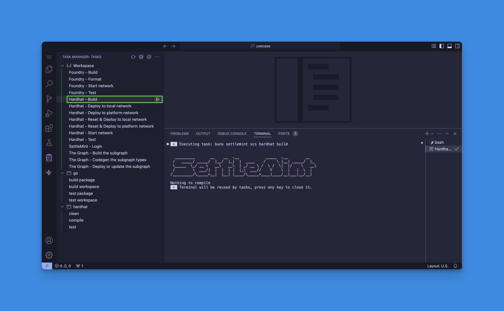
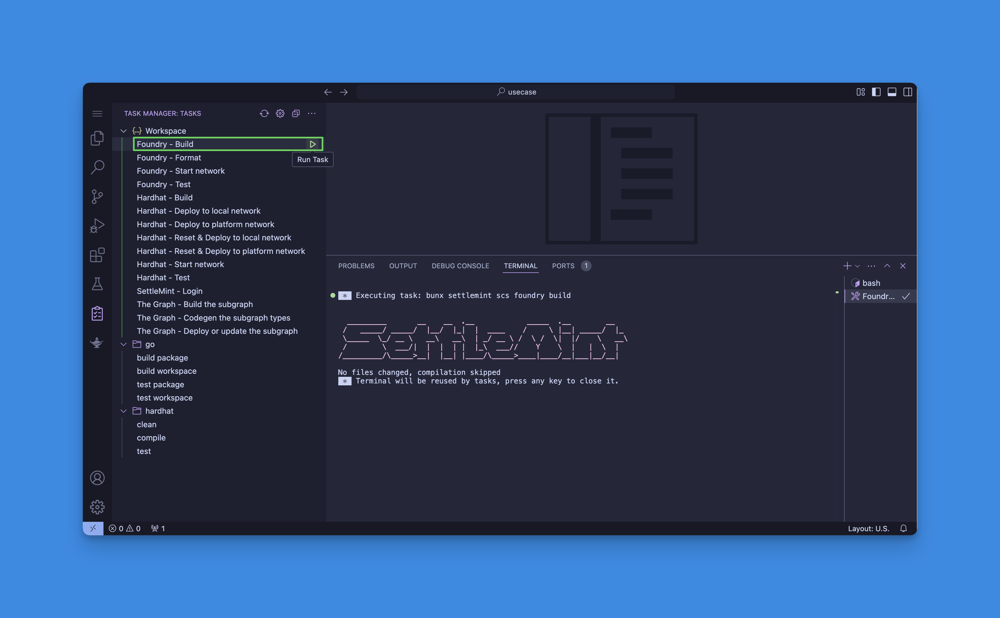
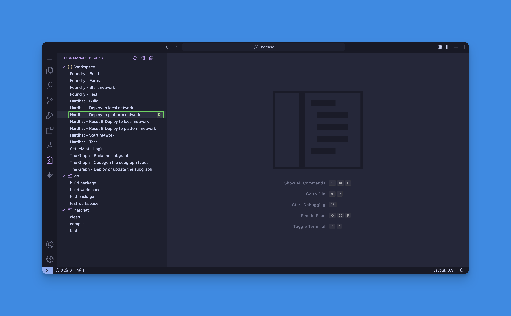
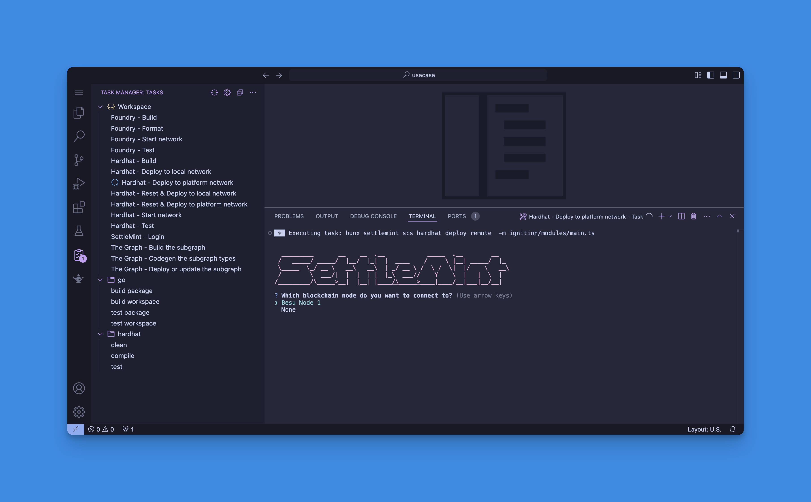
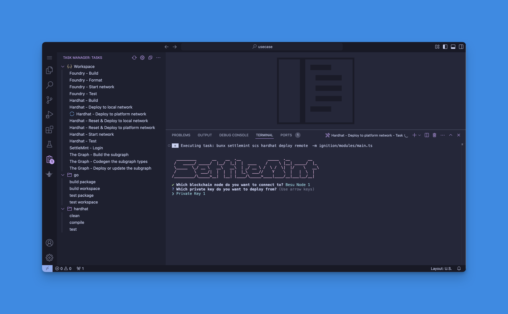
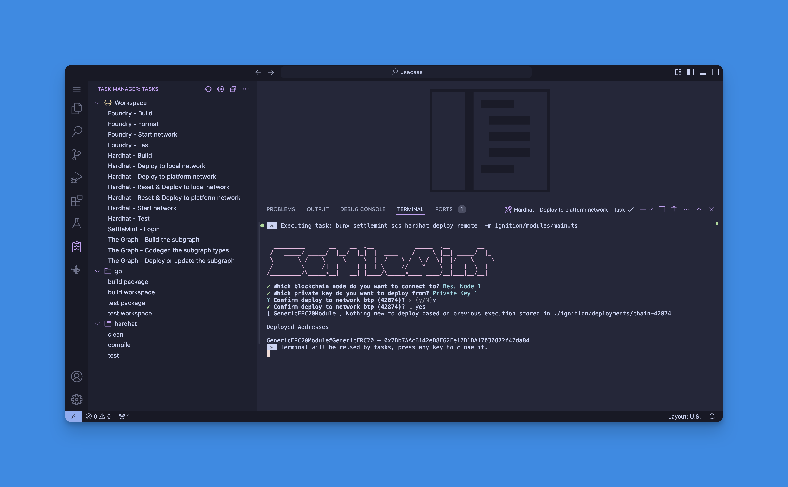
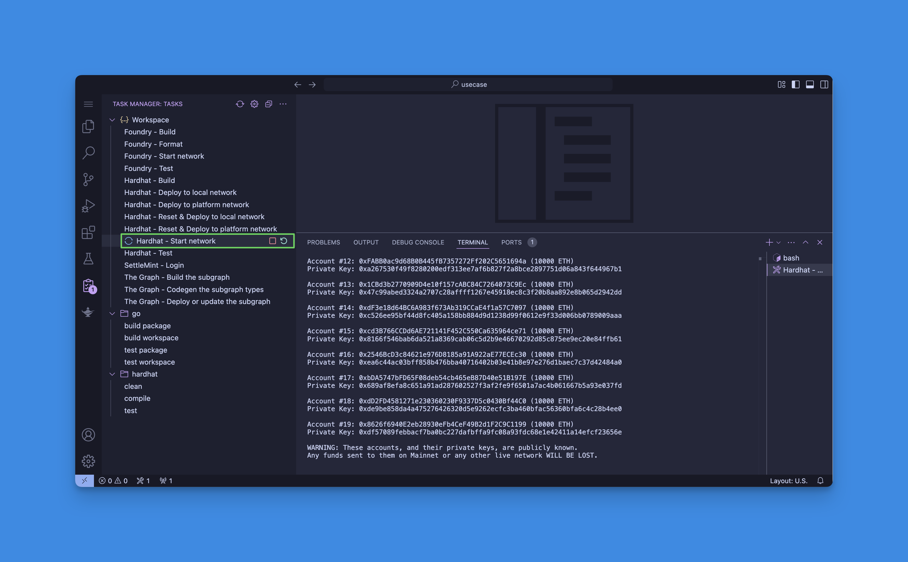
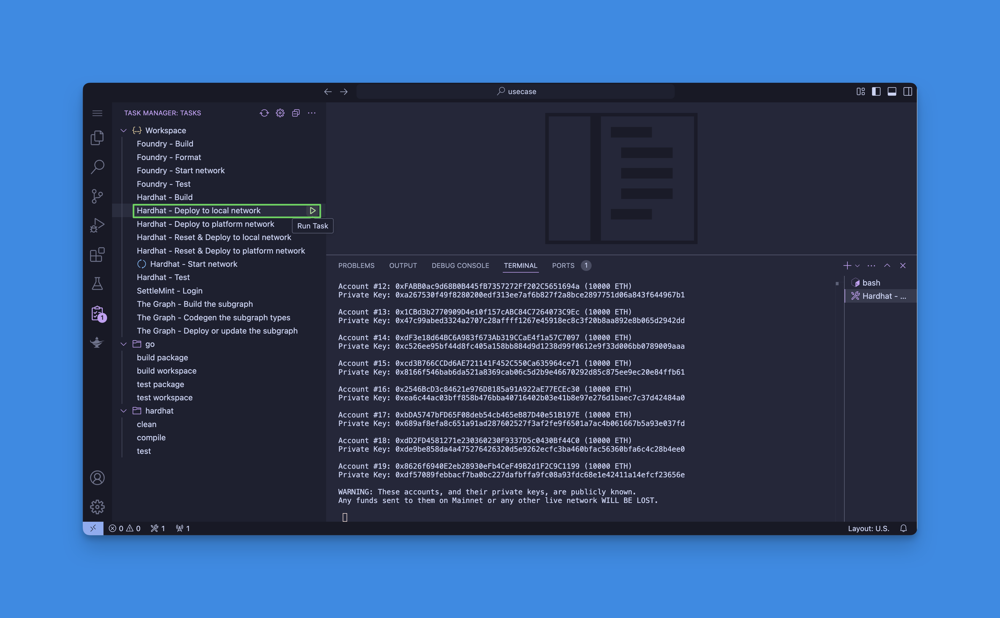
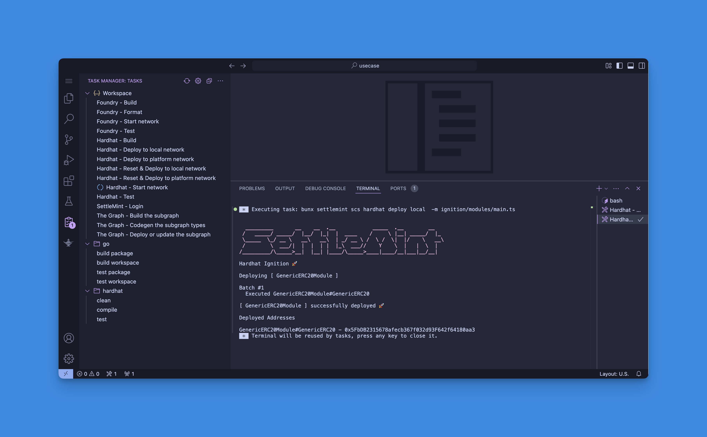

# Deploying a smart contract

There are two main ways to deploy smart contracts in the Smart Contract Set: you can either use the Task Manager or run the commands manually in the terminal.

You can deploy your contracts to a local anvil node (for testing purposes) or to a network you have created in the platform.

The typical folder structure of SettleMint's smart contract set will include:

- **`contracts/`**: Contains the Solidity smart contracts for the project.
- **`test/`**: Houses the Solidity tests, written to verify the functionality of the smart contracts.
  - The test folder can contain both Hardhat tests written in TypeScript, and Foundry tests written in Solidity.
- **`script/`**: Includes scripts for deploying or interacting with the contracts post-deployment.
- **`lib/`**: Optional directory for Solidity libraries or external dependencies.
- **`ignitions/`**: A folder containing the ignitions for Hardhat deployment.
- **`out/`**: Generated directory where compilation artifacts (like ABI and binary) are stored.
- **`foundry.toml`**: Configuration file for Foundry, where you can set global settings and parameters.
- **`hardhat.config`**: Hardhat configuration file.
- **`subgraphs`**: Contains the indexing logic for your subgraphs, specific to your smart contract.

The following sections will guide you through the process of deploying your contracts to a network in the platform or a hardhat network running locally in the IDE. All the tasks are available in the Task Manager. Follow these steps to access the Task Manager:

**Step 1**: Open the IDE

**Step 2**: Click on the `Task Manager` button

## Compile

You need to compile your contracts before you can deploy them. SettleMint's smart contract sets include both Hardhat and Foundry. You can compile using your preferred framework.

### Hardhat

To compile your contracts using Hardhat, you can run the `Hardhat - Build` task

### Foundry

To compile your contracts using Foundry, you can run the `Foundry - Build` task

## Deploy to a network in the platform

You can deploy your contracts to a network in the same application as the smart contract set by running the `Hardhat - Deploy to platform network` task

:::note

Ensure you have the following:

- A running node in the network
- A private key activated on the node

:::

### Hardhat

**Step 1**: Log in to the platform by running the `SettleMint - Login` task

**Step 2**: Run the `Hardhat - Deploy to platform network` task

**Step 3**: Select the node you want to deploy to

**Step 4**: Select the private key you want to use for the deployment

**Step 5**: Confirm the deployment

## Deploy to a local network

### Hardhat

**Step 1**: Start the local hardhat network by running the `Hardhat - Start local network` task

**Step 2**: Then, run the `Hardhat - Deploy to local network` task. Ensure you don't stop the previous task, because the hardhat network needs to be running for the contract to be deployed on it.

Success! The contract has been deployed to the local network.

