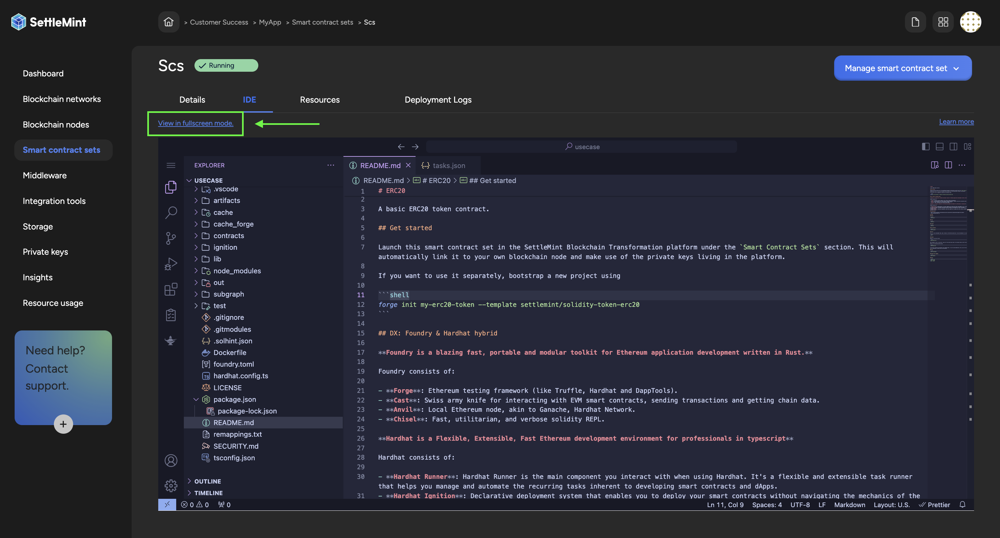
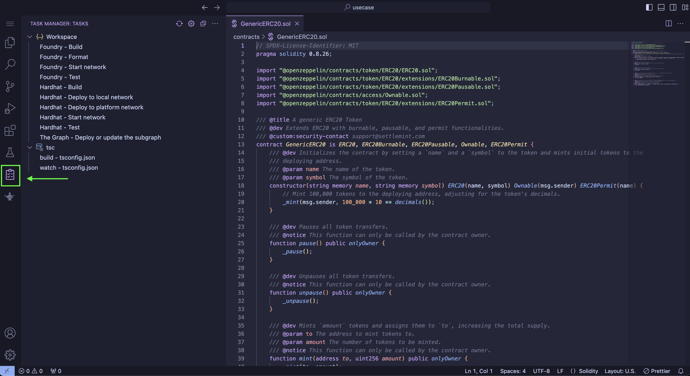
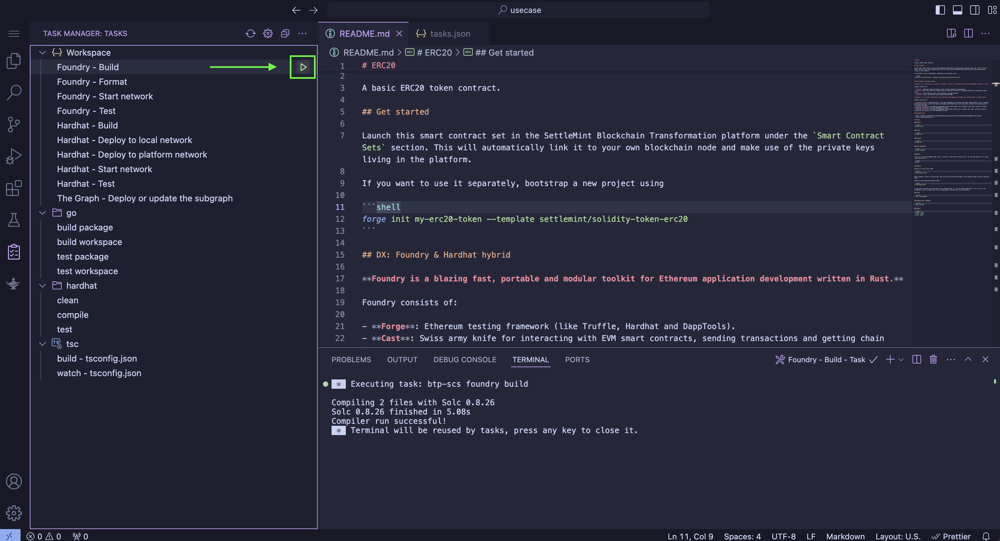
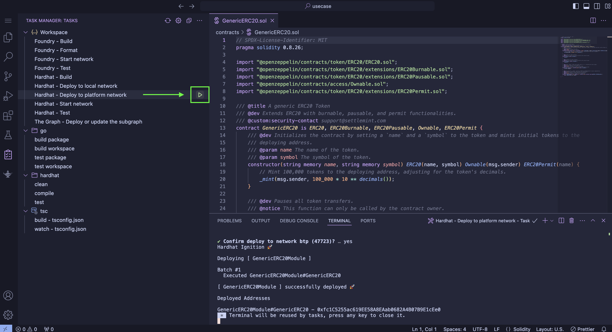
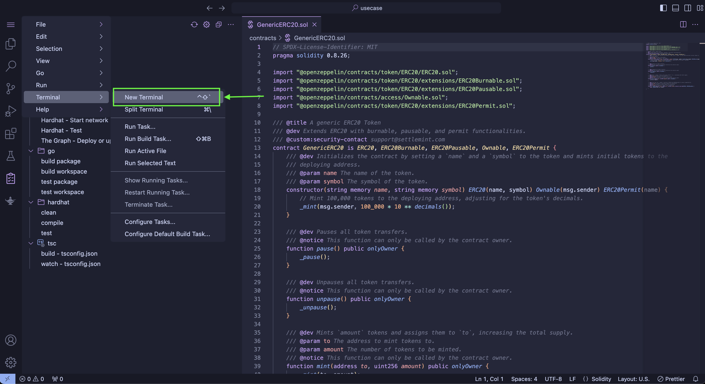
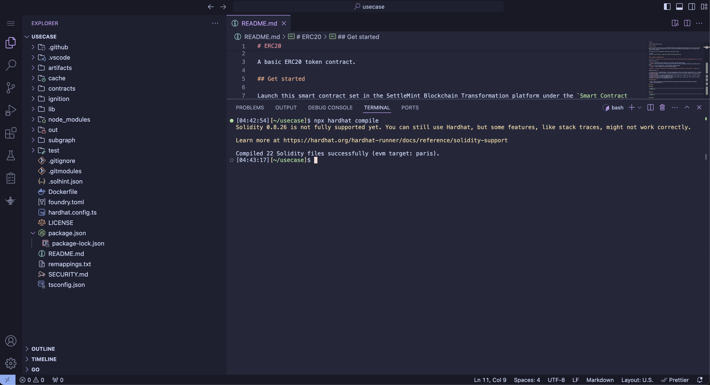
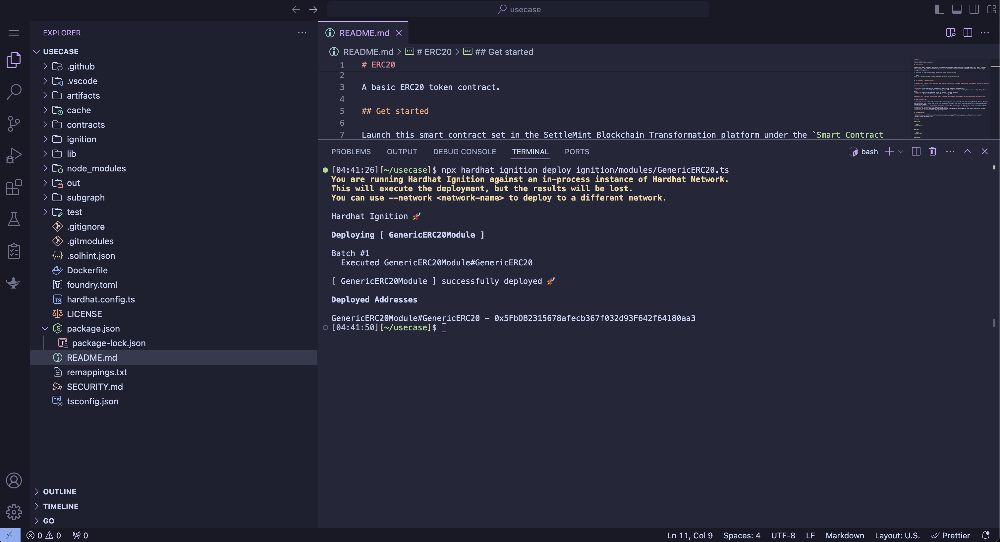

# Deploying a smart contract

Deploying a smart contract in SettleMint won't be much different from doing so in your own environment.

There are two main ways to deploy smart contracts in SettleMint: you can either run the commands manually in your terminal or use the Task Manager.

The typical folder structure of SettleMint's smart contract set will include:

- **`contracts/`**: Contains the Solidity smart contracts for the project.
- **`test/`**: Houses the Solidity tests, written to verify the functionality of the smart contracts.
  - The test folder can contain both Hardhat tests written in TypeScript, and Foundry tests written in Solidity.
- **`script/`**: Includes scripts for deploying or interacting with the contracts post-deployment.
- **`lib/`**: Optional directory for Solidity libraries or external dependencies.
- **`ignitions/`**: A folder containing the ignitions for Hardhat deployment.
- **`out/`**: Generated directory where compilation artifacts (like ABI and binary) are stored.
- **`foundry.toml`**: Configuration file for Foundry, where you can set global settings and parameters.
- **`hardhat.config`**: Hardhat configuration file.
- **`subgraphs`**: Contains the indexing logic for your subgraphs, specific to your smart contract.

## Deploy with Task Manager

Follow these steps to deploy a contract using the Task Manager:

1. Click `View in Fullscreen Mode` for a better user experience :)
   

2. Navigate to the `Task Manager`.
   

3. Click `Foundry - Build` or `Hardhat - Build` to compile the Smart Contract.
   

4. Then run `Hardhat - Deploy to local network` to deploy locally or `Hardhat - Deploy to platform network` to deploy to your connected network.
   

Great job! Your contract has been successfully deployed.

## Deploy with the Terminal

Follow these steps to deploy a contract using the terminal:

1. Open the terminal.
   

2. Run the command `forge build` or `Hardhat compile` to compile the smart contracts.
   

3. Then run `npx hardhat ignition deploy IGNITION_MODULE_PATH` or forge create --rpc-url YOUR_RPC_URL --private-key YOUR_PRIVATE_KEY --constructor-args ARG1 ARG2` to deploy to your connected network.
   

Well done! You've successfully deployed your contract.
