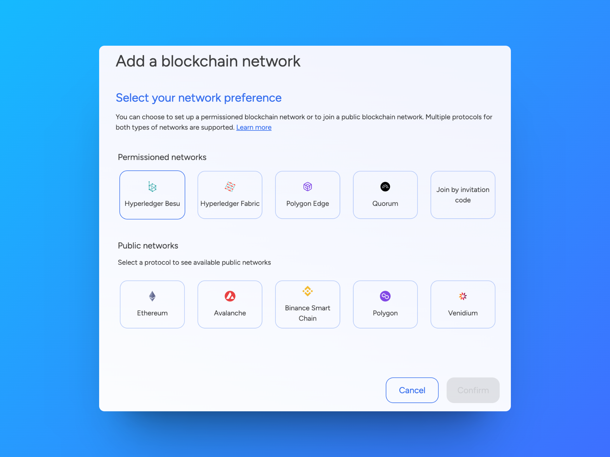
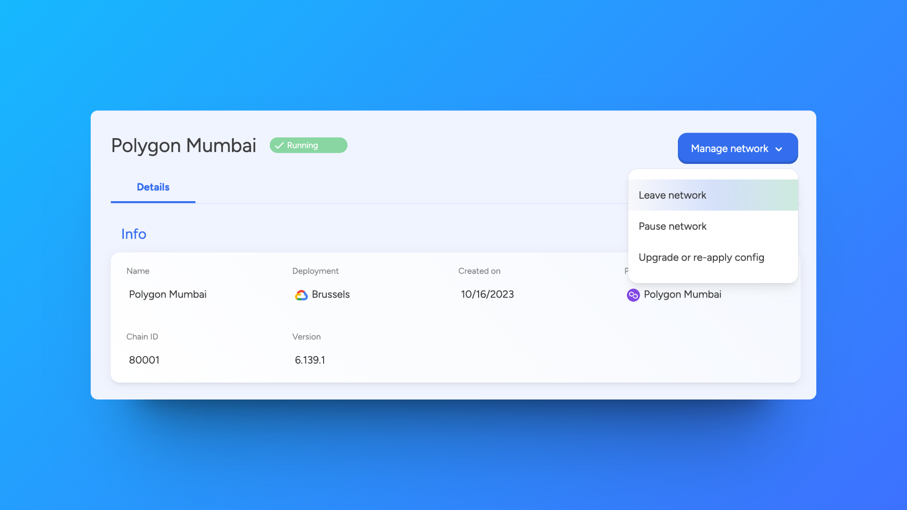

# Add a network to an application

Before setting up a blockchain network, ensure you have an application in place. You must always [create an application](0_create-an-application.md) first, as this provides the context for organizing networks, nodes, smart contract sets, etc.

## Permissioned and public blockchain networks

You can choose to **create a permissioned blockchain network**, **join a public blockchain network**, **join a permissioned blockchain network**, or join an existing network in SettleMint **with an invitation code**.

In a public blockchain network, anyone can freely join and participate in the network's activities. In a permissioned blockchain network (often called a consortium network), participants need permission to join. The network owner dictates who can join and allocates a set of permissions to participants.

SettleMint supports **multiple protocols** for both types of networks. You can learn more about these protocols in the blockchain guides included in this documentation.

Permissioned networks:

- [Hyperledger Besu](../blockchain-guides/1_Hyperledger-Besu/1_enterprise-ethereum-the-basics.md)
- [Hyperledger Fabric](../blockchain-guides/5_Hyperledger-Fabric/1_hyperledger-fabric-the-basics.md)
- [Polygon Edge](../blockchain-guides/6_Polygon-Edge/1_polygon-edge-the-basics.md)

Public networks (Mainnets & Testnets):

- [Ethereum](../blockchain-guides/0_Ethereum/1_ethereum-the-basics.md)
- [Avalanche](../blockchain-guides/2_Avalanche/1_avalanche-the-basics.md)
- [Binance Smart Chain](../blockchain-guides/3_Binance-Smart-Chain/1_binance-smart-chain-the-basics.md)
- [Polygon](../blockchain-guides/4_Polygon/1_polygon-the-basics.md)

Joining a permissioned network:

- [How to join an external permissioned network](../blockchain-guides/1_Hyperledger-Besu/9_enterprise-ethereum-connect-external-network.md)

Joining a network with an invitation code:

- [How to join an existing network in SettleMint with an invitation code](./4_join-a-network-by-invitation.md). For more information on inviting network participants, see [how to invite network participants](./3_invite-network-participants.md).

## How to add a blockchain network

This section describes the general process for setting up a blockchain network. For protocol-specific information, please refer to the relevant sections in the blockchain guides.

Navigate to the **application** where you will create the network. Click the **grid icon** in the upper right corner, then click the **application name** to go to the application dashboard.

The application dashboard is initially empty. This will change once you add your first blockchain network and node. Click **Start here**, or click **Blockchain networks** in the left navigation.

Click **Add blockchain network** to open a form.

Follow these steps to set up the blockchain network:

1. **Select the protocol** of your choice and click **Continue**.
2. Choose a **network name** and a **node name**. Use names that are easily recognizable in your dashboards. If you are joining a public network, you do not need to provide a network name.

:::info

Note that your network requires at least 1 validating node to be operational. We will deploy 1 validating node to your network initially. You can [add more nodes](2_add-a-node-to-a-network.md) later.

:::

3. Choose a **deployment plan**. Select the type, cloud provider, region, and resource pack. [Learn more about deployment plans](../launch-platform/managed-cloud-deployment/13_deployment-plans.md)
4. For [Hyperledger Besu](../blockchain-guides/1_Hyperledger-Besu/2_enterprise-ethereum-network-settings.md) and [Hyperledger Fabric](../blockchain-guides/5_Hyperledger-Fabric/2_hyperledger-fabric-network-settings.md) only (optional): **Configure the network settings**. You can keep the default settings or configure them according to your preferences. Note that these settings cannot be changed once your network is deployed.
5. Review the **resource costs** associated with this network displayed at the bottom of the form. Click **Confirm** to add the network to your application.

The network is now added to the **blockchain network overview** with the status "deploying". When your network is fully deployed, the status will change to "running". This typically takes a few minutes. Click the network in the overview list to see detailed information, such as stats, usage metrics, logs, network participants, etc. Available network information varies depending on the protocol.

Navigate to the **Blockchain nodes** section of the application to see the **first node** that was deployed with the network. Click this node in the overview list to see detailed information, such as stats, usage metrics, connection info, logs, etc. Available node information varies depending on the protocol.

You can now start [adding more nodes](2_add-a-node-to-a-network.md).

## Manage a network

Navigate to the **application** containing the blockchain network. Click **Blockchain networks** in the left navigation, then choose the network from the overview list.

Click **Manage network** to see the available actions. You can only perform these actions if you have administrator rights.

- **Leave Network** - Removes the network from the application
- **Pause Network** - Pauses the network's operation
- **Upgrade or re-apply config** - Retries deploying the network or adds more resources

:::warning Warning

You can only delete a blockchain network when it has no more associated resources (e.g., nodes, smart contract sets, etc.). Resources must be deleted one by one first.

:::
