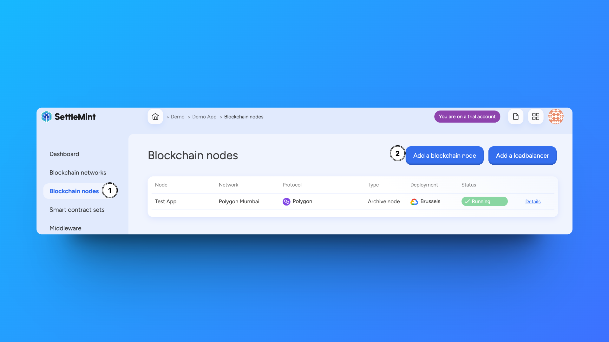

# Add a node to a network

Once you have deployed a permissioned network or joined a public network, you can add more nodes to it.

When you added a permissioned network or joined a public network, we already deploy 1 node for you as this is the minimum for your network to be operational. Now you can start adding more nodes. The number of nodes needed to keep your permissioned network up and running in case some nodes fail, and the type of nodes you need, depends on your network's protocol.

## How to add a node

This section describes the general flow for adding nodes to a network. For protocol-specific information, we refer to the relevant sections in the blockchain guides:

- [Hyperledger Besu nodes](../blockchain-guides/1_Hyperledger-Besu/3_enterprise-ethereum-node-types.md)
- [Ethereum nodes](../blockchain-guides/0_Ethereum/2_ethereum-node-types.md)
- [Avalanche nodes](../blockchain-guides/2_Avalanche/2_avalanche-node-types.md)
- [Polygon nodes](../blockchain-guides/4_Polygon/2_polygon-node-types.md)
- [Polygon Edge nodes](../blockchain-guides/4_Polygon/2_polygon-node-types.md)
- [Hyperledger Fabric nodes](../blockchain-guides/5_Hyperledger-Fabric/3_hyperledger-fabric-node-types.md)

Navigate to the **application** that includes the network to which you want to add nodes.

Click **Blockchain nodes** in the left navigation, and then click **Add a blockchain node**. This opens a form.

Follow these steps to add the blockchain node:

1. Select to which **blockchain network** you want to add this node, and click **Continue**.
2. Choose a **node name**. Choose a name that is easily recognizable in your dashboards.
3. Only for nodes in permissioned networks: Select what **type of node** you want to add. For more information on the types of nodes, refer to the Nodes sections in the blockchain guides (see the links above). For nodes on a public network, we deploy a full node by default.
4. Choose a **deployment plan**. Select the type, cloud provider, region and resource pack. [More about deployment plans](../launch-platform/managed-cloud-deployment/13_deployment-plans.md)
5. You see the **resource cost** for this node displayed at the bottom of the form. Click **Confirm** to add the node.

The node is now added to the **blockchain node overview** with the status "deploying". When your node is fully deployed, the status will change to "running". This will only take a few minutes.

You can click the node in the overview list to see detailed information, e.g. stats, usage metrics, logs, connection info, etc. Depending on the protocol, different node information will be available.

## Manage a node

Navigate to the **application** in which the blockchain node is created. Click **Blockchain nodes** in the left navigation, and then choose the node from the overview list.

Click **Manage node** to see available actions. You can only perform these actions if you have administrator rights.

- **Change name** - Changes the name of the application without any further impact.
- **Restart** - Restarts the node and keeps the current settings.
- **Delete** - Removes the node from the network.

:::info Info

Nodes do not autoscale. However, you can scale your deployment if you notice that your node does not have enough resources. [More on deployment plans](../launch-platform/managed-cloud-deployment/13_deployment-plans.md)

:::

:::warning Warning

You can only delete a blockchain node when it has no more resources (e.g. middleware) related to it. Resources first have to be deleted one by one.

:::
