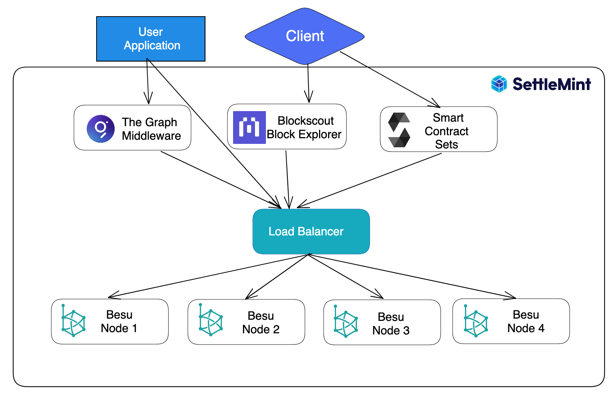
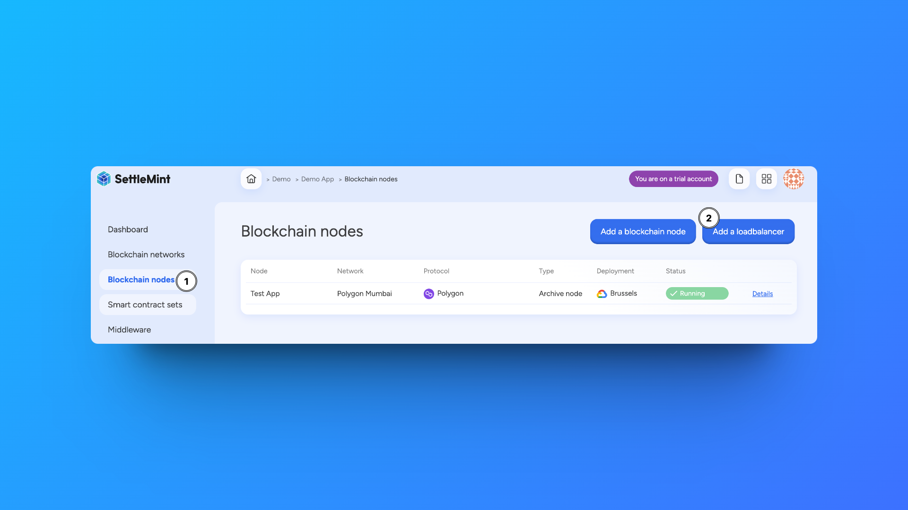

# Add a Load Balancer

:::info Info

Load balancers are a new feature to SettleMint. We plan to add more management capabilities and interface additions.

:::

After deploying nodes to your blockchain network, you can add a load balancer to the network.
Like traditional network load balancers, these distribute traffic among your deployed nodes.

## Why Use A Load Balancer

The benefits of adding a load balancer to your network include:

- **Performance** - Load balancers enable you to spread JSON-RPC traffic over multiple nodes which ensures maximum throughput and high availability.
- **Monitoring** - Load balancers are application-aware which gives you the ability to monitor the status of underlying nodes and prevents wrong or stale data.
- **Stability** - Load balancers give you the option to change and move nodes around without changing your application by using a stable URL form.

## How to Add a Load Balancer

Click on **Blockchain Node** in the left navigation. Then click the **Add Load Balancer** button.

From here, you can choose the **Blockchain Network** and then select the **Blockchain Nodes** to include under the load balancer.

:::warning Warning

Adding Validator nodes to your load balancer is not advised. This could disrupt your network operations if a Validator node becomes overloaded from an increase of traffic.

:::

Once you confirm the deployment configuration, your load balancers will appear under the list of deployed nodes.

## Managing a Load Balancer

You can select the load balancer to view the number of deployed nodes under it and access logs. More information including the ability to add or remove nodes are in development.

When deploying services including **The Graph Middleware** or **Blockscout Explorer**, you will now have the option to deploy to the load balancer.
