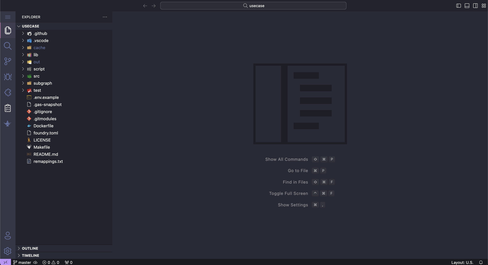
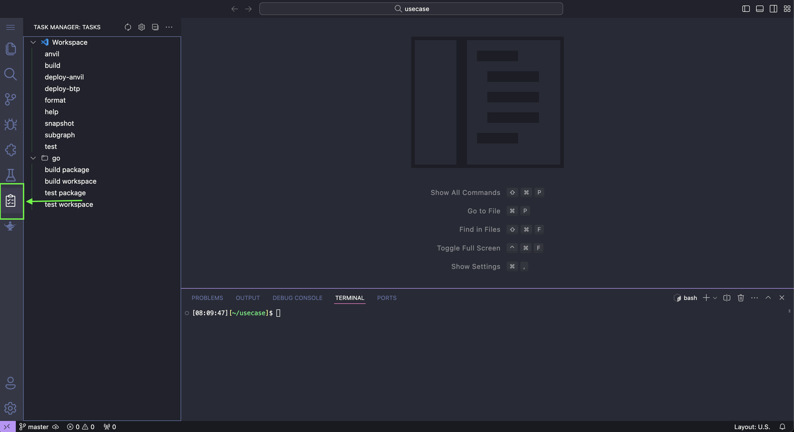
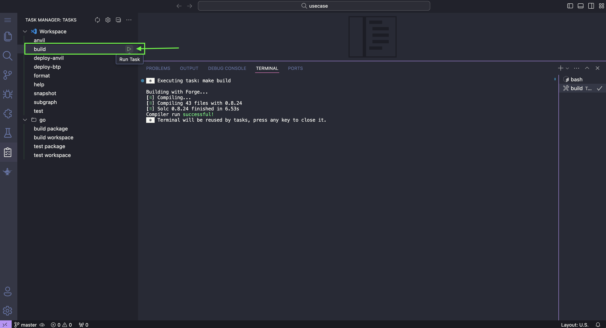
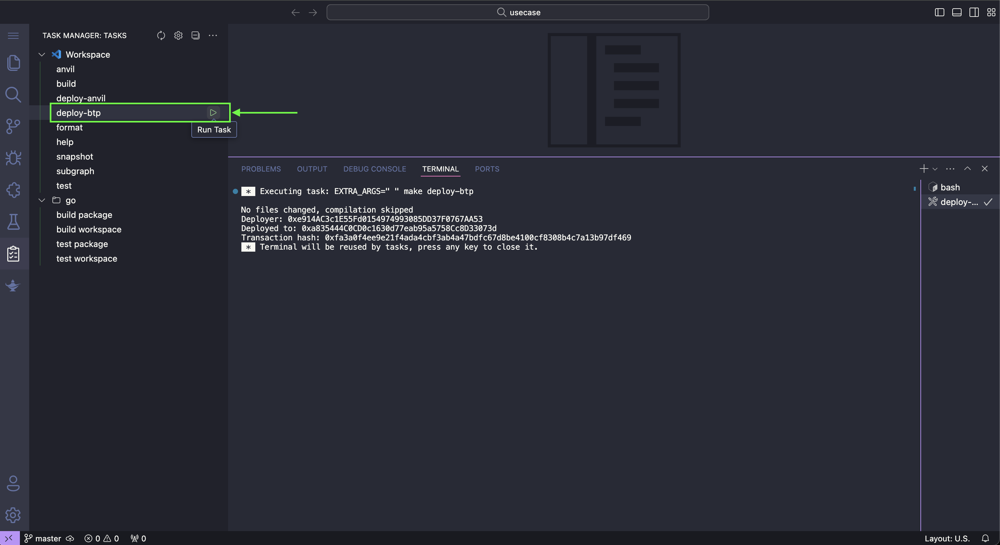
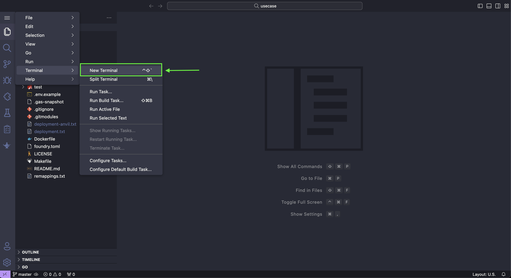
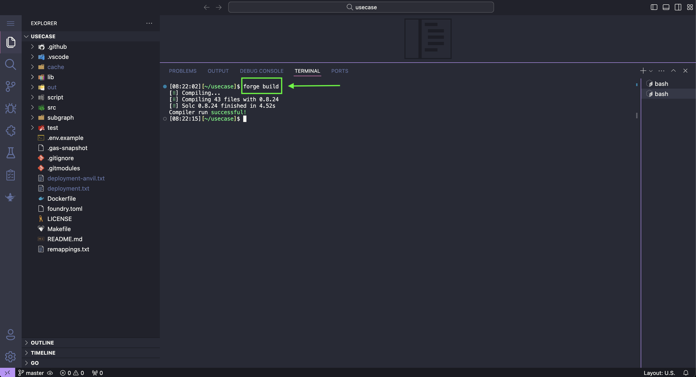
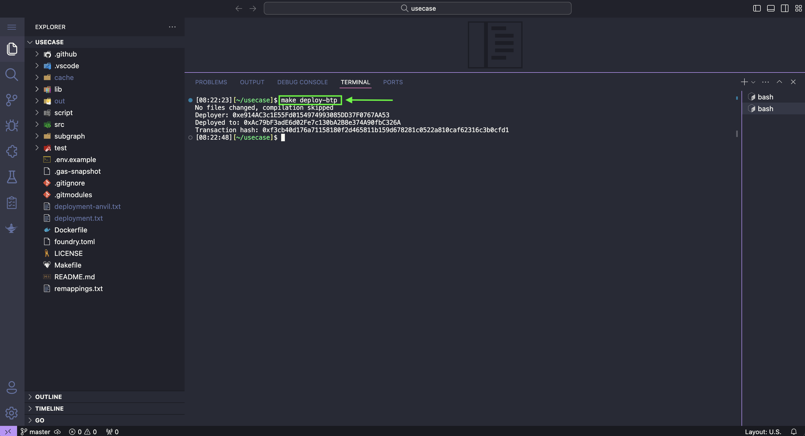

# Deploying a Smart Contract with Foundry

  

Foundry is a development toolkit for Ethereum smart contracts, designed to be fast and flexible.

There are two ways to deploy smart contracts with Foundry in SettleMint: you can either run the commands manually or use the Task Manager. All the commands are declared in the [Makefile](/docs/using-platform/6_add_smart_contract_sets/4_Make_file.md).

The typical folder structure in a Foundry project includes:

- **`src/`**: Contains the Solidity smart contracts for the project.
- **`test/`**: Houses the Solidity tests, written to verify the functionality of the smart contracts.
- **`script/`**: Includes scripts for deploying or interacting with the contracts post-deployment.
- **`lib/`**: Optional directory for Solidity libraries or external dependencies.
- **`out/`**: Generated directory where compilation artifacts (like ABI and binary) are stored.
- **`foundry.toml`**: Configuration file for Foundry, where you can set global settings and parameters.
- **`deployment.txt`**: Created after deployment is complete, stores the smart contract and deployer addresses, and the transaction hash.
- [**`Makefile`**](/): The Makefile in a Foundry project provides a collection of commands to automate the compilation, testing, and deployment of smart contracts.

## Deploy with Task Manager

Follow these steps to deploy a contract using Foundry's "Task Manager":

1. Click `View in Fullscreen Mode` for a better user experience :)
  

2. Navigate to the `Task Manager`.
  

3. Click `Build` to compile the Smart Contract.
  

4. Then run `deploy-anvil` to deploy locally or `deploy-btp` to deploy to your connected network.
  

Great job! Your contract has been successfully deployed.

## Deploy with the Terminal

Follow these steps to deploy a contract using Foundry's "terminal":

1. Open the terminal.
  

2. Run the command `forge build` to compile the contract.
  

3. Then run `make deploy-anvil` to deploy locally or `make deploy-btp` to deploy to your connected network.
  

Well done! You've successfully deployed your contract.

After the deployment is complete, you can find your smart contract address, transaction hash, and deployer address in the `deployment.txt` file.

