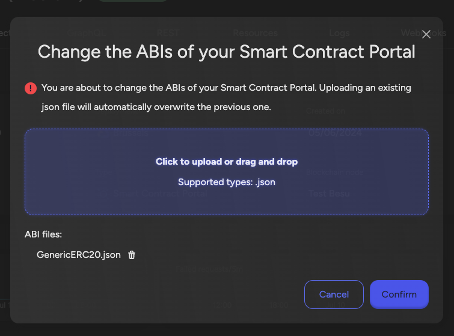
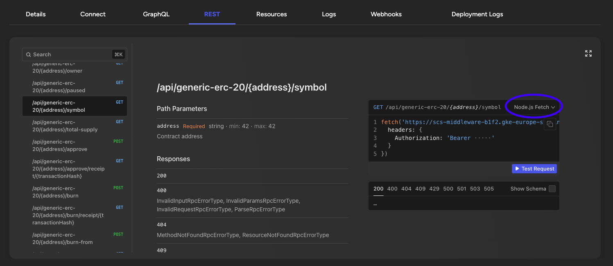
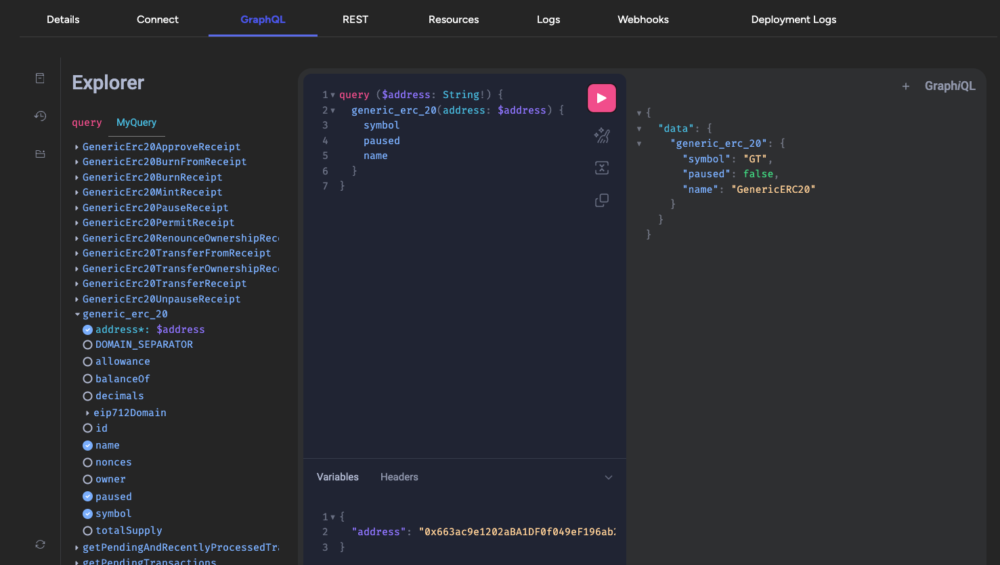
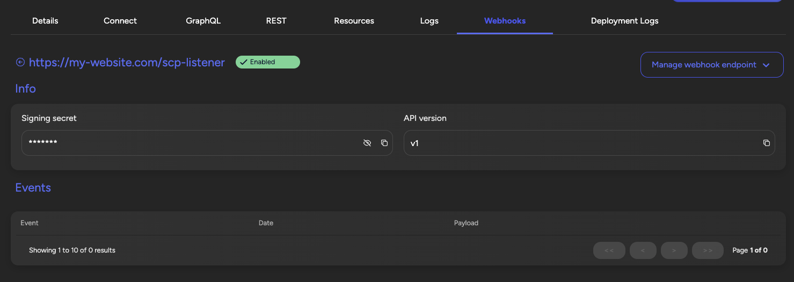

import Tabs from '@theme/Tabs';
import TabItem from '@theme/TabItem';

# Middleware

Middleware acts as a bridge between your blockchain network and applications, providing essential services like data indexing, API access, and event monitoring. Before adding middleware, ensure you have an application and blockchain node in place.

## Available Options

- **Graph Middleware** - For EVM chains, providing subgraph-based indexing with GraphQL API
- **Smart Contract Portal** - For EVM chains, offering REST & GraphQL APIs with webhooks
- **FabConnect** - For Hyperledger Fabric, providing RESTful API
- **Attestation Indexer** - Specialized indexer for attestations with GraphQL API

## How to Add Middleware

<Tabs>
<TabItem value="platform-ui" label="Platform UI">

Navigate to the **application** where you want to add middleware. Click **Middleware** in the left navigation, and then click **Add a middleware**. This opens a form.

Follow these steps:
1. Choose middleware type (Graph or Portal)
2. Choose a **Middleware name**
3. Select the **blockchain node**
4. Configure deployment settings
5. Click **Confirm**

</TabItem>
<TabItem value="sdk-cli" label="SDK CLI">

First ensure you're authenticated:
```bash
settlemint login
```

Create a middleware:
```bash
settlemint platform create middleware <type> <name> \
  --application <app-name> \
  --blockchain-node <node-name> \
  --provider <provider> \
  --region <region>
```

Where `<type>` can be:
- `smart-contract-portal`
- `graph`

Optional parameters:
- `--size <SMALL|MEDIUM|LARGE>`
- `--accept-defaults`

</TabItem>
<TabItem value="sdk-js" label="SDK JS">

```typescript
import { createSettleMintClient } from '@settlemint/sdk-js';

const client = createSettleMintClient({
  accessToken: process.env.SETTLEMINT_ACCESS_TOKEN,
  instance: 'https://console.settlemint.com'
});

// Create middleware
const createMiddleware = async () => {
  const result = await client.middleware.create({
    applicationUniqueName: "your-app",
    name: "my-middleware",
    type: "SHARED", //DEDICATED
    blockchainNodeUniqueName: "your-node",
    size: "SMALL"
  });
  console.log('Middleware created:', result);
};

// List middlewares
const listMiddlewares = async () => {
  const middlewares = await client.middleware.list("your-app");
  console.log('Middlewares:', middlewares);
};

// Get middleware details
const getMiddleware = async () => {
  const middleware = await client.middleware.read("middleware-unique-name");
  console.log('Middleware details:', middleware);
};

// Delete middleware
const deleteMiddleware = async () => {
  await client.middleware.delete("middleware-unique-name");
};
```

:::tip
Get your access token from the Platform UI under User Settings → API Tokens.
:::

</TabItem>
</Tabs>

## Manage Middleware

<Tabs>
<TabItem value="platform-ui" label="Platform UI">

Navigate to your middleware and click **Manage middleware** to:
- View middleware details and status
- Update configurations
- Monitor health
- Access endpoints

</TabItem>
<TabItem value="sdk-cli" label="SDK CLI">

```bash
# List middlewares
settlemint platform list middlewares --application <app-name>

# Get middleware details
settlemint platform read middleware <middleware-name>

# Delete middleware
settlemint platform delete middleware <middleware-name>
```

</TabItem>
<TabItem value="sdk-js" label="SDK JS">

```typescript
// List middlewares
await client.middleware.list("your-app");

// Get middleware details
await client.middleware.read("middleware-unique-name");

// Delete middleware
await client.middleware.delete("middleware-unique-name");
```

</TabItem>
</Tabs>

## The Graph Middleware

The Graph provides powerful indexing capabilities for EVM chains through subgraphs. Use this middleware when you need:
- Custom indexing logic through subgraph manifests
- Complex GraphQL queries
- Real-time data updates

### Using The Graph SDK

```typescript
import { createTheGraphClient } from '@settlemint/sdk-thegraph';

const { client: graphClient, graphql } = createTheGraphClient({
  instances: JSON.parse(process.env.SETTLEMINT_THEGRAPH_SUBGRAPHS_ENDPOINTS || '[]'),
  accessToken: process.env.SETTLEMINT_ACCESS_TOKEN!,
  subgraphName: 'your-subgraph'
});

// Make queries
const query = graphql(`
  query GetTokens {
    tokens {
      id
      tokenID
    }
  }
`);

const result = await graphClient.request(query);
```


### Using The Graph Middleware

[The Graph](https://thegraph.com/en/) is a protocol for indexing and querying blockchain data from networks. It can be used with all EVM-compatible chains like Ethereum, Hyperledger Besu, Polygon, Avalanche, etc. You can run it on your own blockchain nodes (both public and permissioned).

Using the Graph protocol, you can create **subgraphs** that define which blockchain data will be indexed. The middleware will then use these subgraphs to correctly index your smart contracts and expose a developer-friendly and efficient **GraphQL API**, allowing you to query the data you need.

We have some prebuilt subgraph indexing modules included in the smart contract set, and you can build your own modules if you have a custom smart contract set.

:::warning Warning

Before you start, make sure you are running:

- An EVM-compatible network (Ethereum, Polygon, Hyperledger Besu, Avalanche, etc.)

:::

When the middleware is deployed, follow these steps to start using it:

### Define and deploy a subgraph

Navigate to the **smart contract set** which you want to index, go the **details** and open the **IDE**. Here you will define the subgraph to set the indexing specifications, and deploy it so it can be loaded into the middleware. There are instructions included in the IDE to help you.

#### Subgraph raw configuration

Inside the root you will find a file called `subgraph.config.json` that contains the raw configuration of the subgraph. The important section is the **datasources** section.

- **Name** - here we defined the smart contracts with their name (the name of the artifact created in the 'deployments' folder when running the deploy task)
- **Address & Startblock** - You will notice the startblock and address to be 0. You must fill these in when your contract has been deployed. The block number and the address can be found in the **deployment** folder, under **ignition**.
- **Module** - In the modules array all the indexing modules to activate for this smart contract.

#### About the indexing modules

We provide **two libraries** of indexing modules: one by the **OpenZeppelin** team for all the common smart contracts in their smart contract library, and one by the **SettleMint** team to extend the capabilities of the OpenZeppelin one, and to provide indexing of the specific SettleMint smart contract sets.

The OpenZeppelin set contains the following indexing modules:

- accesscontrol
- erc1155
- erc1967upgrade
- erc20
- erc721
- governor
- ownable
- pausable
- timelock
- voting

The SettleMint set contains the following indexing modules:

- erc721ipfs: to extend the ERC-721 from OpenZeppelin to index IPFS metadata of your ERC-721 tokens
- crowdsale/vestingvault/vestingwallet: to index and expose all the data for the crowdsale contract set
- forwarder: for the ERC-20 Meta transactions forwarder data
- statemachinemetadata: to index IPFS metadata for state machines

These are available in the `subgraph` folder in your IDE. You can create your own modules for any other data you want to index, or for custom smart contracts not part of the default sets. And you can modify the existing ones if you want to index things a bit different.

#### Write your own indexing module

You can also write your own custom indexing module for smart contracts that are not part of the default sets.

Follow these steps to create a custom indexing module:

- Primitives to generate a GraphQL schema: `subgraph/datasource/x.gql.json` - In order to allow composability, the schema are not defined in the GraphQL format but rather in a dedicated JSON format which is can be assembled and compiled to GraphQL.
- Template to generate a subgraph manifest: `subgraph/datasource/x.yaml` - This file lists all the events that the datasources should listen to, and links that to the corresponding indexing logic.
- Indexing logic: `subgraph/datasources/x.ts` and (optionally) `subgraph/fetch/x.ts` - This is the core logic that processes the events to index the onchain activity.

[To learn more, check it out on Github.](https://github.com/OpenZeppelin/openzeppelin-subgraphs)

#### Start your subgraph

The following tasks need to be run in this sequence:

- `btp-scs subgraph codegen` - Generates the AssemblyScript types for your contracts ABI.
- `btp-scs subgraph build` - Compiles the WASM files based on the outputs generated by `btp-scs subgraph codegen`.
- `btp-scs subgraph deploy` - Deploys the WASM files to IPFS and updates the middleware to start or update the indexing.

The indexing of your smart contracts has now started. This can take a while, but once done you can query the middleware for your data in seconds using the **GraphQL API**. You can find the **endpoint** in the **Connect-tab**.

## Further Reading

- [The Graph Middleware](#the-graph-middleware)
- [The Smart Contract Portal Middleware](#the-smart-contract-portal-middleware)
- [Attestation Indexer](#attestation-indexer)
- [Firefly FabConnect](#firefly-fabconnect)

:::info Note
All operations require appropriate permissions in your workspace.
:::

## The Smart Contract Portal Middleware

The Smart Contract Portal is a middleware which creates an easy to use api on top of your smart contracts. It can be used with all EVM-compatible chains like Ethereum, Hyperledger Besu, Polygon, Avalanche, etc. You can run it on your own blockchain nodes (both public and permissioned) or on a Load Balancer.

Benefits of using the smart contract portal:

1. Simplified Integration: APIs allow developers to interact with complex smart contract functions through familiar interfaces, reducing the need to understand blockchain-specific languages and protocols.
2. Data Aggregation: APIs can consolidate data from multiple smart contracts, providing a unified view.
3. Improved Performance: GraphQL optimizes data fetching, ensuring that clients retrieve only the necessary data in a single request, reducing network load and improving performance.
4. Stack agnostic: Teams are free to choose their own technology stack.

:::warning Warning

Before you start, make sure you are running:

- An EVM-compatible network (Ethereum, Polygon, Hyperledger Besu, Avalanche, etc.)
- A Private Key

:::

### Using The Smart Contract Portal Middleware

The Portal middleware provides instant API access to your smart contracts. Key features include:
- Auto-generated REST & GraphQL APIs
- Built-in webhooks for event notifications
- Type-safe contract interactions
- Automatic ABI parsing

### Using The Portal SDK

```typescript
import { createPortalClient } from '@settlemint/sdk-portal';

const { client: portalClient, graphql: portalGraphql } = createPortalClient({
  instance: process.env.SETTLEMINT_PORTAL_GRAPHQL_ENDPOINT,
  accessToken: process.env.SETTLEMINT_ACCESS_TOKEN
});

// Make GraphQL queries
const query = portalGraphql(`
  query GetContracts {
    contracts {
      address
      name
    }
  }
`);

const result = await portalClient.request(query);
```

### Upload an ABI

A smart contract ABI (Application Binary Interface) is a standardized way for interacting with smart contracts in the Ethereum blockchain and other compatible systems. It serves as the bridge between human-readable contract code (written in languages like Solidity) and the Ethereum Virtual Machine (EVM), which executes the contract. The ABI specifies the functions that can be called on the contract, including their names, input parameters, and output types.

When deploying a smart contract the ABI file can be found as part of the artificats. See [Deploying the Smart Contract](/documentation/docs/developer-guides/connect-frontend#adding-the-abi). Download the ABI json files and save them on your local filesystem.

When creating a new middleware you'll need to upload at least one ABI.

To update the ABIs of an existing smart contract portal middleware navigate to the middleware, go the details and click on the 'Manage Middleware' button on the top right. Click on the 'Update ABIs' item and a dialog will open. In this dialog upload the ABI file(s) you saved on your local filesystem in the previous step.



### REST

A fully typed REST api with documentation is created out of the Smart Contract ABI, you can discover all its endpoints on the REST tab. To see examples in your technology of choice use the dropdown in the example section on the right.



### GraphQL

The GraphQL api exposes the same functionality as the REST api, you can discover it on the GraphQL tab.



### Webhooks

On the Webhooks tab you can register your own webhook. The portal will send events to this webhook when a transaction is processed.

When sending a message the event will have a signature which allows the receiver to validate if the event has not been tampered with.

The secret to validate the signature can be copied from the details page of your webhook.



Standard Webhooks has built [SDKs and useful tools](https://www.standardwebhooks.com/#resources) using different programming languages that make it easy to start using webhooks.

An example using Typescript, [Elysia](https://elysiajs.com/) and [standard webhooks](https://www.standardwebhooks.com/).

```ts
import { Elysia, t } from 'elysia';
import { Webhook } from 'standardwebhooks';

async function webhookConsumerBootstrap(secret: string) {
  const webhookConsumer = new Elysia().post(
    '/scp-listener',
    ({ headers, body }) => {
      try {
        const wh = new Webhook(btoa(secret));
        const verifiedPayload = wh.verify(JSON.stringify(body.payload), {
          'webhook-id': headers['btp-portal-event-id']!,
          'webhook-signature': headers['btp-portal-event-signature']!,
          'webhook-timestamp': headers['btp-portal-event-timestamp']!
        });
        console.log(
          `Received a webhook event: ${JSON.stringify(verifiedPayload)}`
        );
      } catch (err) {
        console.error('Webhook payload invalid', err);
        throw err;
      }
    },
    {
      body: t.Object({
        payload: t.Object({
          apiVersion: t.String(),
          eventId: t.String(),
          eventName: t.String(),
          timestamp: t.Number(),
          data: t.Any()
        })
      })
    }
  );
  const app = new Elysia().use(webhookConsumer).onStart(({ server }) => {
    console.log(
      `Started the test webhook consumer on ${server?.url.toString()}`
    );
  });
  await app.listen(3000);
}

webhookConsumerBootstrap('your-secret');
```