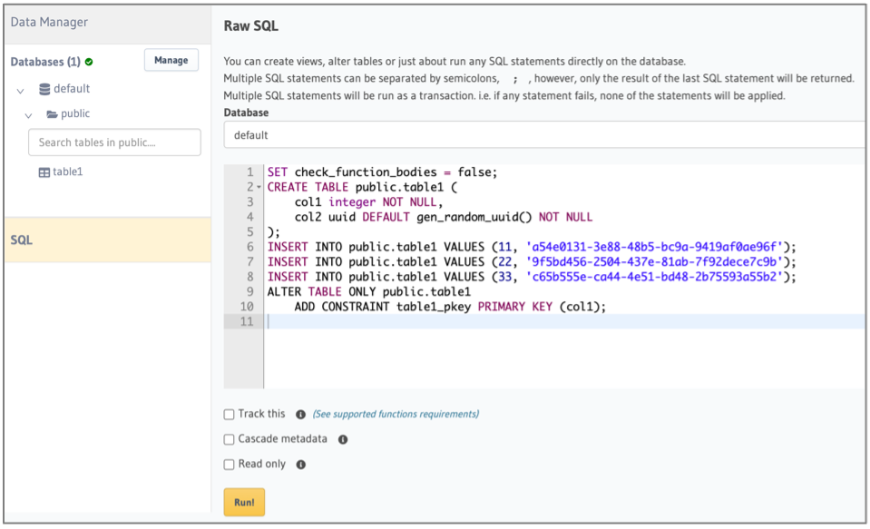

import Tabs from '@theme/Tabs';
import TabItem from '@theme/TabItem';

# Hasura - Backend-as-a-service

Many dApps need more than just decentralized tools to build an end-to-end solution. The SettleMint Hasura SDK provides a seamless way to interact with Hasura GraphQL APIs for managing application data.

## Add Hasura

<Tabs>
<TabItem value="platform-ui" label="Platform UI">

Navigate to the **application** where you want to add Hasura. Click **Integration tools** in the left navigation, and then click **Add an integration tool**. This opens a form.

Follow these steps to add Hasura:
1. Select **Hasura**, and click **Continue**
2. Choose a **name** for your backend-as-a-service
3. Choose a deployment plan (provider, region, resource pack)
4. Click **Confirm** to add it

</TabItem>
<TabItem value="sdk-cli" label="SDK CLI">

First ensure you're authenticated:
```bash
settlemint login
```

Create Hasura instance:
```bash
settlemint platform create integration-tool hasura <name>

# Get information about the command and all available options
settlemint platform create integration-tool hasura --help
```

</TabItem>
<TabItem value="sdk-js" label="SDK JS">

For a full example of how to create a blockchain explorer using the SDK, see the [Hasura SDK API Reference](https://www.npmjs.com/package/@settlemint/sdk-hasura#api-reference).

:::tip
The SDK enables you to easily query and mutate data stored in your SettleMint-powered PostgreSQL databases through a type-safe GraphQL interface. For detailed API reference, check out the [Hasura SDK documentation](https://github.com/settlemint/sdk/tree/main/sdk/hasura).
:::

</TabItem>
</Tabs>

## Some basic features

- Under the data subtab you can create an arbitrary number of **schema's**. A schema is a collection of tables.
- In a schema you can create **tables**, choose which columns you want and define relations and indexes.
- You can add, edit and delete **data** in these columns as well.
  [Learn more here](https://hasura.io/docs/latest/graphql/core/databases/postgres/schema/tables.html)

Any table you make is instantly visible in the **API subtab**. Note that by using the **REST and Derive Action buttons** you can convert queries into REST endpoints if that fits your application better. Using the **Code Exporter button** you can get the actual code snippets you can use in your application or the integration studio.

A bit more advanced are **actions**. Actions are custom queries or mutations that are resolved via HTTP handlers. Actions can be used to carry out complex data validations, data enrichment from external sources or execute just about any custom business logic. Actions can be kickstarted by using the **Derive Action button** in the **API subtab**.
[Learn more here.](https://hasura.io/docs/latest/graphql/core/actions/index.html)

If you need to execute tasks based on changes to your database you can leverage **Events**. An **Event Trigger** atomically captures events (insert, update, delete) on a specified table and then reliably calls a HTTP webhook to run some custom business logic.
[Learn more here.](https://hasura.io/docs/latest/graphql/core/event-triggers/index.html)

**Cron Triggers** can be used to reliably trigger HTTP endpoints to run some custom business logic periodically based on a cron schedule.

**One-off Scheduled Events** are individual events that can be scheduled to reliably trigger a HTTP webhook to run some custom business logic at a particular timestamp.

**Access to your database** can be handled all the way to the row level by using the authentication and authorisation options available in Hasura.
[Learn more here.](https://hasura.io/docs/latest/graphql/core/auth/index.html)

This is of course on top of the [application access tokens](16_application-access-tokens.md) and [personal access tokens](17_personal-access-tokens.md) in the platform you can use to close off access to the entire API.

## Backups

You should take a backup of the following components:

1. Hasura Database
2. Hasura Metadata

### Steps for taking a backup of Hasura Database

1. Install Hasura CLI (https://hasura.io/docs/latest/hasura-cli/install-hasura-cli/)
2. Run hasura init command to initiate a new Hasura project in the working directory.
3. Edit config.yaml file to configure remote Hasura instance. We need to generate an API Key in BPaaS and pass it with the endpoint.

config.yaml example:

```
version: 3

endpoint: <hasura-db-endpoint-here/API-key>
admin_secret: <admin-secret-here>

metadata_directory: metadata
actions:
 kind: synchronous
 handler_webhook_baseurl: http://localhost:3000
```

4. Run hasura console command. (this command will sync everything to your local hasura instance.)
5. Run this curl command to generate DB export:

Curl Format

```
curl -d '{"opts": [ "-O", "-x", "--schema=public", "--inserts"], "clean_output": true, "source": "default"}' -H "x-hasura-admin-secret: <SecretKey>" <Endpoint URL/APIKey>/v1alpha1/pg_dump > db.sql
```

Example Curl

```
curl -d '{"opts": [ "-O", "-x", "--schema=public", "--inserts"], "clean_output": true, "source": "default"}' -H "x-hasura-admin-secret:78b0e4618125322de0eb" https://fuchsiacapybara-7f70.gke-europe.settlemint.com/bpaas-1d79Acd6A2f112EA450F1C07a372a7D582E6121F/v1alpha1/pg_dump > db.sql
```

### Importing data into a new instance

Please copy the content of the exported db.sql file, paste it and execute as a SQL statement.



> More info on this and other commands can be found in the [Hasura docs](https://hasura.io/docs/latest/api-reference/pgdump/), please note to always add the x-auth-token header with an api key for your Hasura instance.

### Steps for taking a backup of Hasura Metadata

Hasura Metadata Export is a collection of yaml files which captures all the Metadata required by the GraphQL Engine. This includes info about tables that are tracked, permission rules, relationships, and event triggers that are defined on those tables.

If you have already initialized your project via the Hasura CLI you should see the Metadata directory structure in your project directory.

To export your entire Metadata using the Hasura CLI execute the following command in your terminal:

```
#in hasura CLI
hasura metadata export
```

This will export the Metadata as YAML files in the /metadata directory

### Steps for importing or applying Hasura Metadata

You can apply Metadata from one Hasura Server instance to another. You can also apply an older or modified version of an instance's Metadata onto itself to replace the existing Metadata. Applying or importing completely replaces the Metadata on that instance, i.e. you lose any Metadata that existed before applying.

```
#in hasura CLI
hasura metadata apply
```

### Reload Hasura Metadata

In some cases, the Metadata can be out of sync with the database schema. For example, when a new column has been added to a table via an external tool.

```
#in hasura CLI
hasura metadata reload
```

For more on Hasura Metadata, refer: https://hasura.io/docs/latest/migrations-metadata-seeds/manage-metadata/
For more on Hasura Migrations, refer: https://hasura.io/docs/latest/migrations-metadata-seeds/manage-migrations/

## Usage Examples

You can interact with your Hasura database in two ways: through the GraphQL API (recommended) or directly via PostgreSQL connection.

<Tabs>
<TabItem value="graphql" label="GraphQL API (Recommended)">

```javascript
import fetch from 'node-fetch';

// Configure your authentication details
const HASURA_ENDPOINT = "YOUR_HASURA_ENDPOINT";
const HASURA_ADMIN_SECRET = "YOUR_HASURA_ADMIN_SECRET"; // Found in the "Connect" tab of Hasura console
const APP_ACCESS_TOKEN = "YOUR_APP_ACCESS_TOKEN"; // Generated following the Application Access Tokens guide

// Reusable function to make GraphQL requests
async function fetchGraphQL(operationsDoc, operationName, variables) {
  try {
    const result = await fetch(
      HASURA_ENDPOINT,
      {
        method: "POST",
        headers: {
          'Content-Type': 'application/json',
          'x-hasura-admin-secret': HASURA_ADMIN_SECRET,
          'x-auth-token': APP_ACCESS_TOKEN
        },
        body: JSON.stringify({
          query: operationsDoc,
          variables: variables,
          operationName: operationName
        })
      }
    );

    if (!result.ok) {
      const text = await result.text();
      throw new Error(`HTTP error! status: ${result.status}, body: ${text}`);
    }

    return await result.json();
  } catch (error) {
    console.error('Request failed:', error);
    throw error;
  }
}

// Query to fetch verification records
const operationsDoc = `
  query MyQuery {
    verification {
      id
    }
  }
`;

// Mutation to insert a new verification record
const insertOperationDoc = `
  mutation InsertVerification($name: String!, $status: String!) {
    insert_verification_one(object: {name: $name, status: $status}) {
      id
      name
      status
    }
  }
`;

// Function to fetch verification records
async function main() {
  try {
    const { errors, data } = await fetchGraphQL(operationsDoc, "MyQuery", {});
    
    if (errors) {
      console.error('GraphQL Errors:', errors);
      return;
    }

    console.log('Data:', data);
  } catch (error) {
    console.error('Failed:', error);
  }
}

// Function to insert a new verification record
async function insertWithGraphQL() {
  try {
    const { errors, data } = await fetchGraphQL(
      insertOperationDoc,
      "InsertVerification",
      {
        name: "Test User",
        status: "pending"
      }
    );
    
    if (errors) {
      console.error('GraphQL Errors:', errors);
      return;
    }

    console.log('Inserted Data:', data);
  } catch (error) {
    console.error('Failed:', error);
  }
}

// Execute both query and mutation
main();
insertWithGraphQL();
```

</TabItem>
<TabItem value="postgresql" label="Direct PostgreSQL Connection">

```javascript 
import pkg from 'pg';
const { Pool } = pkg;

// Initialize PostgreSQL connection (get connection string from Hasura console -> "Connect" tab)
const pool = new Pool({
  connectionString: 'YOUR_POSTGRES_CONNECTION_STRING'
});

// Simple query to read all records from verification table
const readData = async () => {
  const query = 'SELECT * FROM verification';
  const result = await pool.query(query);
  console.log('Current Data:', result.rows);
};

// Insert a new verification record with sample data
const insertData = async () => {
  const query = `
    INSERT INTO verification (id, identifier, value, created_at, expires_at) 
    VALUES ($1, $2, $3, $4, $5) 
    RETURNING *`;
  
  // Sample values - modify according to your needs
  const values = [
    'test-id-123',
    'test-identifier',
    'test-value',
    new Date(),
    new Date(Date.now() + 24 * 60 * 60 * 1000) // Sets expiry to 24h from now
  ];
  
  const result = await pool.query(query, values);
  console.log('Inserted:', result.rows[0]);
};

// Update an existing record by ID
const updateData = async () => {
  const query = `
    UPDATE verification 
    SET value = $1, updated_at = $2 
    WHERE id = $3 
    RETURNING *`;
  
  const values = ['updated-value', new Date(), 'test-id-123'];
  const result = await pool.query(query, values);
  console.log('Updated:', result.rows[0]);
};

// Execute all operations in sequence
async function main() {
  try {
    await readData();
    await insertData();
    await updateData();
    await readData();
  } finally {
    await pool.end(); // Close database connection
  }
}

main();
```

</TabItem>
</Tabs>

### Authentication Setup

To run these examples, you'll need the following:

For GraphQL API:
1. **Hasura Admin Secret**: Found in the "Connect" tab of Hasura console
2. **Application Access Token**: Generate this by following our [Application Access Tokens guide](16_application-access-tokens.md)

For PostgreSQL:
1. **PostgreSQL Connection String**: Found in the "Connect" tab of Hasura console under "Database URL"


:::warning
Always keep your credentials secure and never expose them in client-side code. Use environment variables or a secure configuration management system in production environments.
:::
