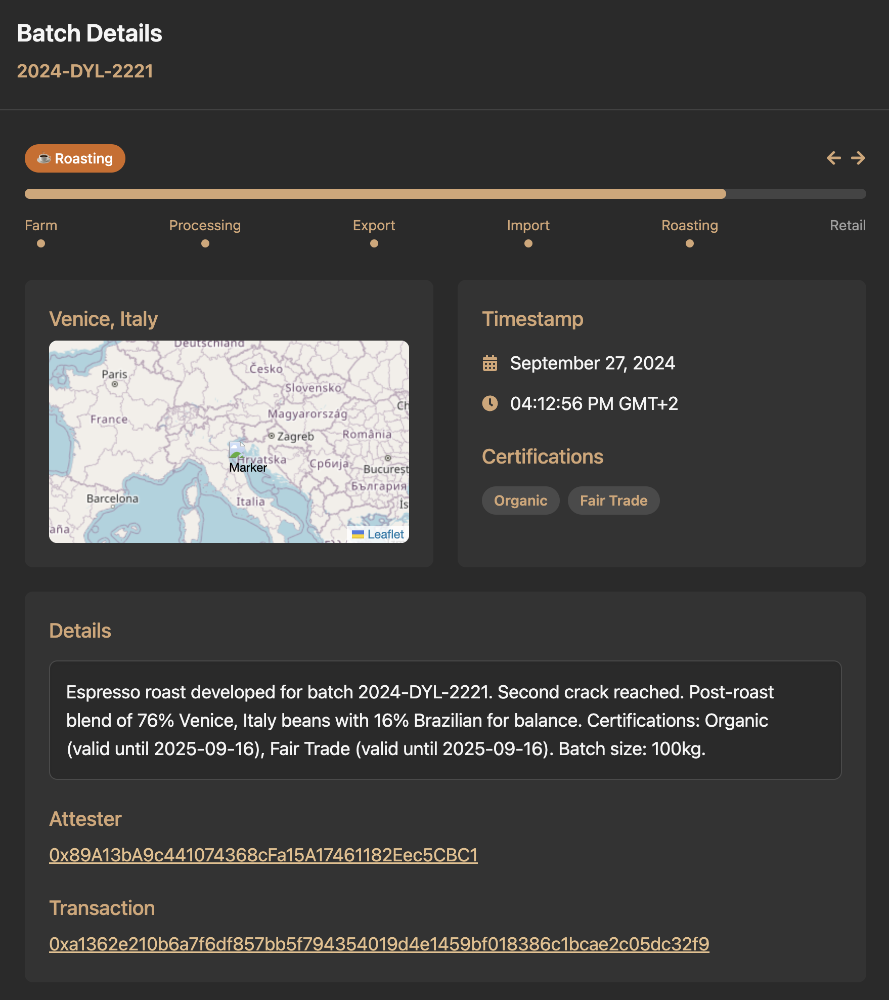

# Attestation Service

The Attestation Service is a groundbreaking framework designed to facilitate the creation, management, and verification of attestations on EVM cpmpatible blockchains (public or cosortium). By leveraging the decentralized and immutable nature of blockchain technology, it allows individuals and organizations to issue verifiable statements of fact, which can include anything from identity verification to compliance with regulatory standards. This service empowers users to maintain control over their data while providing transparency and trustworthiness to various processes.

One of the most remarkable aspects of the Attestation Service is its potential to streamline numerous processes across various industries. For instance, in the realm of education, institutions can issue verified diplomas and certifications that are tamper-proof, ensuring that employers can trust the qualifications of job candidates. In healthcare, medical professionals can share validated credentials, thus enhancing patient safety and care quality. The Attestation Service also plays a crucial role in compliance-related scenarios, allowing businesses to demonstrate adherence to regulations and standards seamlessly, reducing the burden of paperwork and audits.

The versatility of the Attestation Service extends to a wide array of use cases, making it an invaluable tool for both individuals and enterprises. Beyond identity verification and compliance, EAS can be applied to create transparent voting systems, enhance reputation management in decentralized finance (DeFi), and even support peer-to-peer lending by validating the creditworthiness of borrowers. Moreover, in the realm of environmental sustainability, it can help track and verify carbon credits, ensuring that claims about carbon offsets are accurate and trustworthy. Overall, the Ethereum Attestation Service stands as a transformative solution, unlocking new possibilities for trust and verification in our increasingly digital world.
