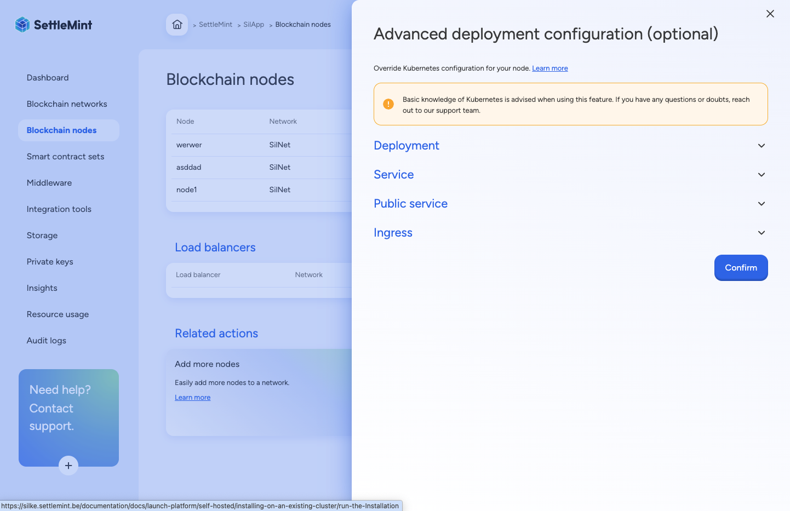

# Customize Kubernetes deployment settings

**Sep 25 2024**

The feature to customize Kubernetes deployment settings within SettleMint offers users an intuitive user interface (UI) that simplifies the management of deployed services in self-managed installations. This UI provides a comprehensive set of options for adjusting key deployment parameters, such as annotations, labels, tolerations, affinity, and node selectors. By making these customization options readily accessible, SettleMint enables users to tailor their Kubernetes configurations to better align with their specific operational needs and infrastructure requirements, fostering a more efficient and optimized deployment process.

One of the standout benefits of this feature is its ability to facilitate seamless integration into existing infrastructure. Organizations often have unique requirements based on their operational environment, and the customization options provided by SettleMint empower users to implement any necessary settings effortlessly. This flexibility ensures that deployments can adhere to organizational policies and best practices while maintaining compatibility with the broader Kubernetes ecosystem. By allowing users to specify their desired configurations directly through the UI, SettleMint reduces the complexity typically associated with Kubernetes management, allowing teams to focus on their core business objectives.

Moreover, the customization of deployment settings significantly enhances the scalability and resilience of services within the Kubernetes environment. By leveraging advanced features like affinity and tolerations, users can optimize resource allocation and improve workload distribution across nodes, leading to better performance and reliability. The ability to modify labels and annotations also aids in effective resource management, enabling users to implement advanced monitoring, logging, and orchestration strategies tailored to their needs. Overall, this feature empowers users to harness the full potential of their Kubernetes deployments, ensuring they can operate efficiently and effectively within their own customized infrastructure.
